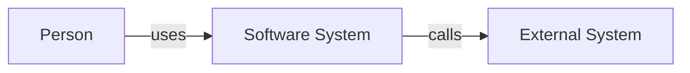
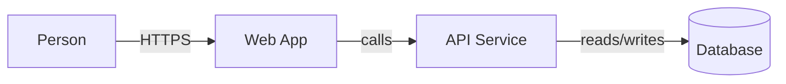
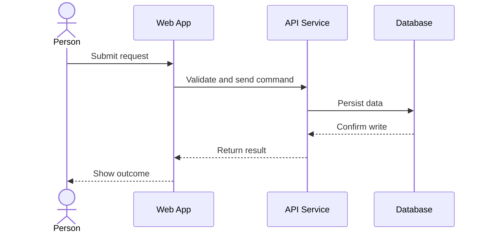

# C4 Diagram Templates

## System Context

```mermaid
flowchart LR
  person[Person]
  system[Software System]
  external[External System]
  person -->|uses| system
  system -->|calls| external
```

## Container

```mermaid
flowchart LR
  person[Person]
  web[Web App]
  api[API Service]
  db[(Database)]
  person -->|HTTPS| web
  web -->|calls| api
  api -->|reads/writes| db
```

## Dynamic

```mermaid
sequenceDiagram
  actor Person
  participant Web as Web App
  participant API as API Service
  participant DB as Database
  Person->>Web: Submit request
  Web->>API: Validate and send command
  API->>DB: Persist data
  DB-->>API: Confirm write
  API-->>Web: Return result
  Web-->>Person: Show outcome
```
