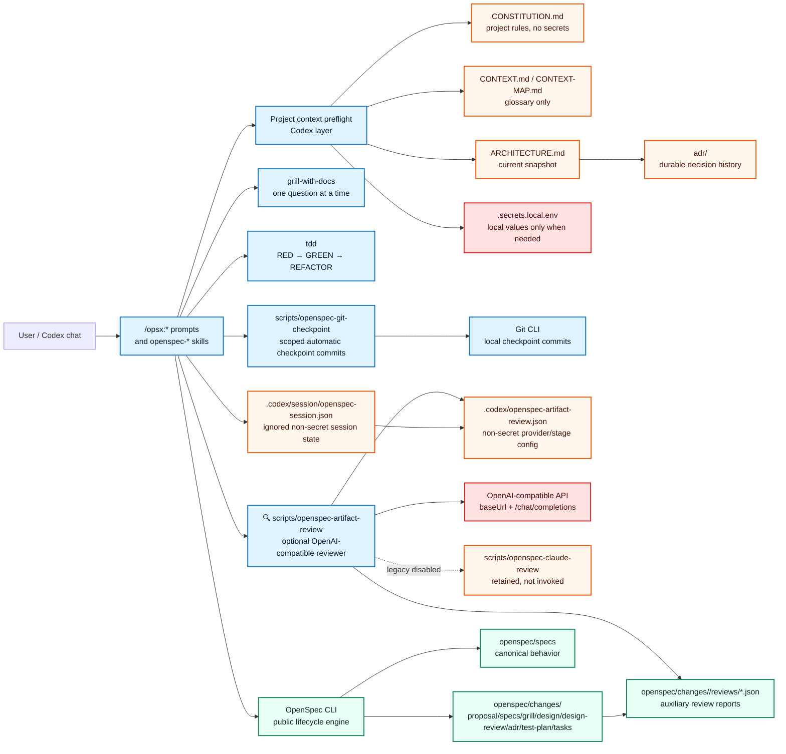

# Architecture Snapshot

This file is the current architecture entry point for new Codex chats and
architecture-sensitive `/opsx:*` work. It summarizes the in-force state; durable
rationale lives in `adr/`.

## Current in-force ADRs

- `adr/0001-adopt-codex-native-intent-driven-openspec-overlay.md` — adopts the
  project-local Codex/OpenSpec overlay architecture.
- `adr/0003-formalize-project-context-entrypoints.md` — formalizes root
  `CONSTITUTION.md`, root `ARCHITECTURE.md`, `openspec/README.md` as a bridge,
  ADR-derived architecture snapshots, and local-secret boundaries.
- `adr/0005-adopt-matt-grill-and-tdd-gates.md` — hardens the lifecycle with
  Matt `grill-with-docs` gates, glossary context, and canonical Matt TDD apply
  discipline.
- `adr/0006-adopt-claude-artifact-review.md` — historical Claude-specific reviewer decision, superseded for active review by ADR 0008.
- `adr/0007-adopt-automatic-checkpoints-and-claude-session-controls.md` —
  adopts automatic safe lifecycle checkpoints by default; its Claude-specific
  review controls are superseded by ADR 0008.
- `adr/0008-adopt-openai-compatible-artifact-review.md` — adopts provider-neutral
  OpenAI-compatible artifact review and disables active Claude review invocation.

ADR 0002 is superseded by ADR 0003. ADR 0004 is superseded by ADR 0005. ADR 0006 is superseded for active reviewer behavior by ADR 0008. ADR 0007 remains in force for checkpoint automation, while ADR 0008 supersedes its Claude-specific review controls. ADR 0001 remains otherwise in force; ADR 0007 narrows only its checkpoint-approval rule for safe local lifecycle commits.

## System model



## Boundaries

- **Codex overlay** (`.codex/prompts`, `.codex/skills`) owns workflow behavior,
  project-context preflight, Matt grill gates, Matt TDD apply discipline, optional
  OpenAI-compatible artifact review orchestration, session review controls, scoped automatic
  checkpoint helpers, goal hand-off prompts, quality skills, and Git discipline
  guidance.
- **OpenSpec CLI** owns lifecycle state, artifact dependency ordering,
  instructions, validation, and archive mechanics. It does not read
  `CONSTITUTION.md`, `CONTEXT.md`, or `ARCHITECTURE.md` itself.
- **Root project context** (`CONSTITUTION.md`, `CONTEXT.md`, `ARCHITECTURE.md`,
  `adr/`, and selected `docs/`) is persistent Git-tracked context outside
  OpenSpec change artifacts.
- **Local secrets** (`.secrets.local.env`) are local-only values outside Git and
  outside the OpenSpec archive flow. provider API credentials are also external local
  state and must not be copied into tracked review config or reports.

## Lifecycle

The canonical OpenSpec lifecycle is:

```text
proposal -> specs -> grill -> design -> design-review -> adr -> test-plan -> tasks -> apply -> verify -> archive
```

`grill.md` records mandatory pre-design Matt `grill-with-docs` findings.
`design-review.md` records mandatory post-design Matt `grill-with-docs` findings.
Both gates ask one material question at a time only when repository context
cannot answer the uncertainty, and both must reach `Open Questions: None` or an
explicit override before the next gate consumes them.

`test-plan.md` records vertical Matt TDD slices. `/opsx:apply` follows RED ->
GREEN -> REFACTOR one behavior at a time and must not write production code for
a behavior before RED evidence unless an explicit exception is approved in the
test plan.

Safe OpenSpec lifecycle checkpoints are automatic by default when session git
discipline is `auto`. Codex still shows affected paths, commit message, commit
hash, and post-commit status. Manual mode remains available, and push, merge,
pull request creation, archive, destructive Git operations, dirty unrelated work,
and hard-gate bypasses still require explicit approval.

Artifact review enablement and stage settings can be overlaid per session through
ignored non-secret `.codex/session/openspec-session.json`; the overlay merges
over `.codex/openspec-artifact-review.json` and never stores credentials. Legacy
`claudeReview` session state is tolerated for old local files but does not enable
current artifact review.

When `.codex/openspec-artifact-review.json` enables a stage, Codex can call
`scripts/openspec-artifact-review` after generating that artifact. The helper uses
an OpenAI-compatible chat completions API with configured provider base URL, model,
effort/reasoning options, optional request-provider routing object, optional budget
cap, and structured JSON output, then writes auxiliary reports under
`openspec/changes/<change>/reviews/`. These
reports inform later gates and verify, but they do not replace any OpenSpec
artifact, grill gate, ADR review, TDD evidence, or validation check.

Claude-specific review files remain as legacy-disabled compatibility assets and
current intent-driven lifecycle prompts do not invoke `scripts/openspec-claude-review`.

Before `/opsx:*` workflows and direct lifecycle skill actions, Codex reads
`CONSTITUTION.md`. For terminology-sensitive work it reads `CONTEXT.md` or
`CONTEXT-MAP.md` when present. For architecture-sensitive work it also reads
this file, `adr/README.md`, and relevant in-force `adr/*.md` files.

## Update rules

- Update `CONTEXT.md` when project glossary/domain language changes.
- Update `ARCHITECTURE.md` whenever an accepted durable ADR changes the current
  architecture snapshot.
- Do not rewrite accepted ADR bodies to change history; create a superseding ADR
  instead.
- Do not move `CONSTITUTION.md`, `CONTEXT.md`, `ARCHITECTURE.md`, `adr/`, or
  `.secrets.local.env` into `openspec/changes/archive/`.
- Do not store real secret values in Git-tracked project context.
