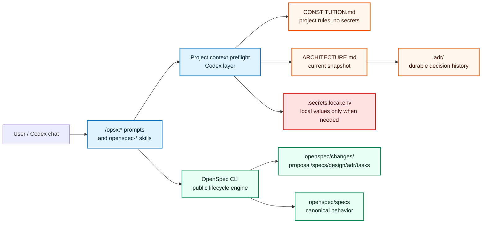

# Architecture Snapshot

This file is the current architecture entry point for new Codex chats and
architecture-sensitive `/opsx:*` work. It summarizes the in-force state; durable
rationale lives in `adr/`.

## Current in-force ADRs

- `adr/0001-adopt-codex-native-intent-driven-openspec-overlay.md` — adopts the
  project-local Codex/OpenSpec overlay architecture.
- `adr/0003-formalize-project-context-entrypoints.md` — formalizes root
  `CONSTITUTION.md`, root `ARCHITECTURE.md`, `openspec/README.md` as a bridge,
  ADR-derived architecture snapshots, and local-secret boundaries.

ADR 0002 is superseded by ADR 0003. It remains historical context for the
original project constitution preflight.

## System model



## Boundaries

- **Codex overlay** (`.codex/prompts`, `.codex/skills`) owns workflow behavior,
  project-context preflight, goal hand-off prompts, quality skills, and Git
  discipline guidance.
- **OpenSpec CLI** owns lifecycle state, artifact dependency ordering,
  instructions, validation, and archive mechanics. It does not read
  `CONSTITUTION.md` or `ARCHITECTURE.md` itself.
- **Root project context** (`CONSTITUTION.md`, `ARCHITECTURE.md`, `adr/`, and
  selected `docs/`) is persistent Git-tracked context outside OpenSpec change
  artifacts.
- **Local secrets** (`.secrets.local.env`) are local-only values outside Git and
  outside the OpenSpec archive flow.

## Lifecycle

The canonical OpenSpec lifecycle remains:

```text
proposal -> specs -> design -> adr -> tasks -> apply -> verify -> archive
```

Before `/opsx:*` workflows and direct lifecycle skill actions, Codex reads
`CONSTITUTION.md`. For architecture-sensitive work it also reads this file,
`adr/README.md`, and relevant in-force `adr/*.md` files.

## Update rules

- Update `ARCHITECTURE.md` whenever an accepted durable ADR changes the current
  architecture snapshot.
- Do not rewrite accepted ADR bodies to change history; create a superseding ADR
  instead.
- Do not move `CONSTITUTION.md`, `ARCHITECTURE.md`, `adr/`, or
  `.secrets.local.env` into `openspec/changes/archive/`.
- Do not store real secret values in Git-tracked project context.
