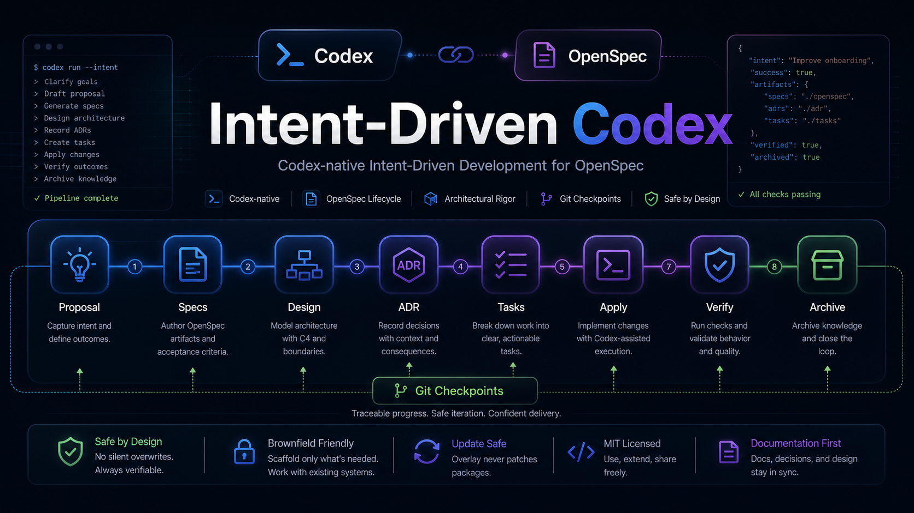
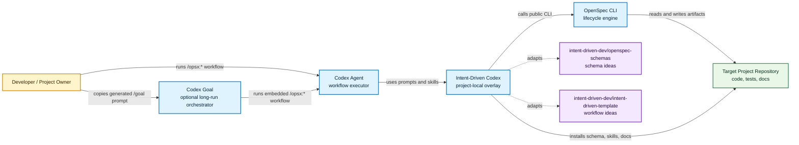
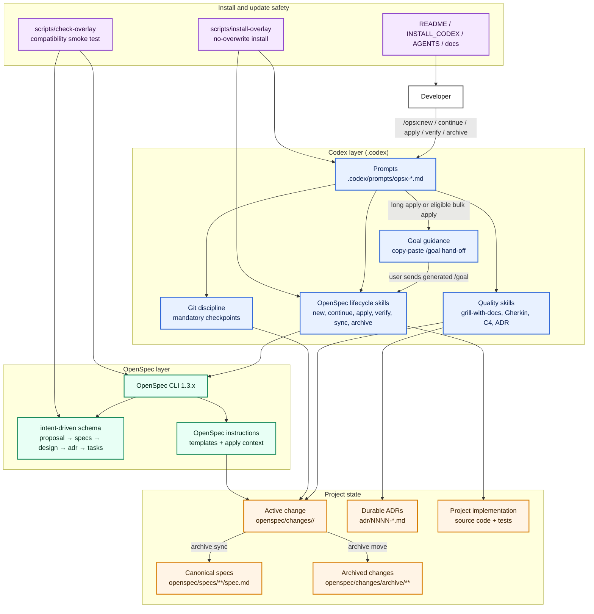

# Intent-Driven Codex

<p align="center">
  <strong>Codex-native Intent-Driven Development for OpenSpec projects.</strong>
</p>

<p align="center">
  <strong>English</strong> | <a href="README.ru.md">Русский</a>
</p>

<p align="center">
  
  <a href="LICENSE"></a>
  
  
  
</p>
<p align="center">
  
</p>

Intent-Driven Codex is a reusable template that brings Intent-Driven
Development to Codex while keeping OpenSpec as the lifecycle engine and source
of truth.

It combines the core ideas from
[`intent-driven-dev/openspec-schemas`](https://github.com/intent-driven-dev/openspec-schemas)
and
[`intent-driven-dev/intent-driven-template`](https://github.com/intent-driven-dev/intent-driven-template),
then adapts them to Codex with `.codex/prompts`, `.codex/skills`, a
project-local OpenSpec schema, ADR guidance, C4 design support, Gherkin-style
specs, mandatory Git checkpoints, and overlay smoke checks.

OpenSpec remains the engine. Codex executes the workflow.

## Highlights

- Project-local OpenSpec schema: `intent-driven`.
- Lifecycle: `proposal -> specs -> design -> adr -> tasks -> apply -> verify -> archive`.
- Codex `/opsx:*` commands for the full OpenSpec workflow.
- `grill-with-docs` for context-aware proposal and design review.
- Gherkin-style scenarios inside OpenSpec Markdown specs.
- C4-style diagrams for non-trivial architecture boundaries.
- Per-change ADR review plus durable top-level ADR history.
- Mandatory Git checkpoints after lifecycle artifacts and implementation groups.
- Optional Codex Goal hand-off prompts for long `/opsx:apply` and eligible `/opsx:bulk-apply` runs.
- Safe Greenfield and Brownfield installation with no silent overwrites.
- Overlay compatibility smoke checks after OpenSpec or template updates.
- Published canonical OpenSpec specs describing the behavior of the template itself.

## Current repository state

The bootstrap implementation and Codex Goal guidance changes have already been
archived. The repository now contains canonical OpenSpec specs for the base
overlay and goal-guided apply/bulk-apply behavior, plus one accepted project
ADR.

| Area | Current state |
| --- | --- |
| Active OpenSpec changes | none (`openspec list --json`) |
| Default schema | `intent-driven` from `openspec/config.yaml` |
| Project-local schema | `openspec/schemas/intent-driven/` |
| Canonical specs | `openspec/specs/**/spec.md` |
| Archived changes | `openspec/changes/archive/2026-05-24-implement-intent-driven-codex-template/`, `openspec/changes/archive/2026-05-24-add-codex-goal-guidance/` |
| Goal guidance specs | `openspec/specs/codex-opsx-workflow/spec.md`, `openspec/specs/template-installation/spec.md` |
| Durable project ADR | `adr/0001-adopt-codex-native-intent-driven-openspec-overlay.md` |
| Compatibility check | `scripts/check-overlay` |
| Installer | `scripts/install-overlay` |

## Architecture

### C4 system context



### C4 container and functionality view



## OpenSpec schema

`openspec/config.yaml` selects the project-local schema:

```yaml
schema: intent-driven
```

The schema creates this artifact graph:

| Artifact | Path inside a change | Depends on | Purpose |
| --- | --- | --- | --- |
| `proposal` | `proposal.md` | — | Intent, value, scope, capabilities, and impact. |
| `specs` | `specs/**/spec.md` | `proposal` | Observable behavior as OpenSpec delta requirements and scenarios. |
| `design` | `design.md` | `proposal`, `specs` | Technical approach, architecture boundaries, risks, and tradeoffs. |
| `adr` | `adr.md` | `design` | Per-change ADR review gate. |
| `tasks` | `tasks.md` | `specs`, `design`, `adr` | Dependency-ordered implementation checklist. |

Implementation starts only after `tasks` is complete and the planning state has
been checkpointed.

## Commands

Prompt files live in `.codex/prompts`.

| Command | Purpose |
| --- | --- |
| `/opsx:explore` | Explore an idea, problem, or code path without implementing. |
| `/opsx:new` | Create a new OpenSpec change and show the first artifact instructions. |
| `/opsx:continue` | Create exactly one next ready artifact for an existing change. |
| `/opsx:propose` | Prepare planning artifacts quickly when the user explicitly wants the fast path. |
| `/opsx:ff` | Fast-forward artifact preparation with visible checkpoint boundaries. |
| `/opsx:apply` | Implement pending tasks from OpenSpec context; for long or risky runs it may first print a copy-paste `/goal` prompt and stop before edits. |
| `/opsx:verify` | Verify implementation against specs, design, ADRs, and tasks. |
| `/opsx:sync` | Sync delta specs into canonical specs without archiving. |
| `/opsx:archive` | Archive a verified and integrated change. |
| `/opsx:check-overlay` | Run overlay compatibility and smoke checks. |
| `/opsx:bulk-apply` | Apply several independent changes through isolated flows; for eligible multi-change runs it may first print a parent `/goal` prompt before worktrees/subagents. |
| `/opsx:bulk-archive` | Archive several completed changes after conflict checks. |

## Codex Goal guidance

OpenSpec remains the source of truth even when Codex Goal manages execution.
Goal guidance is only an orchestration hand-off for long or risky apply runs; it
never replaces `proposal.md`, specs, `design.md`, `adr.md`, `tasks.md`,
verification, or Git checkpoint approval.

### When a goal prompt appears

| Workflow | Generates `/goal` when | Skips goal guidance when |
| --- | --- | --- |
| `/opsx:apply <change>` | The change is apply-ready and has 3+ pending tasks, material design/ADR constraints, multiple checkpoint boundaries, external dependencies, generated assets, migrations, or long verification. | The run is already inside an active Codex Goal for the same change, the user asks for no goal, or the work is small and local. |
| `/opsx:bulk-apply <changes...>` | Two or more executable changes remain after eligibility checks. | Fewer than two executable changes remain, the run is already goal-guided, or the user asks for no goal. |

The prompt is printed after OpenSpec eligibility is known and before the first
implementation side effect: before implementation file edits for apply, and
before worktree creation or subagent dispatch for bulk apply.

### How to use it

1. Run `/opsx:apply <change>` or `/opsx:bulk-apply <changes...>` as usual.
2. If Codex prints a generated `/goal` prompt, copy the whole prompt and send it
   as your next message when you want Codex Goal to manage the run.
3. The generated goal first tries the literal `/opsx:*` workflow. If nested
   slash commands are not executed literally by the runtime, it falls back to
   `openspec-apply-change` or `openspec-bulk-apply-change` with the same target.
4. The goal is complete only after apply, verify, final reporting, and checkpoint
   presentation are complete.
5. Archive, merge, push, staging/commit, destructive Git actions, and irreversible
   operations still require separate explicit approval.

### Example generated apply goal

```text
/goal Implement Intent-Driven OpenSpec change add-example-guidance in the current project until it is verify-ready.

First action: run workflow `/opsx:apply add-example-guidance`. If nested slash commands are not executed literally, use workflow/skill `openspec-apply-change` for this change.

Completion criteria: all applicable pending tasks are done and checked only after verification; `/opsx:verify add-example-guidance` finishes without critical issues; the final report lists completed tasks, changed files, verification status, and unresolved warnings; required checkpoint boundaries have been shown to the user.

Stop without completing the goal if planning artifacts are dirty, OpenSpec state is blocked/all-done, credentials/secrets are missing, an external service is unavailable, checks fail for reasons outside Codex control, artifacts contradict each other, a design/spec/ADR decision is required, or archive/merge/push/destructive Git action or another separately approved action is needed.
```

### Example generated bulk goal

```text
/goal Run Intent-Driven OpenSpec bulk apply for changes add-a, add-b in the current project.

First action: run workflow `/opsx:bulk-apply add-a add-b`. If nested slash commands are not executed literally, use workflow/skill `openspec-bulk-apply-change` with the same changes.

Completion criteria: every executed change has an isolated worktree, apply result, `/opsx:verify <change>` result, changed-files summary, blocker summary, and normalized parent report; skipped/paused/failed changes have reasons; the parent report lists worktree paths, changed files, blockers, and verify status.

Stop without completing the goal if fewer than two executable changes remain, a planning-artifact gate fails, OpenSpec state is blocked/all-done, worktree creation fails, subagent dispatch fails, credentials/secrets or external services are unavailable, checks fail outside Codex control, artifacts contradict each other, a design/spec/ADR decision is required, a merge/worktree conflict appears, or archive/merge/push/destructive Git action or another separately approved action is needed.
```

### Stop conditions and ownership

Generated goals must stop without completion and report the blocker, affected
change(s), trusted state, files changed so far, and recommended next user action
when they encounter dirty planning artifacts, blocked OpenSpec state, missing
credentials/secrets, unavailable services, external check failures, artifact
contradictions, required design/spec/ADR decisions, worktree/subagent failures,
merge/worktree conflicts, or any action that needs separate approval.

## Skills

Skills live in `.codex/skills`. They do not replace OpenSpec; they help Codex
execute the OpenSpec workflow consistently.

### Lifecycle skills

- `openspec-new-change` — starts a new change.
- `openspec-continue-change` — creates the next ready artifact.
- `openspec-propose` — prepares all planning artifacts in one fast path.
- `openspec-ff-change` — fast-forwards planning artifacts.
- `openspec-apply-change` — implements tasks from an OpenSpec change.
- `openspec-verify-change` — checks implementation against the change artifacts.
- `openspec-sync-specs` — syncs delta specs into canonical specs.
- `openspec-archive-change` — archives a completed change.
- `openspec-bulk-apply-change` — applies several independent changes.
- `openspec-bulk-archive-change` — archives several completed changes.
- `openspec-check-overlay` — validates overlay compatibility.
- `openspec-onboard` — introduces the workflow on a real task.
- `openspec-explore` — supports investigation before implementation.

### Quality and discipline skills

- `grill-with-docs` — reviews proposals and designs against project context,
  OpenSpec artifacts, ADRs, documentation, and relevant code.
- `gherkin-authoring` — improves scenarios and acceptance criteria while
  keeping OpenSpec Markdown as the source of truth.
- `c4-diagrams` — maps architecture boundaries, responsibilities,
  dependencies, and data flow.
- `architectural-decision-records` — records durable architecture decisions and
  supersession history.
- `openspec-git-discipline` — enforces checkpoint boundaries around the
  OpenSpec lifecycle.

`grill-with-docs` intentionally replaces a docs-free review flow. It reads the
project first and asks only the questions that cannot be answered from the
available context.

## ADR model

Intent-Driven Codex uses a dual ADR model:

| ADR type | Location | Purpose |
| --- | --- | --- |
| Per-change ADR review | `openspec/changes/<change>/adr.md` | Required review gate for each intent-driven change. |
| Durable project ADR | `adr/NNNN-kebab-title.md` | Long-lived architecture decision history. |

The current in-force project ADR is:

```text
adr/0001-adopt-codex-native-intent-driven-openspec-overlay.md
```

Rules:

- accepted durable ADRs are append-only;
- changed decisions are superseded by new ADRs;
- apply, tasks, and verify steps read top-level `adr/*.md` in addition to the
  OpenSpec context files;
- target projects that install this template create their own durable ADRs for
  their own architecture decisions.

## Git discipline

Every OpenSpec lifecycle state change is a checkpoint boundary.

| Boundary | Required behavior |
| --- | --- |
| New change scaffold | Show `git status --short`; checkpoint before dependent artifacts. |
| Each planning artifact | Checkpoint before another artifact depends on it. |
| Apply task group | Checkpoint after coherent verified work. |
| Verification | Commit verification changes if verification updates files. |
| Archive | Commit the archive move and canonical spec sync. |

Codex must not stage, commit, merge, push, or archive without explicit user
approval. A one-time override must state the gate, trusted dirty state, accepted
risk, and the next checkpoint where normal discipline resumes.

## Installation

### Greenfield project

```bash
cd /path/to/new-project
openspec init . --tools codex --profile core

/path/to/intent-driven-codex/scripts/install-overlay /path/to/new-project

cd /path/to/new-project
openspec schema validate intent-driven
scripts/check-overlay
```

### Brownfield project

Inspect the existing project first:

```bash
git status --short
find openspec -maxdepth 3 -type f 2>/dev/null | sort
find .codex -maxdepth 3 -type f 2>/dev/null | sort
find adr -maxdepth 2 -type f 2>/dev/null | sort
```

Then install the overlay:

```bash
/path/to/intent-driven-codex/scripts/install-overlay /path/to/brownfield-project
```

The installer is no-overwrite by default. It preserves existing active changes,
canonical specs, ADR history, `.codex` customizations, source code, tests, and
project documentation unless the user explicitly decides otherwise.

See [`INSTALL_CODEX.md`](INSTALL_CODEX.md) for the full installation guide.

## Repository structure

```text
.codex/
  prompts/                         Codex /opsx:* commands
  skills/                          lifecycle and quality skills
adr/
  README.md                        ADR policy and index
  0001-*.md                        project architecture decision
openspec/
  config.yaml                      selects schema: intent-driven
  schemas/intent-driven/           project-local schema and templates
  specs/                           canonical specs published by archive
  changes/archive/                 archived implementation changes
docs/
  lifecycle.md                     concise lifecycle reference
  update-safety.md                 OpenSpec update boundaries
scripts/
  check-overlay                    compatibility smoke check
  install-overlay                  safe no-overwrite installer
README.md                          English main README
README.ru.md                       Russian translation
VERSION                            release version
LICENSE                            MIT license
```

## Verification

Run these checks after installation or before publishing a release:

```bash
openspec schemas --json
openspec validate --all --strict
openspec schema validate intent-driven
scripts/check-overlay
```

Expected result:

- `intent-driven` is listed as a project-local schema;
- all canonical specs pass strict validation;
- the schema validates successfully;
- the smoke check creates, verifies, and removes a temporary
  `zz-smoke-intent-overlay-*` change.
- goal-guidance requirements remain captured in canonical specs and documented
  in both README languages.

## Version

Current release: `v0.1.0`.

## License

MIT. See [`LICENSE`](LICENSE).
