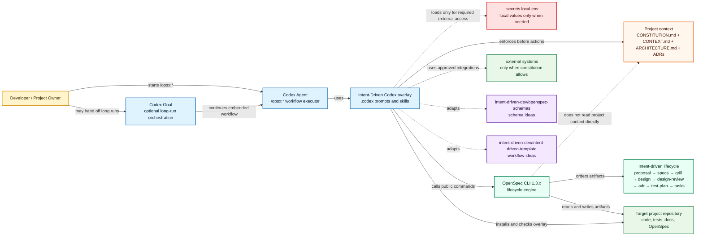
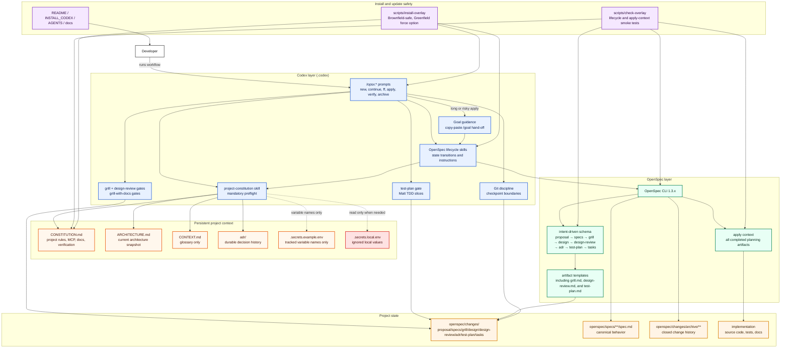

# Intent-Driven Codex

<p align="center">
  <strong>Codex-native Intent-Driven Development for OpenSpec projects.</strong>
</p>

<p align="center">
  <strong>English</strong> | <a href="README.ru.md">Русский</a>
</p>

<p align="center">
  
  <a href="LICENSE"></a>
  
  
  
</p>
<p align="center">
  
</p>

Intent-Driven Codex is a reusable template that brings Intent-Driven
Development to Codex while keeping OpenSpec as the lifecycle engine and source
of truth.

It combines the core ideas from
[`intent-driven-dev/openspec-schemas`](https://github.com/intent-driven-dev/openspec-schemas)
and
[`intent-driven-dev/intent-driven-template`](https://github.com/intent-driven-dev/intent-driven-template),
then adapts them to Codex with `.codex/prompts`, `.codex/skills`, a
project-local OpenSpec schema, ADR guidance, glossary-aware Matt grill gates,
mandatory Matt TDD slices, architecture diagram support, Gherkin-style specs,
mandatory Git checkpoints, and overlay smoke checks.

OpenSpec remains the engine. Codex executes the workflow.

## Highlights

- Project-local OpenSpec schema: `intent-driven`.
- Lifecycle: `proposal -> specs -> grill -> design -> design-review -> adr -> test-plan -> tasks -> apply -> verify -> archive`.
- Codex `/opsx:*` commands for the full OpenSpec workflow.
- Root `CONSTITUTION.md` for persistent project rules that Codex reads before `/opsx:*` actions.
- Root `ARCHITECTURE.md` as the current architecture snapshot for new chats.
- Root `CONTEXT.md` as glossary/domain language for grill and TDD flows.
- Local `.secrets.local.env` handling for external-system credentials without committing secret values.
- Mandatory `grill.md` and `design-review.md` gates powered by the full Matt `grill-with-docs` skill.
- Gherkin-style scenarios inside OpenSpec Markdown specs.
- Lightweight architecture diagrams for non-trivial boundaries and integrations.
- Mandatory `test-plan.md` gate for Matt TDD vertical RED/GREEN/REFACTOR slices.
- Per-change ADR review plus durable top-level ADR history.
- Mandatory Git checkpoints after lifecycle artifacts and implementation groups.
- Optional Codex Goal hand-off prompts for long `/opsx:apply` and eligible `/opsx:bulk-apply` runs.
- Safe Greenfield and Brownfield installation with no silent overwrites.
- Overlay compatibility smoke checks after OpenSpec or template updates.
- Published canonical OpenSpec specs describing the behavior of the template itself.

## Current development state

`v0.1.3` hardens the earlier gates with full Matt `grill-with-docs` and Matt `tdd` integration:

- root `CONSTITUTION.md` for mandatory project rules that Codex reads before `/opsx:*`;
- root `ARCHITECTURE.md` for current architecture context and links to in-force ADRs;
- root `CONTEXT.md` for glossary/domain language used by grill and TDD;
- shared `project-constitution` preflight skill used by `/opsx:*` prompts and OpenSpec lifecycle skills;
- strict missing-constitution behavior with bootstrap-safe and diagnostic exceptions;
- conflict stops when constitution rules contradict the request or OpenSpec artifacts;
- local-only `.secrets.local.env` for external-system credentials, with tracked `.secrets.example.env` placeholders;
- `openspec/README.md` bridge explaining which context lives outside OpenSpec change artifacts;
- ADR 0003-backed architecture snapshot model, where `ARCHITECTURE.md` is current state and `adr/` is durable history;
- first-class `grill.md`, `design-review.md`, and `test-plan.md` artifacts in the `intent-driven` lifecycle;
- `/opsx:continue`, `/opsx:ff`, `/opsx:apply`, `/opsx:verify`, and overlay smoke checks wired to automatic grill gates and mandatory TDD evidence;
- Greenfield install support for replacing generated overlay files with `scripts/install-overlay --force-overlay`.

## Current repository state

The bootstrap implementation, Codex Goal guidance, project constitution support,
project context architecture formalization, mandatory historical review/test-plan gates, and hardened v0.1.3 Matt grill/TDD gates
have all been archived. The repository contains canonical OpenSpec specs for
the base overlay, goal-guided apply/bulk-apply behavior, persistent project
context, the current project ADR set, and the implemented hardened
Matt grill/TDD lifecycle gates. There are currently no active OpenSpec changes.

| Area | Current state |
| --- | --- |
| Active OpenSpec changes | None |
| Default schema | `intent-driven` from `openspec/config.yaml` |
| Project-local schema | `openspec/schemas/intent-driven/` |
| Canonical specs | `openspec/specs/**/spec.md` |
| Archived changes | `openspec/changes/archive/2026-05-24-implement-intent-driven-codex-template/`<br>`openspec/changes/archive/2026-05-24-add-codex-goal-guidance/`<br>`openspec/changes/archive/2026-05-25-add-project-constitution/`<br>`openspec/changes/archive/2026-05-26-formalize-project-context-architecture/`<br>`openspec/changes/archive/2026-05-28-add-mandatory-review-and-tdd-gates/`<br>`openspec/changes/archive/2026-05-28-harden-mandatory-grill-and-tdd-gates/` |
| Goal guidance specs | `openspec/specs/codex-opsx-workflow/spec.md`, `openspec/specs/template-installation/spec.md` |
| Project context | `CONSTITUTION.md`, `ARCHITECTURE.md`, `openspec/README.md`, `.secrets.example.env`, `.codex/skills/project-constitution/SKILL.md` |
| Durable project ADRs | `adr/0001-adopt-codex-native-intent-driven-openspec-overlay.md`, `adr/0003-formalize-project-context-entrypoints.md`, `adr/0005-adopt-matt-grill-and-tdd-gates.md` (ADR 0002 is superseded) |
| Compatibility check | `scripts/check-overlay` |
| Installer | `scripts/install-overlay` |

## Architecture

### System context



### Container and functionality view



## OpenSpec schema

`openspec/config.yaml` selects the project-local schema:

```yaml
schema: intent-driven
```

The schema creates this artifact graph:

| Artifact | Path inside a change | Depends on | Purpose |
| --- | --- | --- | --- |
| `proposal` | `proposal.md` | — | Intent, value, scope, capabilities, and impact. |
| `specs` | `specs/**/spec.md` | `proposal` | Observable behavior as OpenSpec delta requirements and scenarios. |
| `grill` | `grill.md` | `proposal`, `specs` | Mandatory pre-design Matt `grill-with-docs` gate. |
| `design` | `design.md` | `proposal`, `specs`, `grill` | Technical approach, architecture boundaries, risks, and tradeoffs. |
| `design-review` | `design-review.md` | `design` | Mandatory post-design Matt `grill-with-docs` gate. |
| `adr` | `adr.md` | `design-review` | Per-change ADR review gate informed by grill findings. |
| `test-plan` | `test-plan.md` | `adr` | Matt TDD vertical slice plan before implementation tasks. |
| `tasks` | `tasks.md` | `specs`, `grill`, `design`, `design-review`, `adr`, `test-plan` | Dependency-ordered implementation checklist. |

Implementation starts only after `grill`, `design-review`, `adr`, `test-plan`, and `tasks` are complete and the planning state has
been checkpointed.

## Commands

Prompt files live in `.codex/prompts`.

| Command | Purpose |
| --- | --- |
| `/opsx:explore` | Explore an idea, problem, or code path without implementing. |
| `/opsx:new` | Create a new OpenSpec change and show the first artifact instructions. |
| `/opsx:continue` | Create exactly one next ready artifact for an existing change. |
| `/opsx:propose` | Prepare planning artifacts quickly when the user explicitly wants the fast path. |
| `/opsx:ff` | Fast-forward artifact preparation with visible checkpoint boundaries. |
| `/opsx:apply` | Implement pending tasks from OpenSpec context; for long or risky runs it may first print a copy-paste `/goal` prompt and stop before edits. |
| `/opsx:verify` | Verify implementation against specs, design, ADRs, and tasks. |
| `/opsx:sync` | Sync delta specs into canonical specs without archiving. |
| `/opsx:archive` | Archive a verified and integrated change. |
| `/opsx:check-overlay` | Run overlay compatibility and smoke checks. |
| `/opsx:bulk-apply` | Apply several independent changes through isolated flows; for eligible multi-change runs it may first print a parent `/goal` prompt before worktrees/subagents. |
| `/opsx:bulk-archive` | Archive several completed changes after conflict checks. |

## Project context

`ARCHITECTURE.md` is the current architecture snapshot for new chats and architecture-sensitive work. It summarizes the current state and links to in-force ADRs. Durable rationale remains in `adr/`, and `openspec/README.md` bridges OpenSpec lifecycle files to these root project context files.

`CONTEXT.md` is the glossary/domain language file used by Matt grill and TDD flows. It is not policy, architecture, a spec, or a scratchpad. Multi-context repositories can add `CONTEXT-MAP.md` to point Codex to context-local glossaries and ADRs.

`CONSTITUTION.md` is the persistent, Git-tracked project rule source
that Codex reads before `/opsx:*` workflow actions. It is **not** an OpenSpec
change artifact, is not archived with changes, and is not read by OpenSpec CLI
itself. The Codex overlay enforces it through the shared
`project-constitution` skill and short preflight rules in the `/opsx:*` prompts
and OpenSpec lifecycle skills.

Use it to record project context that must not be missed:

| Constitution section | What Codex uses it for |
| --- | --- |
| Required Technologies | Mandatory languages, frameworks, runtimes, package managers, architecture rules, and coding standards. |
| MCP Servers | Which MCP server to use for a development block and which non-secret parameters are allowed. |
| External Systems | Non-MCP systems, access method, and the credential variable names needed for them. |
| Secret Handling | The boundary between tracked variable names and local secret values. |
| Documentation Sources | Project docs, official docs, and lookup rules Codex should prefer. |
| Verification Rules | Checks Codex must run or explicitly report before claiming completion. |
| Additional AI Instructions | Project-wide constraints that should not disappear between chats. |

### Workflow behavior

When the constitution is present, Codex applies relevant rules before planning,
apply, verify, sync, archive, and bulk workflows. This keeps project-wide
technology choices, MCP usage, documentation policy, and verification
requirements visible throughout the whole OpenSpec lifecycle. For architecture-sensitive work Codex also reads `ARCHITECTURE.md`, `adr/README.md`, and relevant in-force ADRs.

When the constitution is missing, Codex reports it and offers to create it from
the template. Only bootstrap-safe or diagnostic actions should continue without
it, such as exploration, creating the constitution, starting a constitution setup
change, or `/opsx:check-overlay`. Apply, verify, sync, archive, and bulk
workflows stop until the constitution exists or the user gives an explicit
one-time override.

When constitution rules conflict with the user request or OpenSpec artifacts,
Codex stops before modifying files or calling external systems and asks whether
to update the constitution, update the artifact/task, change the request, or use
a one-time override.

### Local secrets

Never put real logins, passwords, tokens, or private service URLs in
`CONSTITUTION.md`, OpenSpec artifacts, ADRs, docs, examples, diffs, or
chat output. Keep values in ignored `.secrets.local.env`. Tracked files may
contain variable names and empty placeholders only, for example in
`.secrets.example.env`.

Codex reads `.secrets.local.env` only when the current workflow actually needs
an external system listed in the constitution. If required variables are
missing, Codex reports the missing variable names and stops before the external
call.

Example tracked constitution entry:

```text
External system: Customer OData
Required variables: CUSTOMER_ODATA_URL, CUSTOMER_ODATA_USERNAME, CUSTOMER_ODATA_PASSWORD
Values: stored locally in .secrets.local.env
```

Example local-only secret file:

```dotenv
CUSTOMER_ODATA_URL=
CUSTOMER_ODATA_USERNAME=
CUSTOMER_ODATA_PASSWORD=
```

Keep the example file empty or placeholder-only when tracked; fill real values
only in the ignored local file.

## Codex Goal guidance

OpenSpec remains the source of truth even when Codex Goal manages execution.
Goal guidance is only an orchestration hand-off for long or risky apply runs; it
never replaces `proposal.md`, specs, `grill.md`, `design.md`, `design-review.md`, `adr.md`, `test-plan.md`, `tasks.md`,
verification, or Git checkpoint approval.

### When a goal prompt appears

| Workflow | Generates `/goal` when | Skips goal guidance when |
| --- | --- | --- |
| `/opsx:apply <change>` | The change is apply-ready and has 3+ pending tasks, material design/ADR constraints, multiple checkpoint boundaries, external dependencies, generated assets, migrations, or long verification. | The run is already inside an active Codex Goal for the same change, the user asks for no goal, or the work is small and local. |
| `/opsx:bulk-apply <changes...>` | Two or more executable changes remain after eligibility checks. | Fewer than two executable changes remain, the run is already goal-guided, or the user asks for no goal. |

The prompt is printed after OpenSpec eligibility is known and before the first
implementation side effect: before implementation file edits for apply, and
before worktree creation or subagent dispatch for bulk apply.

### How to use it

1. Run `/opsx:apply <change>` or `/opsx:bulk-apply <changes...>` as usual.
2. If Codex prints a generated `/goal` prompt, copy the whole prompt and send it
   as your next message when you want Codex Goal to manage the run.
3. The generated goal first tries the literal `/opsx:*` workflow. If nested
   slash commands are not executed literally by the runtime, it falls back to
   `openspec-apply-change` or `openspec-bulk-apply-change` with the same target.
4. The goal is complete only after apply, verify, final reporting, and checkpoint
   presentation are complete.
5. Archive, merge, push, staging/commit, destructive Git actions, and irreversible
   operations still require separate explicit approval.

### Example generated apply goal

```text
/goal Implement Intent-Driven OpenSpec change add-example-guidance in the current project until it is verify-ready.

First action: run workflow `/opsx:apply add-example-guidance`. If nested slash commands are not executed literally, use workflow/skill `openspec-apply-change` for this change.

Completion criteria: all applicable pending tasks are done and checked only after verification; `/opsx:verify add-example-guidance` finishes without critical issues; the final report lists completed tasks, changed files, verification status, and unresolved warnings; required checkpoint boundaries have been shown to the user.

Stop without completing the goal if planning artifacts are dirty, OpenSpec state is blocked/all-done, credentials/secrets are missing, an external service is unavailable, checks fail for reasons outside Codex control, artifacts contradict each other, a design/spec/ADR decision is required, or archive/merge/push/destructive Git action or another separately approved action is needed.
```

### Example generated bulk goal

```text
/goal Run Intent-Driven OpenSpec bulk apply for changes add-a, add-b in the current project.

First action: run workflow `/opsx:bulk-apply add-a add-b`. If nested slash commands are not executed literally, use workflow/skill `openspec-bulk-apply-change` with the same changes.

Completion criteria: every executed change has an isolated worktree, apply result, `/opsx:verify <change>` result, changed-files summary, blocker summary, and normalized parent report; skipped/paused/failed changes have reasons; the parent report lists worktree paths, changed files, blockers, and verify status.

Stop without completing the goal if fewer than two executable changes remain, a planning-artifact gate fails, OpenSpec state is blocked/all-done, worktree creation fails, subagent dispatch fails, credentials/secrets or external services are unavailable, checks fail outside Codex control, artifacts contradict each other, a design/spec/ADR decision is required, a merge/worktree conflict appears, or archive/merge/push/destructive Git action or another separately approved action is needed.
```

### Stop conditions and ownership

Generated goals must stop without completion and report the blocker, affected
change(s), trusted state, files changed so far, and recommended next user action
when they encounter dirty planning artifacts, blocked OpenSpec state, missing
credentials/secrets, unavailable services, external check failures, artifact
contradictions, required design/spec/ADR decisions, worktree/subagent failures,
merge/worktree conflicts, or any action that needs separate approval.

## Skills

Skills live in `.codex/skills`. They do not replace OpenSpec; they help Codex
execute the OpenSpec workflow consistently.

### Lifecycle skills

- `openspec-new-change` — starts a new change.
- `openspec-continue-change` — creates the next ready artifact.
- `openspec-propose` — prepares all planning artifacts in one fast path.
- `openspec-ff-change` — fast-forwards planning artifacts.
- `openspec-apply-change` — implements tasks from an OpenSpec change.
- `openspec-verify-change` — checks implementation against the change artifacts.
- `openspec-sync-specs` — syncs delta specs into canonical specs.
- `openspec-archive-change` — archives a completed change.
- `openspec-bulk-apply-change` — applies several independent changes.
- `openspec-bulk-archive-change` — archives several completed changes.
- `openspec-check-overlay` — validates overlay compatibility.
- `openspec-onboard` — introduces the workflow on a real task.
- `openspec-explore` — supports investigation before implementation.

### Quality and discipline skills

- `grill-with-docs` — runs automatically for `grill.md` and `design-review.md`; reads project context first, asks one material question at a time, and updates glossary/artifacts/ADR candidates as decisions crystallize.
- `gherkin-authoring` — improves scenarios and acceptance criteria while
  keeping OpenSpec Markdown as the source of truth.
- Architecture diagrams — map architecture boundaries, responsibilities,
  dependencies, and data flow.
- `architectural-decision-records` — records durable architecture decisions and
  supersession history.
- `tdd` — canonical Matt RED/GREEN/REFACTOR discipline for behavior-changing `/opsx:apply` work.
- `openspec-git-discipline` — enforces checkpoint boundaries around the
  OpenSpec lifecycle.

`grill-with-docs` intentionally replaces a docs-free review flow. It reads the
project first, asks only questions that cannot be answered from the available
context, and proceeds only when `Open Questions` is `None` or an explicit
one-time override is recorded.

## ADR model

Intent-Driven Codex uses a dual ADR model:

| ADR type | Location | Purpose |
| --- | --- | --- |
| Per-change grill review | `openspec/changes/<change>/grill.md` and `openspec/changes/<change>/design-review.md` | Mandatory Matt `grill-with-docs` gates before and after design. |
| Per-change ADR review | `openspec/changes/<change>/adr.md` | Required ADR gate informed by grill/design-review findings. |
| Per-change test plan | `openspec/changes/<change>/test-plan.md` | Matt TDD vertical slice plan before tasks. |
| Durable project ADR | `adr/NNNN-kebab-title.md` | Long-lived architecture decision history. |

The current in-force project ADRs are:

```text
adr/0001-adopt-codex-native-intent-driven-openspec-overlay.md
adr/0003-formalize-project-context-entrypoints.md
adr/0005-adopt-matt-grill-and-tdd-gates.md
```

Rules:

- accepted durable ADRs are append-only;
- changed decisions are superseded by new ADRs;
- apply, tasks, and verify steps read top-level `adr/*.md` in addition to the
  OpenSpec context files;
- target projects that install this template create their own durable ADRs for
  their own architecture decisions.

## Git discipline

Every OpenSpec lifecycle state change is a checkpoint boundary.

| Boundary | Required behavior |
| --- | --- |
| New change scaffold | Show `git status --short`; checkpoint before dependent artifacts. |
| Each planning artifact | Checkpoint before another artifact depends on it. |
| Apply task group | Checkpoint after coherent verified work. |
| Verification | Commit verification changes if verification updates files. |
| Archive | Commit the archive move and canonical spec sync. |

Codex must not stage, commit, merge, push, or archive without explicit user
approval. A one-time override must state the gate, trusted dirty state, accepted
risk, and the next checkpoint where normal discipline resumes.

## Installation

### Greenfield project

```bash
cd /path/to/new-project
openspec init . --tools codex --profile core

/path/to/intent-driven-codex/scripts/install-overlay /path/to/new-project

cd /path/to/new-project
openspec schema validate intent-driven
scripts/check-overlay
```

### Brownfield project

Inspect the existing project first:

```bash
git status --short
find openspec -maxdepth 3 -type f 2>/dev/null | sort
find .codex -maxdepth 3 -type f 2>/dev/null | sort
find adr -maxdepth 2 -type f 2>/dev/null | sort
```

Then install the overlay:

```bash
/path/to/intent-driven-codex/scripts/install-overlay /path/to/brownfield-project
```

The installer is no-overwrite by default. It preserves existing active changes,
canonical specs, ADR history, `.codex` customizations, source code, tests, and
project documentation unless the user explicitly decides otherwise.

See [`INSTALL_CODEX.md`](INSTALL_CODEX.md) for the full installation guide.

## Repository structure

```text
.codex/
  prompts/                         Codex /opsx:* commands
  skills/                          lifecycle, quality, and constitution skills
adr/
  README.md                        ADR policy and index
  0001-*.md, 0002-*.md, 0003-*.md   project architecture decisions
openspec/
  config.yaml                      selects schema: intent-driven
  schemas/intent-driven/           project-local schema and templates
  specs/                           canonical specs published by archive
  README.md                         bridge to root project context
  changes/archive/                 archived implementation changes
docs/
  lifecycle.md                     concise lifecycle reference
  update-safety.md                 OpenSpec update boundaries
scripts/
  check-overlay                    compatibility smoke check
  install-overlay                  safe no-overwrite installer
CONSTITUTION.md                     tracked project rules for Codex preflight
ARCHITECTURE.md                     current architecture snapshot
.secrets.example.env               tracked variable-name example, no values
README.md                          English main README
README.ru.md                       Russian translation
VERSION                            release version
LICENSE                            MIT license
```

## Verification

Run these checks after installation or before publishing a release:

```bash
openspec schemas --json
openspec validate --all --strict
openspec schema validate intent-driven
scripts/check-overlay
```

Expected result:

- `intent-driven` is listed as a project-local schema;
- all canonical specs pass strict validation;
- the schema validates successfully;
- the smoke check creates, verifies, and removes a temporary
  `zz-smoke-intent-overlay-*` change.
- goal-guidance requirements remain captured in canonical specs and documented
  in both README languages;
- project context guidance is documented, architecture snapshot exists, and local secret files remain
  ignored/untracked.

## Version

Current release: `v0.1.3`.

## License

MIT. See [`LICENSE`](LICENSE).
