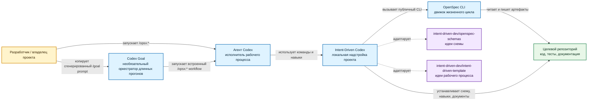
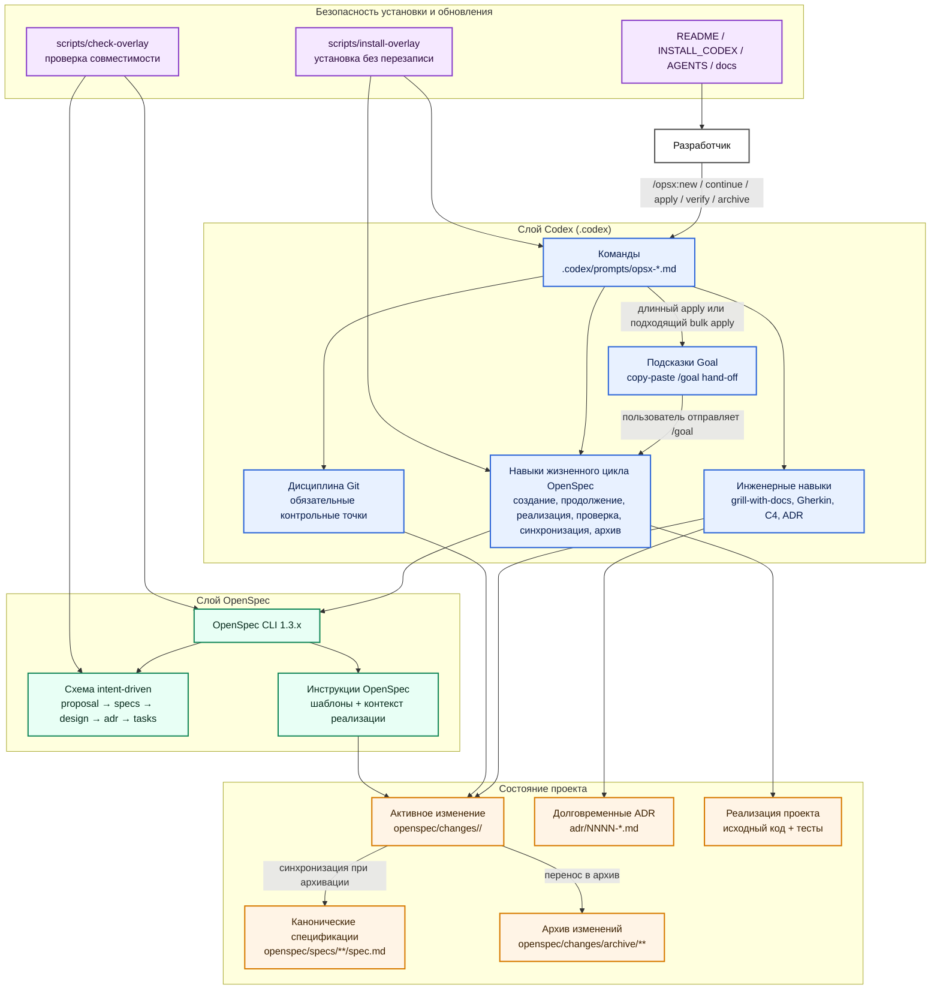

# Intent-Driven Codex

<p align="center">
  <strong>Надстройка Codex для разработки по намерениям в проектах OpenSpec.</strong>
</p>

<p align="center">
  <a href="README.md">English</a> | <strong>Русский</strong>
</p>

<p align="center">
  
  <a href="LICENSE"></a>
  
  
  
</p>
<p align="center">
  
</p>

Intent-Driven Codex — это переиспользуемый шаблон, который переносит разработку
по намерениям в Codex и при этом оставляет OpenSpec движком жизненного цикла и
основным источником истины.

Проект объединяет идеи из
[`intent-driven-dev/openspec-schemas`](https://github.com/intent-driven-dev/openspec-schemas)
и
[`intent-driven-dev/intent-driven-template`](https://github.com/intent-driven-dev/intent-driven-template),
а затем адаптирует их под Codex: добавляет команды `.codex/prompts`, навыки
`.codex/skills`, локальную схему OpenSpec, правила архитектурных решений,
поддержку C4-диаграмм, сценарии в стиле Gherkin, обязательные контрольные точки
Git и проверку совместимости надстройки.

OpenSpec остается движком. Codex выполняет рабочий процесс.

## Главное

- Локальная схема OpenSpec: `intent-driven`.
- Жизненный цикл: `proposal -> specs -> design -> adr -> tasks -> apply -> verify -> archive`.
- Команды Codex `/opsx:*` для полного рабочего процесса OpenSpec.
- `grill-with-docs` для контекстной проверки предложения и проектного решения.
- Сценарии в стиле Gherkin внутри Markdown-спецификаций OpenSpec.
- C4-диаграммы для нетривиальных архитектурных границ.
- Проверка архитектурных решений в каждом изменении и долговременная история ADR.
- Обязательные контрольные точки Git после артефактов и групп реализации.
- Необязательные hand-off prompts Codex Goal для длинных `/opsx:apply` и подходящих `/opsx:bulk-apply`.
- Безопасная установка в новые и существующие проекты без тихой перезаписи файлов.
- Проверка совместимости после обновлений OpenSpec или самой надстройки.
- Опубликованные канонические спецификации OpenSpec, описывающие поведение шаблона.

## Текущее состояние репозитория

Начальное изменение реализации и изменение с подсказками Codex Goal уже
заархивированы. В репозитории есть канонические спецификации OpenSpec для
базовой надстройки и goal-guided apply/bulk-apply, а также одно принятое
проектное ADR.

| Область | Состояние |
| --- | --- |
| Активные изменения OpenSpec | нет (`openspec list --json`) |
| Схема по умолчанию | `intent-driven` из `openspec/config.yaml` |
| Локальная схема проекта | `openspec/schemas/intent-driven/` |
| Канонические спецификации | `openspec/specs/**/spec.md` |
| Архив изменений | `openspec/changes/archive/2026-05-24-implement-intent-driven-codex-template/`, `openspec/changes/archive/2026-05-24-add-codex-goal-guidance/` |
| Спецификации Goal guidance | `openspec/specs/codex-opsx-workflow/spec.md`, `openspec/specs/template-installation/spec.md` |
| Долговременное ADR проекта | `adr/0001-adopt-codex-native-intent-driven-openspec-overlay.md` |
| Проверка совместимости | `scripts/check-overlay` |
| Установщик | `scripts/install-overlay` |

## Архитектура

### C4: контекст системы



### C4: контейнеры и функциональность



## Схема OpenSpec

В `openspec/config.yaml` выбрана локальная схема проекта:

```yaml
schema: intent-driven
```

Граф артефактов:

| Артефакт | Путь внутри изменения | Зависит от | Назначение |
| --- | --- | --- | --- |
| `proposal` | `proposal.md` | — | Намерение, ценность, область изменения, возможности и влияние. |
| `specs` | `specs/**/spec.md` | `proposal` | Наблюдаемое поведение как изменения требований OpenSpec и сценарии. |
| `design` | `design.md` | `proposal`, `specs` | Технический подход, архитектурные границы, риски и компромиссы. |
| `adr` | `adr.md` | `design` | Проверка архитектурных решений для конкретного изменения. |
| `tasks` | `tasks.md` | `specs`, `design`, `adr` | Упорядоченный список задач реализации. |

Реализация начинается только после завершения `tasks` и фиксации состояния
планирования в Git.

## Команды

Файлы команд находятся в `.codex/prompts`.

| Команда | Назначение |
| --- | --- |
| `/opsx:explore` | Исследовать идею, проблему или участок кода без реализации. |
| `/opsx:new` | Создать новое изменение OpenSpec и показать инструкции первого артефакта. |
| `/opsx:continue` | Создать ровно один следующий готовый артефакт существующего изменения. |
| `/opsx:propose` | Быстро подготовить артефакты планирования, если пользователь явно выбрал быстрый путь. |
| `/opsx:ff` | Быстро провести подготовку артефактов с видимыми контрольными точками. |
| `/opsx:apply` | Реализовать ожидающие задачи по контексту OpenSpec; для длинных или рискованных прогонов может сначала напечатать copy-paste prompt `/goal` и остановиться до правок. |
| `/opsx:verify` | Проверить реализацию по спецификациям, проектному решению, ADR и задачам. |
| `/opsx:sync` | Синхронизировать изменения спецификаций без архивации. |
| `/opsx:archive` | Архивировать проверенное и встроенное изменение. |
| `/opsx:check-overlay` | Проверить совместимость надстройки. |
| `/opsx:bulk-apply` | Реализовать несколько независимых изменений в изолированных потоках; для подходящих multi-change прогонов может сначала напечатать родительский `/goal` до worktree/subagents. |
| `/opsx:bulk-archive` | Архивировать несколько завершенных изменений после проверки конфликтов. |

## Подсказки Codex Goal

OpenSpec остается источником истины даже тогда, когда исполнением управляет
Codex Goal. Goal guidance — это только оркестрационный hand-off для длинной или
рискованной реализации; он не заменяет `proposal.md`, спецификации, `design.md`,
`adr.md`, `tasks.md`, проверку или согласование контрольных точек Git.

### Когда появляется prompt `/goal`

| Workflow | Создает `/goal`, когда | Пропускает Goal guidance, когда |
| --- | --- | --- |
| `/opsx:apply <change>` | Изменение готово к apply и в нем 3+ pending tasks, важные ограничения design/ADR, несколько checkpoint boundaries, внешние зависимости, generated assets, migrations или долгая verification. | Прогон уже находится внутри active Codex Goal для того же change, пользователь просит no goal, либо работа мала и локальна. |
| `/opsx:bulk-apply <changes...>` | После проверок готовности осталось два или более executable changes. | Осталось меньше двух executable changes, прогон уже goal-guided, либо пользователь просит no goal. |

Prompt печатается после того, как известна готовность OpenSpec, и до первого
побочного эффекта реализации: до редактирования файлов при apply и до создания
worktree или запуска subagents при bulk apply.

### Как этим пользоваться

1. Запустите `/opsx:apply <change>` или `/opsx:bulk-apply <changes...>` как обычно.
2. Если Codex напечатал сгенерированный prompt `/goal`, скопируйте его целиком и
   отправьте следующим сообщением, когда хотите передать прогон под управление Codex Goal.
3. Сгенерированный Goal сначала пытается выполнить буквальный workflow `/opsx:*`.
   Если runtime не исполняет вложенные slash-команды буквально, он использует
   fallback skill `openspec-apply-change` или `openspec-bulk-apply-change` с той
   же целью.
4. Goal считается завершенным только после apply, verify, итогового отчета и
   показа checkpoint boundaries.
5. Archive, merge, push, staging/commit, destructive Git actions и необратимые
   операции по-прежнему требуют отдельного явного approval.

### Пример сгенерированного apply goal

```text
/goal Реализуй Intent-Driven OpenSpec change add-example-guidance в текущем проекте до состояния verify-ready.

Первое действие: запусти workflow `/opsx:apply add-example-guidance`. Если вложенная slash-команда не исполняется буквально, используй workflow/skill `openspec-apply-change` для этого change.

Критерии завершения: все применимые pending tasks выполнены и отмечены только после проверки; `/opsx:verify add-example-guidance` завершен без critical issues; итоговый отчет перечисляет выполненные задачи, измененные файлы, статус проверки и нерешенные предупреждения; необходимые checkpoint boundaries показаны пользователю.

Остановись без завершения goal, если planning artifacts грязные, OpenSpec state blocked/all-done, отсутствуют credentials/secrets, недоступен внешний сервис, проверки падают по причинам вне контроля Codex, артефакты противоречат друг другу, требуется design/spec/ADR decision, либо нужен archive/merge/push/destructive Git action или другое действие с отдельным approval.
```

### Пример сгенерированного bulk goal

```text
/goal Проведи Intent-Driven OpenSpec bulk apply для изменений add-a, add-b в текущем проекте.

Первое действие: запусти workflow `/opsx:bulk-apply add-a add-b`. Если вложенная slash-команда не исполняется буквально, используй workflow/skill `openspec-bulk-apply-change` с теми же изменениями.

Критерии завершения: у каждого выполненного change есть isolated worktree, apply result, `/opsx:verify <change>` result, changed-files summary, blocker summary и normalized parent report; skipped/paused/failed changes имеют причины; parent report перечисляет worktree paths, changed files, blockers и verify status.

Остановись без завершения goal, если осталось меньше двух executable changes, planning-artifact gate не пройден, OpenSpec state blocked/all-done, worktree creation failed, subagent dispatch failed, credentials/secrets или external services недоступны, checks fail вне контроля Codex, есть artifact contradictions, требуется design/spec/ADR decision, возник merge/worktree conflict, либо нужен archive/merge/push/destructive Git action или другое действие с отдельным approval.
```

### Stop conditions и ответственность

Сгенерированный Goal должен остановиться без завершения и сообщить blocker,
affected change(s), trusted state, files changed so far и recommended next user
action, если встречает dirty planning artifacts, blocked OpenSpec state,
отсутствующие credentials/secrets, недоступные services, external check failures,
artifact contradictions, необходимость design/spec/ADR decisions,
worktree/subagent failures, merge/worktree conflicts или любое действие, которому
нужно отдельное approval.

## Навыки

Навыки находятся в `.codex/skills`. Они не заменяют OpenSpec, а помогают Codex
последовательно выполнять рабочий процесс OpenSpec.

### Навыки жизненного цикла

- `openspec-new-change` — начинает новое изменение.
- `openspec-continue-change` — создает следующий готовый артефакт.
- `openspec-propose` — готовит все артефакты планирования быстрым путем.
- `openspec-ff-change` — ускоряет подготовку артефактов планирования.
- `openspec-apply-change` — реализует задачи из изменения OpenSpec.
- `openspec-verify-change` — проверяет реализацию по артефактам изменения.
- `openspec-sync-specs` — переносит изменения в канонические спецификации.
- `openspec-archive-change` — архивирует завершенное изменение.
- `openspec-bulk-apply-change` — реализует несколько независимых изменений.
- `openspec-bulk-archive-change` — архивирует несколько завершенных изменений.
- `openspec-check-overlay` — проверяет совместимость надстройки.
- `openspec-onboard` — знакомит с рабочим процессом на реальной задаче.
- `openspec-explore` — помогает исследовать задачу до реализации.

### Навыки качества и дисциплины

- `grill-with-docs` — проверяет предложение и проектное решение по контексту
  проекта, артефактам OpenSpec, ADR, документации и релевантному коду.
- `gherkin-authoring` — улучшает сценарии и критерии приемки, сохраняя
  Markdown-спецификации OpenSpec источником истины.
- `c4-diagrams` — описывает архитектурные границы, зоны ответственности,
  зависимости и потоки данных.
- `architectural-decision-records` — фиксирует долговременные архитектурные
  решения и историю их замены.
- `openspec-git-discipline` — удерживает контрольные точки вокруг жизненного
  цикла OpenSpec.

`grill-with-docs` намеренно заменяет проверку без документов. Он сначала читает
проект и задает только те вопросы, на которые нельзя ответить по доступному
контексту.

## Модель ADR

Intent-Driven Codex использует двойную модель ADR:

| Тип ADR | Расположение | Назначение |
| --- | --- | --- |
| Проверка ADR для изменения | `openspec/changes/<change>/adr.md` | Обязательный этап для каждого изменения в схеме `intent-driven`. |
| Долговременное ADR проекта | `adr/NNNN-kebab-title.md` | История архитектурных решений, действующая после архивации изменений. |

Текущее действующее ADR проекта:

```text
adr/0001-adopt-codex-native-intent-driven-openspec-overlay.md
```

Правила:

- принятые долговременные ADR не переписываются;
- изменившиеся решения заменяются новыми ADR со ссылкой на прежние;
- этапы реализации, задач и проверки читают `adr/*.md` вместе с контекстом
  OpenSpec;
- проекты, которые устанавливают этот шаблон, создают собственные ADR для своих
  архитектурных решений.

## Дисциплина Git

Каждое изменение состояния жизненного цикла OpenSpec является контрольной
точкой.

| Граница | Обязательное поведение |
| --- | --- |
| Создание изменения | Показать `git status --short`; зафиксировать состояние до зависимых артефактов. |
| Каждый артефакт планирования | Зафиксировать состояние до того, как следующий артефакт начнет от него зависеть. |
| Группа задач реализации | Зафиксировать состояние после целостной и проверенной работы. |
| Проверка | Закоммитить изменения проверки, если она изменила файлы. |
| Архивация | Закоммитить перенос в архив и синхронизацию канонических спецификаций. |

Codex не должен выполнять `git add`, `git commit`, слияние, публикацию или
архивацию без явного согласия пользователя. Одноразовое исключение должно
указать пропускаемый барьер, доверенное грязное состояние, принятый риск и
следующую контрольную точку.

## Установка

### Новый проект

```bash
cd /path/to/new-project
openspec init . --tools codex --profile core

/path/to/intent-driven-codex/scripts/install-overlay /path/to/new-project

cd /path/to/new-project
openspec schema validate intent-driven
scripts/check-overlay
```

### Существующий проект

Сначала изучите текущее состояние проекта:

```bash
git status --short
find openspec -maxdepth 3 -type f 2>/dev/null | sort
find .codex -maxdepth 3 -type f 2>/dev/null | sort
find adr -maxdepth 2 -type f 2>/dev/null | sort
```

Затем установите надстройку:

```bash
/path/to/intent-driven-codex/scripts/install-overlay /path/to/brownfield-project
```

По умолчанию установщик ничего не перезаписывает. Он сохраняет существующие
активные изменения, канонические спецификации, историю ADR, настройки `.codex`,
исходный код, тесты и проектную документацию, если пользователь явно не решил
иначе.

Подробная инструкция: [`INSTALL_CODEX.md`](INSTALL_CODEX.md).

## Структура репозитория

```text
.codex/
  prompts/                         команды Codex /opsx:*
  skills/                          навыки жизненного цикла и качества
adr/
  README.md                        правила и указатель ADR
  0001-*.md                        архитектурное решение проекта
openspec/
  config.yaml                      выбирает schema: intent-driven
  schemas/intent-driven/           локальная схема и шаблоны
  specs/                           канонические спецификации после архивации
  changes/archive/                 архивированные изменения реализации
docs/
  lifecycle.md                     краткая справка по жизненному циклу
  update-safety.md                 границы безопасного обновления OpenSpec
scripts/
  check-overlay                    проверка совместимости
  install-overlay                  безопасная установка без перезаписи
README.md                          основной README на английском
README.ru.md                       русский перевод
VERSION                            версия выпуска
LICENSE                            лицензия MIT
```

## Проверка

Выполняйте эти проверки после установки или перед публикацией выпуска:

```bash
openspec schemas --json
openspec validate --all --strict
openspec schema validate intent-driven
scripts/check-overlay
```

Ожидаемый результат:

- `intent-driven` указан как локальная схема проекта;
- все канонические спецификации проходят строгую проверку;
- схема успешно проверяется;
- проверка совместимости создает, проверяет и удаляет временное изменение
  `zz-smoke-intent-overlay-*`.
- требования goal guidance остаются в канонических спецификациях и описаны в
  обоих README.

## Версия

Текущий выпуск: `v0.1.0`.

## Лицензия

MIT. См. [`LICENSE`](LICENSE).
