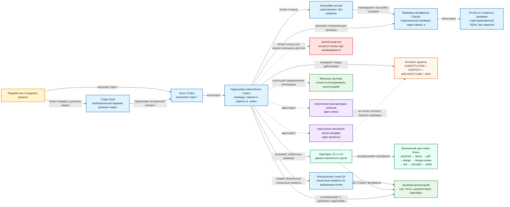

# Intent-Driven Codex

<p align="center">
  <strong>Надстройка Codex для разработки по намерениям в проектах OpenSpec.</strong>
</p>

<p align="center">
  <a href="README.md">English</a> | <strong>Русский</strong>
</p>

<p align="center">
  
  <a href="LICENSE"></a>
  
  
  
</p>
<p align="center">
  
</p>

Intent-Driven Codex — это переиспользуемый шаблон, который переносит разработку
по намерениям в Codex и при этом оставляет OpenSpec движком жизненного цикла и
основным источником истины.

Проект объединяет идеи из
[`intent-driven-dev/openspec-schemas`](https://github.com/intent-driven-dev/openspec-schemas)
и
[`intent-driven-dev/intent-driven-template`](https://github.com/intent-driven-dev/intent-driven-template),
а затем адаптирует их под Codex: добавляет команды в `.codex/prompts`, навыки
в `.codex/skills`, локальную схему OpenSpec, правила архитектурных решений,
этапы Matt grill с глоссарием, обязательные вертикальные срезы Matt TDD, поддержку
архитектурных диаграмм, сценарии в стиле Gherkin, обязательные контрольные
точки Git и проверку совместимости надстройки.

OpenSpec остается движком. Codex выполняет рабочий процесс.

## Главное

- Локальная схема OpenSpec: `intent-driven`.
- Жизненный цикл: `proposal -> specs -> grill -> design -> design-review -> adr -> test-plan -> tasks -> apply -> verify -> archive`.
- Команды Codex `/opsx:*` для полного рабочего процесса OpenSpec.
- Корневой `CONSTITUTION.md` для постоянных правил проекта, которые Codex читает перед `/opsx:*`.
- Корневой `ARCHITECTURE.md` как текущий снимок архитектуры для новых чатов.
- Корневой `CONTEXT.md` как глоссарий и язык предметной области для grill/TDD flows.
- Локальный `.secrets.local.env` для доступов к внешним системам без попадания секретов в Git.
- Обязательные этапы `grill.md` и `design-review.md` на основе полного Matt `grill-with-docs`.
- Сценарии в стиле Gherkin внутри Markdown-спецификаций OpenSpec.
- Легковесные архитектурные диаграммы для нетривиальных границ и интеграций.
- Обязательный gate `test-plan.md` для Matt TDD с вертикальными циклами RED/GREEN/REFACTOR.
- Опциональная проверка артефактов через Claude Code: `scripts/openspec-claude-review` и `.codex/openspec-claude-review.json` с настройкой модели и уровня усилий по этапам, опциональными лимитами бюджета и структурированными отчетами.
- Проверка архитектурных решений в каждом изменении и долговременная история ADR.
- Обязательные контрольные точки Git после артефактов и групп реализации.
- Необязательные готовые подсказки для передачи в Codex Goal для длинных `/opsx:apply` и подходящих `/opsx:bulk-apply`.
- Безопасная установка в новые и существующие проекты без тихой перезаписи файлов.
- Проверка совместимости после обновлений OpenSpec или самой надстройки.
- Опубликованные канонические спецификации OpenSpec, описывающие поведение шаблона.

## Текущее состояние разработки

`v0.1.5` включает усиленный жизненный цикл с Matt `grill-with-docs` и `tdd`, настройки Claude/session/checkpoint, а также hardening auto-repair tooling для OpenSpec 1.4.0, заархивированный 2026-06-02:

- корневой `CONSTITUTION.md` для обязательных правил проекта, которые Codex читает перед `/opsx:*`;
- корневой `ARCHITECTURE.md` для текущей архитектуры и ссылок на действующие ADR;
- корневой `CONTEXT.md` для глоссария и языка предметной области;
- общий навык `project-constitution` для команд `/opsx:*` и навыков жизненного цикла OpenSpec;
- строгую обработку отсутствующей конституции с bootstrap-safe и диагностическими исключениями;
- остановку при конфликте правил конституции с запросом пользователя или артефактами OpenSpec;
- локальный `.secrets.local.env` для доступов к внешним системам и `.secrets.example.env` только с пустыми заполнителями в Git;
- документ-связку `openspec/README.md`, который объясняет, какой контекст живет вне артефактов изменений OpenSpec;
- модель снимка архитектуры на основе ADR 0003: `ARCHITECTURE.md` хранит текущее состояние, а `adr/` — долговременную историю решений;
- обязательные артефакты `grill.md`, `design-review.md` и `test-plan.md` в жизненном цикле `intent-driven`;
- `/opsx:continue`, `/opsx:ff`, `/opsx:apply`, `/opsx:verify` и проверки надстройки, связанные с автоматическими этапами grill и обязательными доказательствами TDD;
- поддержку установки в новый проект с заменой созданных OpenSpec файлов надстройки через `scripts/install-overlay --force-overlay`;
- исходные `bin/opsx`, `bin/openspec-shim` и `manifest.yaml` для auto-repair установки;
- regression-проверки безопасности same-root install, help/version no-op в shim, source-vs-installed doc aliases и stale real OpenSpec paths.

## Текущее состояние репозитория

Начальное изменение реализации, подсказки Codex Goal, поддержка конституции
проекта, формализация архитектуры project context, усиление Matt grill/TDD,
проверка артефактов через Claude, автоматические контрольные точки, настройки сессии и отчетность
по стоимости проверки Claude, исправления по validation report и hardening auto-repair tooling для OpenSpec 1.4.0 уже заархивированы. В репозитории есть канонические
спецификации OpenSpec для базовой надстройки, управляется Codex Goal apply/bulk-apply,
постоянного контекста проекта, текущего набора проектных ADR, усиленных Matt
этапов grill/TDD, опциональной проверки Claude и автоматических безопасных
контрольных точек/настроек сессии.

Активные изменения OpenSpec — временное состояние разработки. Для актуального
списка используйте `openspec list --json`; выпущенное состояние шаблона после
архивации текущего изменения не должно иметь активных изменений.

| Область | Состояние |
| --- | --- |
| Активные изменения OpenSpec | Актуальный список из `openspec list --json`; выпущенное состояние: активных изменений нет. |
| Схема по умолчанию | `intent-driven` из `openspec/config.yaml` |
| Локальная схема проекта | `openspec/schemas/intent-driven/` |
| Канонические спецификации | `openspec/specs/**/spec.md` |
| Архив изменений | `openspec/changes/archive/2026-05-24-implement-intent-driven-codex-template/`<br>`openspec/changes/archive/2026-05-24-add-codex-goal-guidance/`<br>`openspec/changes/archive/2026-05-25-add-project-constitution/`<br>`openspec/changes/archive/2026-05-26-formalize-project-context-architecture/`<br>`openspec/changes/archive/2026-05-28-add-mandatory-review-and-tdd-gates/`<br>`openspec/changes/archive/2026-05-28-harden-mandatory-grill-and-tdd-gates/`<br>`openspec/changes/archive/2026-05-30-add-claude-artifact-review/`<br>`openspec/changes/archive/2026-05-30-add-default-git-automation-and-claude-session-controls/`<br>`openspec/changes/archive/2026-05-30-add-claude-review-cost-summary/`<br>`openspec/changes/archive/2026-05-30-fix-validation-report-findings/`<br>`openspec/changes/archive/2026-06-02-harden-openspec-140-tooling/` |
| Спецификации подсказок Codex Goal | `openspec/specs/codex-opsx-workflow/spec.md`, `openspec/specs/template-installation/spec.md` |
| Контекст проекта | `CONSTITUTION.md`, `CONTEXT.md`, `ARCHITECTURE.md`, `openspec/README.md`, `.secrets.example.env`, `.codex/skills/project-constitution/SKILL.md` |
| Долговременные ADR проекта | `adr/0001-adopt-codex-native-intent-driven-openspec-overlay.md`, `adr/0003-formalize-project-context-entrypoints.md`, `adr/0005-adopt-matt-grill-and-tdd-gates.md`, `adr/0006-adopt-claude-artifact-review.md`, `adr/0007-adopt-automatic-checkpoints-and-claude-session-controls.md` (ADR 0002 и ADR 0004 заменены) |
| Проверка совместимости | `scripts/check-overlay` |
| Установщик | `scripts/install-overlay` |

## Архитектура

### Контекст системы



### Контейнеры и функциональность

```mermaid
flowchart TB
  User["Разработчик"]

  subgraph CodexLayer["Слой Codex (.codex)"]
    Prompts["Команды /opsx:*
new, continue, ff, apply, verify, archive
и управление проверкой Claude"]
    ConstitutionSkill["Навык project-constitution
обязательная предварительная проверка"]
    GrillGates["Этапы grill и design-review
grill-with-docs"]
    TDDGate["План тестирования
вертикальные срезы Matt TDD"]
    LifecycleSkills["Навыки жизненного цикла OpenSpec
переходы состояния и инструкции"]
    GoalGuidance["Подсказка для Codex Goal
готовый /goal для длинных задач"]
    GitSkill["Git-дисциплина
границы контрольных точек"]
    GitCheckpoint["scripts/openspec-git-checkpoint
локальные коммиты по выбранным путям"]
    ClaudeControls["scripts/openspec-session-state
настройки проверки Claude для сессии"]
    ClaudeReview["scripts/openspec-claude-review
опциональная структурированная проверка"]
  end

  subgraph ProjectContext["Постоянный контекст проекта"]
    Constitution["CONSTITUTION.md
правила проекта, MCP, документация, проверки"]
    Architecture["ARCHITECTURE.md
текущий снимок архитектуры"]
    ContextDoc["CONTEXT.md
только глоссарий"]
    ADRs["adr/
долговременная история решений"]
    SecretsExample[".secrets.example.env
только имена переменных"]
    LocalSecrets[".secrets.local.env
локальные значения вне Git"]
  end

  subgraph OpenSpecLayer["Слой OpenSpec"]
    CLI["OpenSpec CLI 1.4.0"]
    Schema["Схема intent-driven
proposal → specs → grill → design → design-review → adr → test-plan → tasks"]
    Templates["Шаблоны артефактов
включая grill.md, design-review.md и test-plan.md"]
    ApplyContext["Контекст реализации
все завершенные артефакты планирования"]
  end

  subgraph ProjectState["Состояние проекта"]
    Change["openspec/changes/<change>
proposal/specs/grill/design/design-review/adr/test-plan/tasks"]
    Reviews["openspec/changes/<change>/reviews
отчеты Claude с возможной стоимостью"]
    SessionState[".codex/session/openspec-session.json
локальное состояние сессии вне Git"]
    CanonicalSpecs["openspec/specs/**/spec.md
каноническое поведение"]
    Archive["openspec/changes/archive/**
история закрытых изменений"]
    Code["реализация
исходный код, тесты, документация"]
  end

  subgraph Safety["Безопасность установки и обновления"]
    Installer["scripts/install-overlay
бережно для существующих проектов, --force-overlay для новых"]
    Checker["scripts/check-overlay
жизненный цикл, дрейф документации, бюджет и стоимость"]
    Docs["README / INSTALL_CODEX / AGENTS / docs"]
  end

  User -->|"запускает процесс"| Prompts
  Prompts --> ConstitutionSkill
  LifecycleSkills --> ConstitutionSkill
  ConstitutionSkill --> Constitution
  ConstitutionSkill --> Architecture
  ConstitutionSkill --> ContextDoc
  ConstitutionSkill --> ADRs
  ConstitutionSkill -. "только имена переменных" .-> SecretsExample
  ConstitutionSkill -. "читать только когда нужно" .-> LocalSecrets
  Prompts --> LifecycleSkills
  Prompts --> GrillGates
  Prompts --> TDDGate
  Prompts --> GitSkill
  Prompts --> ClaudeControls
  Prompts -->|"длинная или рискованная реализация"| GoalGuidance
  GoalGuidance --> LifecycleSkills
  GitSkill --> GitCheckpoint
  GitCheckpoint --> Change
  ClaudeControls --> SessionState
  ClaudeControls --> ClaudeReview
  ClaudeReview --> Reviews
  GrillGates --> Change
  TDDGate --> Change
  LifecycleSkills --> CLI
  CLI --> Schema
  Schema --> Templates
  Templates --> Change
  CLI --> ApplyContext
  ApplyContext --> Code
  CLI --> CanonicalSpecs
  CLI --> Archive
  Checker --> Constitution
  Checker --> CLI
  Checker --> Schema
  Checker --> ApplyContext
  Checker --> Docs
  Checker --> ClaudeReview
  Installer --> Prompts
  Installer --> LifecycleSkills
  Installer --> Constitution
  Docs --> User

  classDef actor fill:#ffffff,stroke:#555,color:#111,stroke-width:2px;
  classDef codex fill:#e8f1ff,stroke:#2f67d8,color:#061b4a,stroke-width:2px;
  classDef rules fill:#fff7ed,stroke:#ea580c,color:#431407,stroke-width:2px;
  classDef secret fill:#fee2e2,stroke:#dc2626,color:#450a0a,stroke-width:2px;
  classDef openspec fill:#e8fff5,stroke:#16885a,color:#06291b,stroke-width:2px;
  classDef state fill:#fff4e6,stroke:#d77a00,color:#3b2000,stroke-width:2px;
  classDef safety fill:#f5e8ff,stroke:#8b42c9,color:#2a083d,stroke-width:2px;
  class User actor;
  class Prompts,ConstitutionSkill,GrillGates,TDDGate,LifecycleSkills,GoalGuidance,GitSkill,GitCheckpoint,ClaudeControls,ClaudeReview codex;
  class Constitution,ContextDoc,Architecture,ADRs,SecretsExample rules;
  class LocalSecrets secret;
  class CLI,Schema,Templates,ApplyContext openspec;
  class Change,Reviews,SessionState,CanonicalSpecs,Archive,Code state;
  class Installer,Checker,Docs safety;
```



## Схема OpenSpec

В `openspec/config.yaml` выбрана локальная схема проекта:

```yaml
schema: intent-driven
```

Граф артефактов:

| Артефакт | Путь внутри изменения | Зависит от | Назначение |
| --- | --- | --- | --- |
| `proposal` | `proposal.md` | — | Намерение, ценность, область изменения, возможности и влияние. |
| `specs` | `specs/**/spec.md` | `proposal` | Наблюдаемое поведение как изменения требований OpenSpec и сценарии. |
| `grill` | `grill.md` | `proposal`, `specs` | Обязательный этап Matt `grill-with-docs` перед проектированием. |
| `design` | `design.md` | `proposal`, `specs`, `grill` | Технический подход, архитектурные границы, риски и компромиссы. |
| `design-review` | `design-review.md` | `design` | Обязательный этап Matt `grill-with-docs` после проектирования. |
| `adr` | `adr.md` | `design-review` | Проверка ADR для изменения с учетом выводов этапов grill. |
| `test-plan` | `test-plan.md` | `adr` | План вертикальных Matt TDD slices до задач реализации. |
| `tasks` | `tasks.md` | `specs`, `grill`, `design`, `design-review`, `adr`, `test-plan` | Упорядоченный список задач реализации. |

Реализация начинается только после завершения `grill`, `design-review`, `adr`, `test-plan` и `tasks` и фиксации состояния
планирования в Git.

## Команды

Файлы команд находятся в `.codex/prompts`.

| Команда | Назначение |
| --- | --- |
| `/opsx:explore` | Исследовать идею, проблему или участок кода без реализации. |
| `/opsx:new` | Создать новое изменение OpenSpec и показать инструкции первого артефакта. |
| `/opsx:continue` | Создать ровно один следующий готовый артефакт существующего изменения. |
| `/opsx:propose` | Быстро подготовить артефакты планирования, если пользователь явно выбрал быстрый путь. |
| `/opsx:ff` | Быстро провести подготовку артефактов с видимыми контрольными точками. |
| `/opsx:apply` | Реализовать ожидающие задачи по контексту OpenSpec; для длинных или рискованных прогонов может сначала напечатать готовую подсказку `/goal` и остановиться до правок. |
| `/opsx:verify` | Проверить реализацию по спецификациям, проектному решению, ADR и задачам. |
| `/opsx:sync` | Синхронизировать изменения спецификаций без архивации. |
| `/opsx:archive` | Архивировать проверенное и встроенное изменение. |
| `/opsx:check-overlay` | Проверить совместимость надстройки. |
| `/opsx:claude-review-status` | Показать эффективные настройки проверки Claude для сессии и глобальные значения по умолчанию. |
| `/opsx:claude-review-on` | Включить проверку Claude в текущих локальных настройках сессии без секретов. |
| `/opsx:claude-review-off` | Отключить проверку Claude для текущей сессии. |
| `/opsx:claude-review-reset` | Очистить переопределения проверки Claude для сессии, чтобы снова применялись глобальные значения по умолчанию. |
| `/opsx:claude-review-set` | Задать модель, уровень усилий, бюджет или блокирующее поведение проверки Claude для этапа в настройках сессии. |
| `/opsx:bulk-apply` | Реализовать несколько независимых изменений в изолированных потоках; для подходящих multi-change прогонов может сначала напечатать родительский `/goal` до worktree/subagents. |
| `/opsx:bulk-archive` | Архивировать несколько завершенных изменений после проверки конфликтов. |

## Опциональная проверка артефактов через Claude

Проект может включить дополнительную проверку на базе Claude Code для выбранных этапов OpenSpec, отредактировав `.codex/openspec-claude-review.json`. Конфигурация безопасна по умолчанию: глобальный `enabled` равен `false`, поэтому новым установкам не нужна авторизация Claude, пока проект явно не включит проверку. Лимиты бюджета тоже отключены по умолчанию (`maxBudgetUsd: null`), потому что расходы Claude Code на запуск и кэш могут исчерпать маленький лимит до получения полезной проверки.

Когда этап включен, Codex вызывает `scripts/openspec-claude-review --change <change> --stage <artifact>` после генерации артефакта. Скрипт передает в `claude -p` ограниченный набор данных без секретов, просит структурированный JSON-ответ и пишет вспомогательные отчеты в `openspec/changes/<change>/reviews/`. Эти отчеты помогают следующим этапам и проверке, но не заменяют проверку OpenSpec, `grill.md`, `design-review.md`, проверку ADR, `test-plan.md` или доказательства TDD.

Для воспроизводимости используйте полные идентификаторы моделей вроде `claude-sonnet-4-6` или `claude-opus-4-8`. Плавающие псевдонимы `sonnet`, `opus`, `haiku` поддерживаются, когда проект явно хочет использовать текущие значения провайдера по умолчанию. Сбалансированные настройки используют Sonnet для обычных проверок и Opus с высоким уровнем усилий для `design-review`, `adr` и `verify`; лимиты бюджета и `xhigh`/`max` должны включаться явно для дорогих проверок.

Если явно заданный лимит бюджета исчерпан, Claude Code возвращает ошибку бюджета. Скрипт считает это блокирующим результатом, сообщает об исчерпанном бюджете и автоматически отключает проверку Claude для текущей сессии. Перед повтором нужно поднять или снять лимит и явно включить проверку снова.

## Управление проверкой Claude в сессии

Используйте `/opsx:claude-review-status`, `/opsx:claude-review-on`, `/opsx:claude-review-off`, `/opsx:claude-review-reset` и `/opsx:claude-review-set` для локальных настроек проверки Claude без секретов в одной Codex/OpenSpec-сессии. Настройки живут в игнорируемой `.codex/session/` и накладываются поверх `.codex/openspec-claude-review.json`; они не хранят учетных данных и не заменяют обязательные этапы OpenSpec, grill, ADR, TDD и проверки. Задайте `budget=none` / `maxBudgetUsd=none`, чтобы снять лимит бюджета сессии.


## Контекст проекта

`ARCHITECTURE.md` — текущий снимок архитектуры для новых чатов и архитектурно значимых работ. Он кратко описывает актуальное состояние и ссылается на действующие ADR. Долговременная мотивация остается в `adr/`, а `openspec/README.md` связывает файлы жизненного цикла OpenSpec с корневым контекстом проекта.

`CONSTITUTION.md` — постоянный источник правил проекта, хранящийся в Git,
который Codex читает перед действиями `/opsx:*`. Это **не** артефакт изменения
OpenSpec: файл не архивируется вместе с изменениями, и сам OpenSpec CLI его не
читает. За исполнение отвечает слой Codex: общий skill
`project-constitution`, короткие правила предварительной проверки в командах `/opsx:*` и
навыки жизненного цикла OpenSpec.

Используйте конституцию, чтобы зафиксировать контекст, который AI не должен
упускать:

| Секция constitution | Для чего Codex ее использует |
| --- | --- |
| Required Technologies | Обязательные языки, фреймворки, рантаймы, package managers, архитектурные правила и standards. |
| MCP Servers | Какой MCP server использовать для блока разработки и какие несекретные параметры допустимы. |
| Внешние системы | Системы без MCP, способ доступа и имена переменных для нужных учетных данных. |
| Обработка секретов | Граница между именами переменных в Git и локальными секретными значениями. |
| Источники документации | Проектная документация, официальная документация и правила поиска, которым Codex должен следовать. |
| Verification Rules | Проверки, которые Codex должен выполнить или явно описать как limitation. |
| Additional AI Instructions | Проектные ограничения, которые не должны теряться между чатами. |

### Поведение процесса

Когда конституция есть, Codex применяет релевантные правила перед planning,
apply, verify, sync, archive и групповые процессы. Так обязательные технологии, MCP,
правила документации и правила проверки остаются видимыми на всем жизненном цикле
OpenSpec. Для архитектурно значимых работ Codex также читает `ARCHITECTURE.md`, `adr/README.md` и релевантные действующие ADR.

Если конституция отсутствует, Codex сообщает об этом и предлагает создать файл
из шаблона. Без него можно продолжать только bootstrap-safe или диагностические
действия: exploration, создание конституции, запуск изменения для настройки конституции
или `/opsx:check-overlay`. Apply, verify, sync, archive и групповые процессы
останавливаются, пока конституция не появится или пользователь не даст явное
одноразовое исключение.

Если правила конституции конфликтуют с запросом пользователя или артефактами
OpenSpec, Codex останавливается до правок файлов и до вызовов внешних систем.
Дальше пользователь выбирает: изменить конституцию, изменить артефакт/задачу,
скорректировать запрос или дать одноразовое исключение.

### Локальные секреты

Нельзя записывать реальные логины, пароли, токены или приватные URL сервисов в
`CONSTITUTION.md`, артефакты OpenSpec, ADR, документацию, примеры, diff
или ответы в чате. Значения хранятся только в игнорируемом `.secrets.local.env`. В
файлах, хранящихся в Git допустимы только имена переменных и пустые placeholders,
например в `.secrets.example.env`.

Codex читает `.secrets.local.env` только когда текущему процессу действительно
нужна внешняя система, перечисленная в конституции. Если переменных не хватает,
Codex сообщает только имена отсутствующих переменных и останавливается до
внешнего вызова.

Пример записи в конституции проекта:

```text
External system: Customer OData
Required variables: CUSTOMER_ODATA_URL, CUSTOMER_ODATA_USERNAME, CUSTOMER_ODATA_PASSWORD
Values: stored locally in .secrets.local.env
```

Пример локального secret file:

```dotenv
CUSTOMER_ODATA_URL=
CUSTOMER_ODATA_USERNAME=
CUSTOMER_ODATA_PASSWORD=
```

Tracked example должен оставаться пустым или placeholder-only; реальные значения
заполняются только в игнорируемом локальном файле.

## Подсказки Codex Goal

OpenSpec остается источником истины даже тогда, когда исполнением управляет
Codex Goal. Подсказка Codex Goal — это только передача управления для длинной или
рискованной реализации; он не заменяет `proposal.md`, спецификации, `grill.md`, `design.md`, `design-review.md`,
`adr.md`, `test-plan.md`, `tasks.md`, проверку или согласование контрольных точек Git.

### Когда появляется prompt `/goal`

| Процесс | Создает `/goal`, когда | Пропускает подсказку Codex Goal, когда |
| --- | --- | --- |
| `/opsx:apply <change>` | Изменение готово к apply и в нем 3+ ожидающих задач, важные ограничения design/ADR, несколько границ контрольных точек, внешние зависимости, создаваемые артефакты, миграции или долгая проверка. | Прогон уже находится внутри активного Codex Goal для того же change, пользователь просит no goal, либо работа мала и локальна. |
| `/opsx:bulk-apply <changes...>` | После проверок готовности осталось два или более изменений, готовых к выполнению. | Осталось меньше двух изменений, готовых к выполнению, прогон уже управляется Codex Goal, либо пользователь просит no goal. |

Prompt печатается после того, как известна готовность OpenSpec, и до первого
побочного эффекта реализации: до редактирования файлов при apply и до создания
worktree или запуска subagents при bulk apply.

### Как этим пользоваться

1. Запустите `/opsx:apply <change>` или `/opsx:bulk-apply <changes...>` как обычно.
2. Если Codex напечатал сгенерированный prompt `/goal`, скопируйте его целиком и
   отправьте следующим сообщением, когда хотите передать прогон под управление Codex Goal.
3. Сгенерированный Goal сначала пытается выполнить буквальный процесс `/opsx:*`.
   Если runtime не исполняет вложенные slash-команды буквально, он использует
   fallback skill `openspec-apply-change` или `openspec-bulk-apply-change` с той
   же целью.
4. Goal считается завершенным только после apply, verify, итогового отчета и
   показа границ контрольных точек.
5. Archive, merge, push, staging/commit, разрушительное действие Gits и необратимые
   операции по-прежнему требуют отдельного явного подтверждение.

### Пример сгенерированного apply goal

```text
/goal Реализуй Intent-Driven OpenSpec change add-example-guidance в текущем проекте до состояния verify-ready.

Первое действие: запусти процесс `/opsx:apply add-example-guidance`. Если вложенная slash-команда не исполняется буквально, используй процесс/навык `openspec-apply-change` для этого изменения.

Критерии завершения: все применимые ожидающих задач выполнены и отмечены только после проверки; `/opsx:verify add-example-guidance` завершен без critical issues; итоговый отчет перечисляет выполненные задачи, измененные файлы, статус проверки и нерешенные предупреждения; необходимые границ контрольных точек показаны пользователю.

Остановись без завершения goal, если артефакты планирования грязные, состояние OpenSpec — blocked/all-done, отсутствуют учетных данных/secrets, недоступен внешний сервис, проверки падают по причинам вне контроля Codex, артефакты противоречат друг другу, требуется решение по design/spec/ADR, либо нужен archive/merge/push/разрушительное действие Git или другое действие с отдельным подтверждение.
```

### Пример сгенерированного bulk goal

```text
/goal Проведи Intent-Driven OpenSpec bulk apply для изменений add-a, add-b в текущем проекте.

Первое действие: запусти процесс `/opsx:bulk-apply add-a add-b`. Если вложенная slash-команда не исполняется буквально, используй процесс/навык `openspec-bulk-apply-change` с теми же изменениями.

Критерии завершения: у каждого выполненного change есть isolated worktree, apply result, `/opsx:verify <change>` result, changed-files summary, blocker summary и normalized parent report; skipped/paused/failed changes имеют причины; parent report перечисляет worktree paths, changed files, blockers и verify status.

Остановись без завершения goal, если осталось меньше двух изменений, готовых к выполнению, planning-artifact gate не пройден, состояние OpenSpec — blocked/all-done, создание worktree завершилось ошибкой, запуск subagent завершился ошибкой, учетных данных/secrets или внешние сервисы недоступны, проверки падают вне контроля Codex, есть противоречия в артефактах, требуется решение по design/spec/ADR, возник конфликт merge/worktree, либо нужен archive/merge/push/разрушительное действие Git или другое действие с отдельным подтверждение.
```

### Stop conditions и ответственность

Сгенерированный Goal должен остановиться без завершения и сообщить blocker,
affected change(s), trusted state, files changed so far и recommended next user
action, если встречает dirty артефакты планирования, блокирующее состояние OpenSpec,
отсутствующие учетных данных/secrets, недоступные services, ошибки внешних проверок,
противоречия в артефактах, необходимость решение по design/spec/ADRs,
worktree/subagent failures, конфликт merge/worktrees или любое действие, которому
нужно отдельное подтверждение.

## Навыки

Навыки находятся в `.codex/skills`. Они не заменяют OpenSpec, а помогают Codex
последовательно выполнять рабочий процесс OpenSpec.

### Навыки жизненного цикла

- `openspec-new-change` — начинает новое изменение.
- `openspec-continue-change` — создает следующий готовый артефакт.
- `openspec-propose` — готовит все артефакты планирования быстрым путем.
- `openspec-ff-change` — ускоряет подготовку артефактов планирования.
- `openspec-apply-change` — реализует задачи из изменения OpenSpec.
- `openspec-verify-change` — проверяет реализацию по артефактам изменения.
- `openspec-sync-specs` — переносит изменения в канонические спецификации.
- `openspec-archive-change` — архивирует завершенное изменение.
- `openspec-bulk-apply-change` — реализует несколько независимых изменений.
- `openspec-bulk-archive-change` — архивирует несколько завершенных изменений.
- `openspec-check-overlay` — проверяет совместимость надстройки.
- `openspec-onboard` — знакомит с рабочим процессом на реальной задаче.
- `openspec-explore` — помогает исследовать задачу до реализации.

### Навыки качества и дисциплины

- `grill-with-docs` — автоматически запускается для `grill.md` и `design-review.md`; сначала читает контекст проекта, задает по одному существенному вопросу и обновляет глоссарий, артефакты и кандидаты в ADR по мере фиксации решений.
- `gherkin-authoring` — улучшает сценарии и критерии приемки, сохраняя
  Markdown-спецификации OpenSpec источником истины.
- `c4-diagrams` — описывает архитектурные границы, зоны ответственности,
  зависимости и потоки данных.
- `architectural-decision-records` — фиксирует долговременные архитектурные
  решения и историю их замены.
- `tdd` — canonical Matt RED/GREEN/REFACTOR дисциплина для behavior-changing `/opsx:apply`.
- `openspec-git-discipline` — удерживает контрольные точки вокруг жизненного
  цикла OpenSpec.

`grill-with-docs` намеренно заменяет проверку без документов. Он сначала читает
проект, задает только вопросы, на которые нельзя ответить по доступному
контексту, и пропускает следующий gate только когда `Open Questions` = `None`
или есть явное одноразовое исключение.

## Модель ADR

Intent-Driven Codex использует двойную модель ADR:

| Тип ADR | Расположение | Назначение |
| --- | --- | --- |
| Grill-проверки изменения | `openspec/changes/<change>/grill.md` и `openspec/changes/<change>/design-review.md` | Обязательные этапы Matt `grill-with-docs` до и после проектирования. |
| Проверка ADR для изменения | `openspec/changes/<change>/adr.md` | Обязательный этап ADR с учетом выводов grill/design-review. |
| Test plan изменения | `openspec/changes/<change>/test-plan.md` | План вертикальных срезов Matt TDD до задач. |
| Долговременное ADR проекта | `adr/NNNN-kebab-title.md` | История архитектурных решений, действующая после архивации изменений. |

Текущие действующие ADR проекта:

```text
adr/0001-adopt-codex-native-intent-driven-openspec-overlay.md
adr/0003-formalize-project-context-entrypoints.md
adr/0005-adopt-matt-grill-and-tdd-gates.md
```

Правила:

- принятые долговременные ADR не переписываются;
- изменившиеся решения заменяются новыми ADR со ссылкой на прежние;
- этапы реализации, задач и проверки читают `adr/*.md` вместе с контекстом
  OpenSpec;
- проекты, которые устанавливают этот шаблон, создают собственные ADR для своих
  архитектурных решений.

## Дисциплина Git

Каждое изменение состояния жизненного цикла OpenSpec является контрольной
точкой.

| Граница | Обязательное поведение |
| --- | --- |
| Создание изменения | Показать `git status --short`; зафиксировать состояние до зависимых артефактов. |
| Каждый артефакт планирования | Зафиксировать состояние до того, как следующий артефакт начнет от него зависеть. |
| Группа задач реализации | Зафиксировать состояние после целостной и проверенной работы. |
| Проверка | Закоммитить изменения проверки, если она изменила файлы. |
| Архивация | Закоммитить перенос в архив и синхронизацию канонических спецификаций. |

Безопасные коммиты контрольных точек жизненного цикла выполняются автоматически по умолчанию, когда Git-дисциплина сессии находится в режиме `auto`: Codex всё равно показывает затронутые пути, сообщение коммита, хеш коммита и статус после коммита. Ручной режим остаётся доступен, если пользователь хочет подтверждать локальные коммиты контрольных точек. Слияние, публикация, pull request, архивация, разрушительные операции Git, грязные несвязанные файлы и обход жестких барьеров всё ещё требуют явного согласия. Одноразовое исключение должно указать пропускаемый барьер, доверенное грязное состояние, принятый риск и следующую контрольную точку.

## Установка

### Новый проект

```bash
cd /path/to/new-project
openspec init . --tools codex --profile core

/path/to/intent-driven-codex/scripts/install-overlay /path/to/new-project --force-overlay

cd /path/to/new-project
openspec schema validate intent-driven
scripts/check-overlay
```

### Существующий проект

Сначала изучите текущее состояние проекта:

```bash
git status --short
find openspec -maxdepth 3 -type f 2>/dev/null | sort
find .codex -maxdepth 3 -type f 2>/dev/null | sort
find adr -maxdepth 2 -type f 2>/dev/null | sort
```

Затем установите надстройку:

```bash
/path/to/intent-driven-codex/scripts/install-overlay /path/to/brownfield-project
```

По умолчанию установщик ничего не перезаписывает. Он сохраняет существующие
активные изменения, канонические спецификации, историю ADR, настройки `.codex`,
исходный код, тесты и проектную документацию, если пользователь явно не решил
иначе.

Подробная инструкция: [`INSTALL_CODEX.md`](INSTALL_CODEX.md).

## Структура репозитория

```text
bin/                              исходные opsx CLI и shim OpenSpec
manifest.yaml                     manifest auto-repair для установленных overlay
.codex/
  prompts/                         команды Codex /opsx:*
  skills/                          навыки жизненного цикла, качества и конституции
  openspec-claude-review.json      опциональный конфиг проверки Claude без секретов
  session/                         локальное состояние сессии вне Git
adr/
  README.md                        правила и указатель ADR
  0001-*.md ... 0007-*.md          архитектурные решения проекта
openspec/
  config.yaml                      выбирает schema: intent-driven
  schemas/intent-driven/           локальная схема и шаблоны
  specs/                           канонические спецификации после архивации
  README.md                         bridge к корневому контексту проекта
  changes/archive/                 архивированные изменения реализации
docs/
  lifecycle.md                     краткая справка по жизненному циклу
  update-safety.md                 границы безопасного обновления OpenSpec
scripts/
  check-overlay                    проверка совместимости
  test-auto-repair-tooling          regression-проверки безопасности opsx/shim
  openspec-claude-review           скрипт опциональной проверки артефактов через Claude
  scripts/openspec-session-state   скрипт локальных настроек сессии вне Git
  scripts/openspec-git-checkpoint  скрипт локальных коммитов контрольных точек по выбранным путям
  install-overlay                  безопасная установка без перезаписи
CONSTITUTION.md                     правила проекта в Git для предварительной проверки Codex
ARCHITECTURE.md                     текущий снимок архитектуры
CONTEXT.md                          glossary/domain language
.secrets.example.env               пример имен переменных в Git, без значений
README.md                          основной README на английском
README.ru.md                       русский перевод
VERSION                            версия выпуска
CHANGELOG.md                       история выпусков
LICENSE                            лицензия MIT
```

## Проверка

Выполняйте эти проверки после установки или перед публикацией выпуска:

```bash
openspec schemas --json
openspec validate --all --strict
openspec schema validate intent-driven
scripts/check-overlay
```

Ожидаемый результат:

- `intent-driven` указан как локальная схема проекта;
- все канонические спецификации проходят строгую проверку;
- схема успешно проверяется;
- проверка совместимости создает, проверяет и удаляет временное изменение
  `zz-smoke-intent-overlay-*`.
- требования goal guidance остаются в канонических спецификациях и описаны в
  обоих README;
- правила конституции проекта описаны, а локальные файлы секретов остаются
  игнорируются и не отслеживаются Git.

## Версия

Текущий выпуск: `v0.1.5`. См. [`CHANGELOG.md`](CHANGELOG.md).

## Лицензия

MIT. См. [`LICENSE`](LICENSE).
