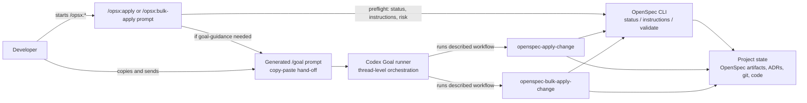

## Context

The current `/opsx:apply` and `/opsx:bulk-apply` flows already use OpenSpec as the persistent source of truth, enforce git gates, read change context, and stop at checkpoint boundaries. They do not yet provide a safe way to start long implementation work under Codex Goal without losing the exact OpenSpec workflow objective.

The goal-guidance layer must therefore be an orchestration aid, not a second source of truth. The durable state remains in OpenSpec artifacts, canonical specs, top-level ADRs, and git history. Codex Goal receives a generated objective that tells it which `/opsx:*` workflow to run, when to stop, and when it may mark the goal complete.

In-force ADRs considered:

- `adr/0001-adopt-codex-native-intent-driven-openspec-overlay.md` — keep the implementation as a project-local Codex/OpenSpec overlay, avoid patching OpenSpec, preserve mandatory git checkpoints, and keep OpenSpec as the lifecycle engine.

### Lightweight C4-style workflow view

The change affects workflow boundaries between the user, Codex prompts, Codex skills, Codex Goal, OpenSpec CLI, and project files. A lightweight C4-style Mermaid diagram is useful because these are distinct responsibilities even though they are not separate deployable services.



## Goals / Non-Goals

**Goals:**

- Generate a ready-to-copy `/goal` prompt for long or risky `/opsx:apply` runs before implementation begins.
- Generate a ready-to-copy parent `/goal` prompt for eligible `/opsx:bulk-apply` runs before worktrees or subagents are created.
- Include the concrete workflow invocation, semantic fallback skill, completion criteria, and stop-without-completion conditions in every generated prompt.
- Prevent nested or duplicate goals when the current run is already inside an active Codex Goal.
- Keep normal apply behavior available for small changes and for explicit user requests to continue without goal guidance.
- Preserve OpenSpec, ADRs, and git checkpoints as the durable source of truth.

**Non-Goals:**

- Do not auto-create a Codex Goal from the `/opsx:*` prompt. The user remains in control by copying and sending the generated `/goal` message.
- Do not change OpenSpec CLI behavior or patch installed OpenSpec packages.
- Do not make every `/opsx:apply` goal-guided; small local applies can run normally.
- Do not merge, archive, push, or perform destructive git actions as part of generated goal completion.
- Do not introduce a new persistent goal file or separate project state store.

## Decisions

### Decision 1: Generate copy-paste `/goal` prompts instead of auto-starting goals

`/opsx:apply` and `/opsx:bulk-apply` will not call goal APIs or create a goal silently. They will print a single generated prompt beginning with `/goal` and stop before implementation or orchestration side effects.

Rationale:

- Codex Goal execution starts from a user message; asking the user to first start `/goal` and then separately run `/opsx:bulk-apply` is unsafe because the goal may begin immediately.
- A generated copy-paste prompt makes the next user message the goal itself, while embedding the intended `/opsx:*` workflow.
- This preserves explicit user consent and keeps the command compatible with environments where direct goal APIs are unavailable.

### Decision 2: Goal preflight happens after apply/bulk eligibility is known but before side effects

For `/opsx:apply`, the workflow should first select the change, run git/status gates, run `openspec instructions apply --change <change> --json`, and inspect pending work. It may read planning context to make the generated prompt concrete, but it must stop before implementation file edits when goal guidance is triggered.

For `/opsx:bulk-apply`, the workflow should identify executable candidate changes and exclude blocked/all-done/ineligible changes before generating the parent goal. It must stop before creating worktrees or dispatching subagents when goal guidance is triggered.

### Decision 3: Use deterministic goal-guidance conditions

Generate an apply goal prompt when any of these are true:

- three or more pending tasks remain;
- implementation is expected to cross multiple checkpoint boundaries;
- the change has material design or ADR constraints;
- the change touches multiple capabilities, subsystems, or documentation plus code;
- the apply flow depends on external services, credentials, generated assets, migrations, or long-running verification;
- the user asks Codex to keep going, implement everything, or avoid stopping except for blockers.

Skip apply goal generation when any of these are true:

- the current run is already inside an active Codex Goal whose scope includes the change;
- the user explicitly says to continue without a goal;
- the apply work is small, local, and unlikely to need multiple checkpoints;
- apply is blocked by uncommitted planning artifacts or invalid OpenSpec state, in which case Codex reports the blocker instead of generating a goal.

For `/opsx:bulk-apply`, generate a parent goal prompt whenever two or more executable changes remain and the run is not already goal-guided, unless the user explicitly requests no goal.

### Decision 4: Generated prompts include both slash workflow and semantic fallback

The generated prompt must include the literal workflow action and a fallback skill path because nested slash commands inside goal text may be interpreted as plain text by some Codex runtimes.

Apply prompt shape:

```text
/goal Реализуй Intent-Driven OpenSpec change <change> в текущем проекте до состояния verify-ready. Первое действие: запусти workflow `/opsx:apply <change>`; если вложенная slash-команда не исполняется буквально, используй workflow/skill `openspec-apply-change` для этого change. ...
```

Bulk prompt shape:

```text
/goal Проведи Intent-Driven OpenSpec bulk apply для изменений <change-a>, <change-b>, ... в текущем проекте. Первое действие: запусти workflow `/opsx:bulk-apply <change-a> <change-b> ...`; если вложенная slash-команда не исполняется буквально, используй workflow/skill `openspec-bulk-apply-change` с теми же изменениями. ...
```

The wording may be localized to the user's language, but the command names, change names, and skill names must stay exact.

### Decision 5: Completion criteria are explicit and verify-gated

Generated apply goals are complete only when:

- all applicable pending tasks for the target change are completed;
- task checkboxes are updated only after verification of the corresponding work;
- `/opsx:verify <change>` completes without critical issues;
- a final report lists completed tasks, changed files, verification status, and unresolved warnings;
- any required checkpoint boundary has been presented to the user.

Generated bulk goals are complete only when:

- every executed change has an isolated worktree;
- every executed change has apply and verify results;
- every skipped, paused, or failed change has a reason;
- the parent report normalizes worktree paths, changed files, blockers, and verify status;
- no merge, archive, push, or destructive git action was performed without separate approval.

### Decision 6: Stop-without-completion conditions are included in the prompt

Every generated prompt must tell Codex to stop without marking the goal complete when it encounters conditions that require user action or external state changes:

- dirty planning artifacts or failed git gate;
- OpenSpec blocked/all-done state that makes the requested apply invalid;
- missing credentials, secrets, or access to required systems;
- unavailable external server or service;
- failed checks caused by environment or dependencies outside Codex control;
- contradictions between proposal, specs, design, ADR, or tasks;
- implementation requiring a design/spec/ADR change;
- worktree creation, subagent dispatch, or merge/worktree conflicts;
- any archive, merge, push, destructive git action, or irreversible operation requiring explicit approval.

When stopping, Codex should report the blocker, affected change(s), trusted state, files changed so far, and the recommended next user action.

### Decision 7: Documentation explains goal guidance as optional orchestration

README, README.ru, AGENTS, and lifecycle docs should state that Codex Goal does not replace OpenSpec artifacts. It only keeps long-running execution aligned with the intended apply or bulk-apply objective.

Docs should include:

- when generated goal prompts appear;
- examples for apply and bulk apply;
- how to copy and send the generated prompt as the next message;
- when goal guidance is skipped;
- how completion and stop conditions work;
- reminder that merge/archive/push remain separate approvals.

## Risks / Trade-offs

- Generated prompts may become too long. Mitigation: keep examples concise but include required completion and stop clauses.
- The runtime may not literally execute nested slash commands inside `/goal`. Mitigation: include semantic fallback to the exact skill/workflow.
- Detecting whether Codex is already inside a goal may be runtime-dependent. Mitigation: use explicit conversation context and any available Codex goal state; if uncertain, prefer not to generate nested goals and explain the assumption.
- Small changes could gain unnecessary ceremony. Mitigation: goal guidance is conditional for apply and can be explicitly bypassed.
- Bulk apply becomes a two-message flow when not already inside a goal. Mitigation: this is safer than starting worktrees/subagents without a goal objective and keeps user consent explicit.

## Migration Plan

1. Update `/opsx:apply` prompt and `openspec-apply-change` skill with goal preflight, generated prompt format, skip conditions, completion criteria, and stop conditions.
2. Update `/opsx:bulk-apply` prompt and `openspec-bulk-apply-change` skill with parent goal generation before worktrees/subagents.
3. Update README, README.ru, AGENTS, and docs/lifecycle with user-facing examples and rules.
4. Validate the OpenSpec change with `openspec validate add-codex-goal-guidance --strict`.
5. Run overlay checks after implementation.
6. Refresh the global Codex installation so `/home/as/.codex/prompts` and `/home/as/.codex/skills` receive the updated files.

Rollback is file-level: revert the prompt, skill, docs, and spec changes from this OpenSpec change. No user project data migration is introduced.

## Open Questions

- No in-force ADR needs supersession. ADR-0001 already supports this design because the change remains a project-local overlay and keeps OpenSpec as the source-of-truth engine.
- During implementation, verify whether the Codex runtime exposes reliable active-goal state to agents. If it does, prompts/skills should instruct agents to check it; if not, they should rely on explicit user wording and avoid nested goal generation when uncertain.
- Before ADR/tasks, a `grill-with-docs` review is recommended because the design changes workflow semantics and user-facing goal behavior.
