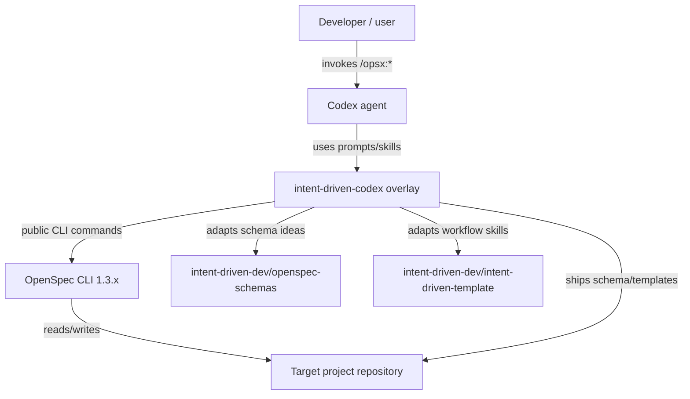
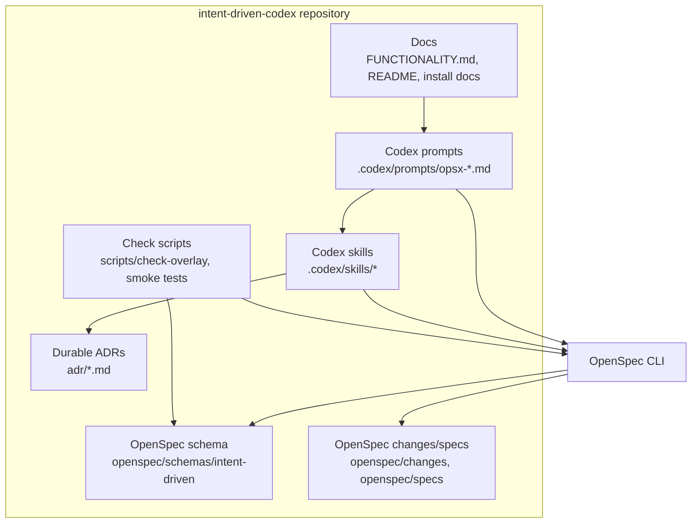

## Context

This repository is a fresh Codex-native template project. It was initialized with OpenSpec 1.3.1 using `openspec init . --tools codex --profile core`, which currently provides only the package `spec-driven` schema and four default Codex OpenSpec skills.

The change bootstraps the real target workflow: an intent-driven development overlay for Codex assembled from:

- `intent-driven-dev/openspec-schemas` — source for the `intent-driven` schema and templates.
- `intent-driven-dev/intent-driven-template` — source for workflow conventions, OpenCode commands/skills, git discipline, ADR/C4/Gherkin skill usage, and bulk-apply concepts.
- The local planning document `FUNCTIONALITY.md` — final Codex-adapted behavior already agreed in this project.

The implementation must preserve OpenSpec as the engine. We add project-local schema, commands, skills, docs, and checks; we do not fork or patch OpenSpec internals.

### Current repository state

```text
/home/as/ai-projects/intent-driven-codex/
├── .codex/skills/                 # default OpenSpec Codex skills from openspec init
├── openspec/changes/...            # bootstrap change artifacts
├── openspec/specs/                 # empty until archive
├── FUNCTIONALITY.md                # agreed functional description
└── .gitignore
```

### C4: system context



### C4: container view



## Goals / Non-Goals

**Goals:**

- Provide a working Codex-native OpenSpec template with default `intent-driven` schema.
- Implement lifecycle behavior for `proposal -> specs -> design -> adr -> tasks`.
- Make specs OpenSpec-valid while preserving Gherkin-style readable behavior scenarios.
- Replace upstream `grill-me` with `grill-with-docs` for context-aware proposal/design review.
- Add per-change ADR review tracked by OpenSpec and durable append-only top-level ADRs.
- Add mandatory git checkpoint behavior after every lifecycle step and hard gates before apply/archive.
- Add overlay compatibility checks for OpenSpec updates.
- Support Greenfield and Brownfield installation without overwriting user project artifacts.

**Non-Goals:**

- Do not implement a new OpenSpec engine.
- Do not patch files inside the installed OpenSpec package.
- Do not support all schemas from `openspec-schemas`; this project focuses on `intent-driven` only.
- Do not depend on OpenCode runtime or `.opencode` commands.
- Do not auto-commit, auto-merge, auto-push, or auto-archive without explicit user approval.
- Do not generate `.feature` files as the primary spec artifact; OpenSpec Markdown specs are the source of truth.

## Decisions

### Decision 1: Ship a project-local overlay, not an OpenSpec fork

The template will own files under `.codex/`, `openspec/schemas/intent-driven/`, `scripts/`, docs, and optional top-level `adr/`. OpenSpec remains an external dependency accessed through public CLI commands such as `openspec schemas`, `openspec status --change`, `openspec instructions`, `openspec validate`, and `openspec archive`.

Alternatives considered:

- **Patch OpenSpec internals**: rejected because upgrades would be brittle and unsafe.
- **Wrapper-only without schema**: rejected because the schema is what gives OpenSpec first-class lifecycle awareness.
- **Project-local overlay**: chosen because it is update-safe, testable, and consistent with OpenSpec customization.

### Decision 2: Adapt only the `intent-driven` schema

The implementation will copy/adapt only the upstream `intent-driven` schema and templates. Other schemas from `openspec-schemas` are out of scope.

Required schema adjustments:

- Set artifact order to `proposal -> specs -> design -> adr -> tasks`.
- Make `design` require `proposal` and `specs` so OpenSpec cannot create design before behavior specs.
- Make `adr` generate `adr.md` inside the change directory, not `../../../adr/*.md`.
- Make `tasks` require `specs`, `design`, and `adr`.
- Keep `apply.requires: [tasks]` and `apply.tracks: tasks.md`.

Rationale: upstream intent-driven schema captures the right idea, but its top-level ADR glob makes OpenSpec consider ADR done when any durable ADR already exists. The Codex adaptation needs an honest per-change gate.

### Decision 3: Track ADR review per change, keep durable ADRs top-level

Every change gets `openspec/changes/<change>/adr.md`. Durable decisions are written to `adr/NNNN-kebab-title.md` only when the ADR review finds a long-term architectural decision.

ADR rules:

- Existing durable ADRs are append-only historical records.
- New decisions create new ADR files.
- Replaced decisions are handled by supersession links, not by rewriting old ADR rationale.
- Apply/tasks/verify must explicitly read top-level `adr/*.md`, because OpenSpec `contextFiles.adr` will point at the per-change `adr.md`.

Alternatives considered:

- **Use only upstream `../../../adr/*.md`**: rejected because it does not guarantee per-change ADR review.
- **Put all ADRs only inside changes**: rejected because durable decisions must survive archive and be easy to find.
- **Dual model**: chosen because it gives OpenSpec an honest gate and preserves architecture history.

### Decision 4: Codex commands are thin adapters around OpenSpec

The `.codex/prompts/opsx-*.md` commands should mostly orchestrate OpenSpec CLI and skills. They should not duplicate OpenSpec parsing logic unless needed for policy gates.

Planned commands:

| Command | Purpose |
|---|---|
| `/opsx:new` | Create new change and show first artifact instructions. |
| `/opsx:continue` | Create one ready artifact. For intent-driven, prefer schema order when multiple artifacts are ready. |
| `/opsx:propose` or `/opsx:ff` | Fast-forward planning artifacts to apply-ready state when user explicitly wants speed. |
| `/opsx:apply` | Implement tasks after all planning artifacts are checkpointed and context is read. |
| `/opsx:verify` | Verify implementation against specs/design/ADR/tasks. |
| `/opsx:sync` | Sync delta specs into canonical specs when requested. |
| `/opsx:archive` | Archive only after verify and merge/checkpoint gates. |
| `/opsx:check-overlay` | Validate overlay compatibility after install/update. |
| `/opsx:bulk-apply` | Optional isolated worktree/subagent flow for multiple independent changes. |
| `/opsx:bulk-archive` | Optional batch archive with conflict checks. |

### Decision 5: `grill-with-docs` replaces `grill-me`

`grill-with-docs` is the Codex-native review mechanism because it reads artifacts, ADRs, docs, and code before asking questions. It is used as a risk gate, not as ceremony for every trivial change.

Invocation policy:

- Proposal: use after a draft when scope, assumptions, risk, or Brownfield context is material.
- Design: use before ADR/tasks when architecture or implementation risk is material.
- It may conclude that no material questions remain.

Alternatives considered:

- **Plain `grill-me`**: rejected because it does not require repository/document context.
- **Always ask many questions**: rejected because low-risk changes should not be blocked by ceremony.
- **Context-aware risk gate**: chosen because it matches Codex and Brownfield needs.

### Decision 6: Specs stay OpenSpec Markdown with Gherkin-style scenarios

Specs must remain `specs/<capability>/spec.md` so OpenSpec validation and archive work. Inside each requirement, scenarios use Gherkin-style observable GIVEN/WHEN/THEN steps.

Validation-critical rules:

- Delta headers must be `## ADDED Requirements`, `## MODIFIED Requirements`, `## REMOVED Requirements`, or `## RENAMED Requirements`.
- Each requirement must use `### Requirement:`.
- Each requirement must contain normative text with `MUST` or `SHALL`.
- Each scenario must use exactly `#### Scenario:`.
- `MODIFIED Requirements` must include the full updated requirement block.

### Decision 7: Git discipline is implemented as mandatory gates plus explicit approval

The workflow enforces checkpoints after each lifecycle artifact, but Codex still asks before mutating git state.

Implementation approach:

- Add/update `openspec-git-discipline` skill with mandatory checkpoint language.
- Embed gate checks into `/opsx:continue`, `/opsx:apply`, `/opsx:verify`, `/opsx:archive`, and bulk workflows.
- `apply` refuses uncommitted planning artifacts.
- `archive` refuses to run before implementation is merged/checkpointed on the chosen integration branch.
- User can explicitly override a planning checkpoint, but the command must say it is bypassing the intended discipline.

### Decision 8: Overlay checks use a deterministic smoke project/change

`/opsx:check-overlay` should run compatibility checks that are valid in OpenSpec 1.3.1:

```bash
openspec --version
openspec schemas --json
openspec schema validate intent-driven
openspec list --json
openspec new change smoke-intent-overlay
openspec status --change smoke-intent-overlay --json
openspec instructions proposal --change smoke-intent-overlay --json
```

It must not run bare `openspec status --json`, because OpenSpec 1.3.1 requires `--change`.

The command should clean up or clearly report the smoke change according to a safe policy. Destructive cleanup requires explicit approval unless it only removes a temporary change created by the command in the same run and documented as temporary.

### Decision 9: Installation is copy/update with ownership boundaries

The template should distinguish template-owned files from user-owned files.

Template-owned:

- `.codex/prompts/opsx-*.md`
- `.codex/skills/<template-skill>/...`
- `openspec/schemas/intent-driven/...`
- `scripts/check-overlay` or equivalent
- template docs such as README/install notes

User-owned:

- `openspec/changes/**`
- `openspec/specs/**`
- `adr/**`
- project source code
- existing project docs unless explicitly chosen

Greenfield install may set `openspec/config.yaml` to `schema: intent-driven`. Brownfield install must detect existing config and ask before changing it.

### Decision 10: Bulk apply is optional and isolated

Bulk apply is not required for the first working version, but if implemented it must be adapted from the OpenCode template to Codex and must use isolated worktrees.

Rules:

- Only run when two or more eligible changes exist.
- One worktree per change under `.worktrees/<change>` by default.
- Parent session does not implement directly.
- Subflows run apply and verify only.
- No merge/archive/commit unless explicitly approved.

## Risks / Trade-offs

- [Risk] OpenSpec CLI behavior changes in a future version -> Mitigation: keep commands on public CLI surfaces and run `/opsx:check-overlay` after OpenSpec updates.
- [Risk] Per-change ADR gate stops OpenSpec from automatically including durable ADRs in apply context -> Mitigation: command/skill adapters explicitly read `adr/*.md` and referenced ADRs.
- [Risk] Mandatory git checkpoints may slow small changes -> Mitigation: allow explicit user override while making the bypass visible.
- [Risk] Brownfield install could overwrite user files -> Mitigation: classify ownership, diff before overwrite, and require confirmation for user-owned files.
- [Risk] `design.requires: specs` differs from upstream intent schema where design and specs can be parallel -> Mitigation: document the Codex adaptation as intentional to preserve the user-requested sequence.
- [Risk] Bulk apply can create merge conflicts across changes -> Mitigation: make it optional, isolate worktrees, and require verify plus explicit merge approval.
- [Risk] OpenSpec archive validation fails if specs are too Gherkin-like and lack normative text -> Mitigation: templates require `MUST`/`SHALL` requirement prose before scenarios.
- [Risk] Too many custom skills make maintenance harder -> Mitigation: keep skills small, copy only relevant upstream skills, and prefer OpenSpec CLI output over duplicated logic.

## Migration Plan

1. Create the adapted `openspec/schemas/intent-driven/` schema and templates.
2. Add `.codex/prompts/opsx-*.md` command adapters.
3. Add `.codex/skills/` entries needed by the workflow:
   - OpenSpec lifecycle skills not installed by core init, such as new/continue/verify/sync.
   - `grill-with-docs`.
   - `gherkin-authoring`.
   - `c4-diagrams`.
   - `architectural-decision-records`.
   - `openspec-git-discipline`.
   - optional bulk apply/archive skills.
4. Add overlay check script/command and smoke-test documentation.
5. Update docs to explain installation, Greenfield/Brownfield behavior, lifecycle, optional skills, ADR lifecycle, and git checkpoints.
6. Run verification:
   - `openspec schema validate intent-driven`
   - `openspec schemas --json`
   - smoke change creation/status/instructions/apply context
   - `openspec validate implement-intent-driven-codex-template --type change --strict`
7. After implementation passes verify, archive the bootstrap change so canonical specs are created under `openspec/specs/`.

Rollback strategy:

- Because all changes are project-local and committed in checkpoints, rollback is `git revert` or reset to the previous checkpoint.
- Do not modify global Codex or OpenSpec installation as part of this change.

## Open Questions

- Should the first implementation include `/opsx:bulk-apply`, or should bulk apply remain documented/optional for a follow-up change?
- Should Greenfield installation be a shell script, a documented copy procedure, or both?
- Should `/opsx:check-overlay` automatically delete its smoke change, or should it leave it for user inspection and ask before cleanup?
- Should the template set `schema: intent-driven` automatically in Brownfield repositories, or only recommend the config change?
- Resolved before archive: create `adr/0001-adopt-codex-native-intent-driven-openspec-overlay.md` to record the project-level overlay architecture decision, even though the bootstrap change itself uses the `spec-driven` schema.
