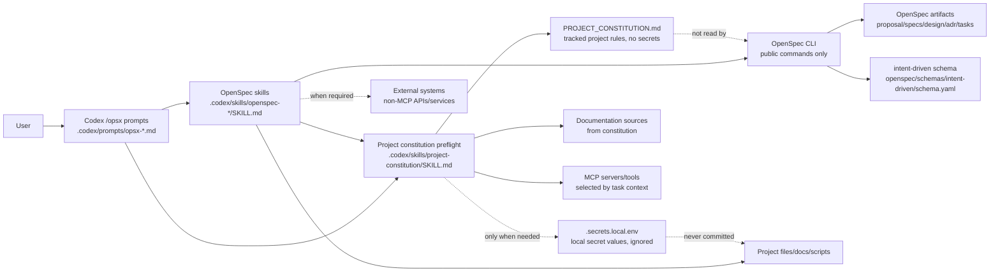

## Context

`add-project-constitution` extends the existing project-local Codex/OpenSpec overlay. ADR 0001 remains in force: OpenSpec is the lifecycle engine, this repository owns the Codex overlay, and installed OpenSpec packages must not be patched.

The new behavior introduces `PROJECT_CONSTITUTION.md` as persistent project context that Codex reads before `/opsx:*` workflows. The constitution is not an OpenSpec artifact; it is a Git-tracked project rules file that survives archive and records required technologies, MCP usage, external systems, secret handling, documentation sources, verification rules, and other AI instructions that must not be missed.

The implementation must enforce the runtime behavior in the Codex layer because `openspec/schemas/intent-driven/schema.yaml` can provide instructions and templates, but cannot itself read repository files, detect missing local secrets, or stop a slash-command workflow.

### C4-inspired container view



Boundaries:

- OpenSpec CLI continues to manage lifecycle state and artifact instructions; it does not read `PROJECT_CONSTITUTION.md`.
- Codex overlay owns constitution preflight and runtime stop/override behavior.
- `PROJECT_CONSTITUTION.md` is Git-tracked non-secret state.
- `.secrets.local.env` is local-only secret state and is read only when a workflow actually needs a listed external system.

## Goals / Non-Goals

**Goals:**

- Add a reusable Codex-layer constitution preflight for all `/opsx:*` workflows.
- Keep the implementation project-local and compatible with ADR 0001.
- Add constitution guidance to `intent-driven` schema instructions without changing the artifact graph.
- Provide a root `PROJECT_CONSTITUTION.md` template/starting file with the required sections.
- Document local secret handling with `.secrets.local.env` and optional tracked examples containing variable names only.
- Ensure missing constitution behavior avoids deadlock by allowing only bootstrap-safe or diagnostic actions.
- Ensure conflicts between constitution rules and requested work stop Codex before file changes or external-system calls.

**Non-Goals:**

- Do not modify or fork OpenSpec CLI.
- Do not make `PROJECT_CONSTITUTION.md` an OpenSpec artifact or archive it with changes.
- Do not build a deterministic policy parser for every natural-language rule.
- Do not print, stage, commit, or archive real secret values.
- Do not configure MCP servers globally; the constitution records usage expectations and non-secret parameters for Codex to follow.

## Decisions

### Decision 1: Use a shared Codex-layer preflight skill

Create a reusable `project-constitution` skill under `.codex/skills/project-constitution/SKILL.md`. `/opsx:*` prompts and `openspec-*` skills will reference this preflight instead of duplicating policy text everywhere.

Preflight responsibilities:

1. Resolve the repository root.
2. Check for root `PROJECT_CONSTITUTION.md`.
3. If missing, allow only bootstrap-safe or diagnostic actions:
   - exploration/read-only explanation;
   - starting or continuing a constitution-related bootstrap change;
   - creating the constitution from a template;
   - overlay health diagnostics.
4. For substantive planning/apply/verify/archive/sync/bulk workflows, stop when the constitution is missing unless the user gives an explicit one-time override.
5. When present, read the constitution and apply relevant rules to the requested workflow.
6. Detect obvious conflicts between constitution rules and the user request or OpenSpec artifacts; stop and ask the user to resolve the conflict.
7. Read `.secrets.local.env` only when the workflow is about to access a listed external system that requires credentials.
8. Report missing credential variable names without revealing values.

Rationale: this is the only layer that can actually read files, choose MCP tools, inspect local secrets, and stop before workflow actions. Keeping it shared reduces drift across commands.

A constitution-related bootstrap change is allowed without an existing
`PROJECT_CONSTITUTION.md` only when all of these are true:

- the change name or user request is explicitly about constitution/setup, such
  as `add-project-constitution`, `initialize-project-constitution`, or
  `update-project-constitution-template`;
- the next action only creates or edits constitution/bootstrap artifacts,
  templates, prompts, skills, docs, or safe setup checks;
- the action does not implement unrelated product behavior, access external
  systems, apply tasks, verify implementation, sync specs, archive, or run bulk
  workflows.

This prevents the missing-constitution bootstrap exception from becoming a
general bypass for unrelated planning or implementation work.

### Decision 2: Keep schema changes instructional only

Update `openspec/schemas/intent-driven/schema.yaml` instructions to remind Codex to account for `PROJECT_CONSTITUTION.md` during artifact creation and apply. Do not add a constitution artifact to the schema.

Expected schema changes:

- `proposal` instruction: research existing specs and constitution context before identifying capabilities.
- `specs` instruction: ensure delta specs do not contradict constitution rules.
- `design` instruction: read constitution context along with proposal/specs/ADRs.
- `adr` instruction: consider whether constitution support creates durable decisions.
- `tasks` instruction: create tasks that preserve constitution constraints.
- `apply.instruction`: run constitution preflight before implementation and before external-system calls.

Rationale: schema instructions make the lifecycle context visible through OpenSpec, but the runtime guard remains in Codex.

### Decision 3: Track project rules, ignore secret values

Add or update project files so this template clearly separates rules from values:

```text
PROJECT_CONSTITUTION.md          # tracked, non-secret project rules
.secrets.local.env               # ignored, real local credentials/URLs/tokens
.secrets.example.env             # optional tracked variable names/placeholders only
```

`PROJECT_CONSTITUTION.md` should include these sections:

1. Required Technologies
2. MCP Servers
3. External Systems
4. Secret Handling
5. Documentation Sources
6. Verification Rules
7. Additional AI Instructions

The Secret Handling section must state that credential values live in `.secrets.local.env`, and External Systems must list credential variable names rather than values.

Rationale: project rules must be reviewable and durable, while local secrets must never enter Git or OpenSpec artifacts.

### Decision 4: Update prompts and skills at the workflow boundary

Update every `.codex/prompts/opsx-*.md` with a short constitution preflight rule near the top. Update `openspec-*` skills so direct skill invocation also follows the same preflight, not only slash prompts.

Priority skills to update explicitly:

- `openspec-new-change`
- `openspec-continue-change`
- `openspec-propose`
- `openspec-ff-change`
- `openspec-apply-change`
- `openspec-bulk-apply-change`
- `openspec-verify-change`
- `openspec-archive-change`
- `openspec-bulk-archive-change`
- `openspec-sync-specs`
- `openspec-check-overlay`
- `openspec-explore`

Rationale: users can invoke either `/opsx:*` prompts or skills directly. Both entry points need the same guardrail.

### Decision 5: Treat constitution changes as project-owned Brownfield state

`PROJECT_CONSTITUTION.md` must not be overwritten by installation, update, archive, or overlay checks without explicit user approval. `.secrets.local.env` must not be staged or committed.

Rationale: constitution content belongs to the target project, just like existing specs, ADRs, docs, source code, and tests.

### Decision 6: Create a durable ADR for constitution preflight

The ADR step should create a new durable ADR that records the constitution preflight as a long-lived extension of the overlay architecture. It should not supersede ADR 0001; it should reference ADR 0001 and record that constitution enforcement remains project-local and Codex-layer only.

Rationale: the change adds a durable architecture boundary and runtime policy that future changes must understand.

## Risks / Trade-offs

- Natural-language constitution rules cannot be enforced with perfect mechanical precision. Mitigation: preflight requires Codex to cite relevant rules and stop on obvious conflicts.
- Updating every prompt/skill entry point is repetitive. Mitigation: keep detailed behavior in the shared `project-constitution` skill and add only short references elsewhere.
- Reading `.secrets.local.env` creates leakage risk. Mitigation: read only when needed, report variable names only, and forbid printing values in responses, artifacts, logs, diffs, or commits.
- A missing constitution could block all work. Mitigation: allow bootstrap-safe and diagnostic actions, plus explicit one-time override semantics.
- Adding a tracked `PROJECT_CONSTITUTION.md` to a reusable template means downstream users must edit it. Mitigation: write it as a clear starting file/template with placeholders and no secrets.

## Migration Plan

1. Add constitution assets:
   - root `PROJECT_CONSTITUTION.md` with required sections and no secret values;
   - optional `.secrets.example.env` with variable-name placeholders only;
   - `.gitignore` entry for `.secrets.local.env`.
2. Add `.codex/skills/project-constitution/SKILL.md` with the shared preflight workflow.
3. Update `.codex/prompts/opsx-*.md` to require constitution preflight before actions.
4. Update relevant `.codex/skills/openspec-*/SKILL.md` files to require constitution preflight when invoked directly.
5. Update `openspec/schemas/intent-driven/schema.yaml` and schema README/templates only with instructional guidance; preserve lifecycle artifacts and validation behavior.
6. Update documentation:
   - `README.md`
   - `README.ru.md`
   - `INSTALL_CODEX.md`
   - `AGENTS.md`
   - `docs/lifecycle.md`
   - `docs/update-safety.md`
7. Update `scripts/check-overlay` if needed so overlay health checks can report missing constitution as setup guidance and never expose `.secrets.local.env` values.
8. Verify:
   - `openspec validate add-project-constitution --type change --strict`;
   - `openspec schema validate intent-driven`;
   - `scripts/check-overlay`;
   - git status confirms `.secrets.local.env` is ignored/untracked.

Rollback:

- Revert the change commit group before archive if the preflight proves too invasive.
- Because OpenSpec CLI is not patched, rollback is limited to project-local overlay files, docs, schema instructions, and templates.

## Open Questions

- None. The reviewed design choices are resolved: shared Codex-layer preflight, schema guidance only, Git-tracked non-secret constitution, local secrets read only when needed, and bootstrap-safe missing constitution behavior.
