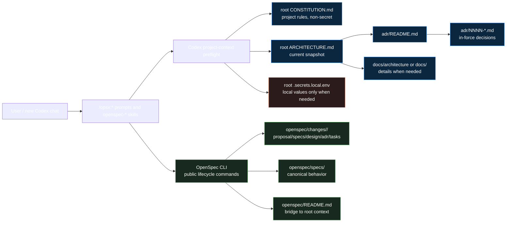

## Context

`intent-driven-codex` already has a project-local Codex/OpenSpec overlay (ADR 0001), durable ADRs under `adr/`, and a constitution preflight (ADR 0002). The current state leaves the always-on project context split across several places:

- root `PROJECT_CONSTITUTION.md` for mandatory Codex operating rules;
- top-level `adr/` for durable decisions;
- `docs/` and README sections for explanatory architecture material;
- OpenSpec specs and archived changes for lifecycle history.

New chats need a short, stable entry point for current architecture and project rules before they create or consume OpenSpec artifacts. The new convention is:

- root `CONSTITUTION.md` is the canonical non-secret project rule file;
- root `ARCHITECTURE.md` is the canonical current architecture snapshot;
- top-level `adr/` remains the durable decision history;
- `openspec/README.md` is only a bridge/index from OpenSpec lifecycle files to persistent project context outside the change artifact graph;
- `.secrets.local.env` remains local-only root state for secret values and is never moved under `openspec/`.

Relevant existing constraints:

- OpenSpec CLI remains unchanged and is used only through public commands.
- Codex prompts/skills own project context preflight; the OpenSpec CLI does not read `CONSTITUTION.md` or `ARCHITECTURE.md` itself.
- Git-tracked files may contain secret variable names and empty placeholders only.
- Accepted durable ADRs are append-only; new decisions supersede older decisions instead of rewriting history.

## Goals / Non-Goals

**Goals:**

- Rename the canonical constitution entry point from `PROJECT_CONSTITUTION.md` to `CONSTITUTION.md` everywhere in the native overlay.
- Add `ARCHITECTURE.md` as the short current architecture snapshot that can be read at the start of future project chats.
- Keep durable architecture history in top-level `adr/` and make `ARCHITECTURE.md` summarize/link the in-force ADR set.
- Add `openspec/README.md` as an index that explains what lives outside the OpenSpec change/spec graph.
- Update prompts, skills, schema guidance, specs, docs, checks, and install guidance to load persistent project context before relevant `/opsx:*` actions.
- Preserve local secret handling: real values stay only in `.secrets.local.env` or the local environment.
- Provide a migration path from existing `PROJECT_CONSTITUTION.md` without silently maintaining two competing constitution files.

**Non-Goals:**

- Do not patch or fork OpenSpec CLI.
- Do not move `CONSTITUTION.md`, `ARCHITECTURE.md`, `adr/`, or `.secrets.local.env` into `openspec/changes/`.
- Do not store secret values in Git-tracked documentation, OpenSpec artifacts, ADRs, examples, screenshots, or logs.
- Do not rewrite accepted ADR 0001 or ADR 0002 in place.
- Do not require OpenSpec schema artifacts to include `CONSTITUTION.md` or `ARCHITECTURE.md` as lifecycle artifacts.

## Decisions

1. **Use root `CONSTITUTION.md` as the canonical constitution name.**

   `CONSTITUTION.md` replaces `PROJECT_CONSTITUTION.md` as the file that Codex reads before `/opsx:*` workflows and direct OpenSpec lifecycle skill actions. During migration, if `CONSTITUTION.md` is missing and legacy `PROJECT_CONSTITUTION.md` exists, Codex reports the legacy file and offers/uses migration guidance rather than treating both as active competing sources.

   Alternative rejected: keep `PROJECT_CONSTITUTION.md` as canonical. The user explicitly prefers the shorter canonical name, and the shorter name is easier to remember across projects.

2. **Use root `ARCHITECTURE.md` as a current snapshot, not as decision history.**

   `ARCHITECTURE.md` provides the concise current architecture state for new chats: overlay boundaries, source-of-truth files, context loading rules, install/update safety, and external secret boundary. It links to in-force durable ADRs for rationale. When architecture decisions change, tasks must update this snapshot if the current architecture view changes.

   Alternative rejected: rely only on `adr/`. ADRs are authoritative history but not optimized as a quick current-state entry point for new chats.

3. **Keep top-level `adr/` as durable decision history.**

   ADR 0001 remains in force and is referenced by the new decision. ADR 0002 is partially superseded because its project-constitution preflight concept remains useful, but the canonical filename and broader context model change. The apply phase should create a new durable ADR, likely `adr/0003-formalize-project-context-entrypoints.md`, that references ADR 0001 and supersedes ADR 0002 for the constitution filename/context-entrypoint decision.

   Alternative rejected: update ADR 0002 in place. Accepted ADRs are append-only.

4. **Use `openspec/README.md` as a bridge/index only.**

   `openspec/README.md` should tell users and Codex which persistent project context files live outside OpenSpec artifacts: `CONSTITUTION.md`, `ARCHITECTURE.md`, `adr/`, `docs/`, and local-only `.secrets.local.env`. It should not become a duplicate architecture source or a secret container.

   Alternative rejected: store constitution/architecture under `openspec/`. These are persistent project context, not change artifacts. Keeping them at root makes them visible to new chats and avoids archive/lifecycle confusion.

5. **Codex layer loads context; OpenSpec CLI remains artifact engine.**

   `/opsx:*` prompts and direct `openspec-*` skills should run a shared project-context preflight that reads `CONSTITUTION.md` and, for architecture-sensitive work, `ARCHITECTURE.md`, `adr/README.md`, and relevant in-force `adr/*.md`. Schema instructions can remind Codex to do this, but they must not claim the CLI enforces it.

   Alternative rejected: implement context reading in OpenSpec CLI. That would violate ADR 0001 and make upgrades brittle.

6. **Secrets remain root local-only state.**

   `CONSTITUTION.md` and `ARCHITECTURE.md` may name variables and non-secret labels. Real values remain in root `.secrets.local.env` or environment variables and are read only when the current workflow actually needs the listed external system.

   Alternative rejected: place secrets under `openspec/`. This increases archive/exposure risk and confuses local credentials with spec artifacts.

## Risks / Trade-offs

- **Naming migration risk:** stale references to `PROJECT_CONSTITUTION.md` may remain in prompts, skills, schema text, docs, or specs. Mitigation: run a repository-wide search and update all intentional references, leaving only explicit legacy-migration notes if needed.
- **Snapshot drift risk:** `ARCHITECTURE.md` can become stale if durable ADRs change. Mitigation: ADR review and tasks must include snapshot updates whenever a decision affects current architecture.
- **Preflight consistency risk:** every prompt and lifecycle skill must remember to invoke project context preflight. Mitigation: keep a shared `project-constitution`/project-context skill and short reminders in entry points.
- **False conflict risk:** natural-language constitution and architecture rules require judgment. Mitigation: stop only on direct/material contradictions that affect behavior, architecture, external access, verification, or secret handling.
- **Secret exposure risk:** adding more context files creates more places where secret values could accidentally be documented. Mitigation: examples use variable names/placeholders only; `.secrets.local.env` remains ignored and is never staged, printed, archived, or copied.

## Migration Plan

1. Rename root `PROJECT_CONSTITUTION.md` to `CONSTITUTION.md` and update the file text to say `CONSTITUTION.md` is canonical.
2. Add root `ARCHITECTURE.md` with a concise snapshot of current overlay architecture and links to in-force ADRs.
3. Add or update `openspec/README.md` to bridge OpenSpec lifecycle files to persistent project context.
4. Update all native `.codex/prompts/opsx-*.md` and `.codex/skills/*` references from `PROJECT_CONSTITUTION.md` to `CONSTITUTION.md`, adding architecture-context preflight where relevant.
5. Update `openspec/schemas/intent-driven/*`, canonical specs, docs, README EN/RU, install/update guidance, `AGENTS.md`, and `scripts/check-overlay`.
6. Create durable ADR 0003 to record the new context-entrypoint architecture. Mark ADR 0002 as superseded by ADR 0003 through the new ADR and ADR index; do not rewrite the accepted body of ADR 0002 except for metadata/index updates if the project convention allows.
7. Ensure `.secrets.local.env` remains ignored and `.secrets.example.env` remains tracked with placeholders only.
8. Validate with `openspec validate formalize-project-context-architecture --type change --strict`, `openspec validate --all --strict`, `openspec schema validate intent-driven`, `scripts/check-overlay`, and repository searches for stale references.

Rollback is straightforward before archive: restore `PROJECT_CONSTITUTION.md` as canonical, remove `ARCHITECTURE.md`/`openspec/README.md` additions, and remove the superseding ADR/task changes. After archive/release, rollback should be represented by a new OpenSpec change and a new superseding ADR rather than rewriting history.

## Open Questions

- Should the shared preflight skill keep the name `project-constitution` while expanding to architecture context, or should apply introduce a new `project-context` skill and leave `project-constitution` as a compatibility alias? Recommended: keep `project-constitution` for this change to minimize churn, but broaden its text to mention project context and architecture.
- How strict should validation be for stale `PROJECT_CONSTITUTION.md` references? Recommended: allow the string only in explicit legacy-migration notes and reject it elsewhere.
