## Context

The current `intent-driven` schema and installed Codex overlay implement this planning lifecycle:

```text
proposal -> specs -> design -> adr -> tasks -> apply -> verify -> archive
```

That lifecycle is already Codex-native and project-local per ADR 0001, and it already relies on persistent root project context per ADR 0003:

- `CONSTITUTION.md` is the Git-tracked, non-secret project rule source.
- `ARCHITECTURE.md` is the current architecture snapshot.
- top-level `adr/` is append-only durable decision history.
- OpenSpec CLI remains the lifecycle engine and is not patched.
- `.secrets.local.env` remains local-only and is not needed for this change.

The gap is that context-aware review and test-first verification planning are currently conditional guidance rather than explicit OpenSpec gates. Review decisions can remain in chat and test strategy can be written only after implementation tasks already exist. For new projects installed from this template, this weakens development/change discipline exactly where users need repeatable defaults.

This change turns the desired behavior into schema-level lifecycle gates while preserving the existing ownership boundaries: OpenSpec manages artifact dependency order, and the Codex overlay reads project context, runs skills, and enforces Git/checkpoint discipline.

### Planned lifecycle architecture

```mermaid
flowchart LR
  User["User / Codex chat"] --> Opsx["/opsx:* prompts\nopenspec-* skills"]
  Opsx --> Preflight["Project context preflight\nCONSTITUTION + architecture"]
  Preflight --> Constitution["CONSTITUTION.md"]
  Preflight --> Snapshot["ARCHITECTURE.md"]
  Snapshot --> DurableADR["adr/*.md\nin-force decisions"]
  Opsx --> OpenSpec["OpenSpec CLI\nproject intent-driven schema"]
  OpenSpec --> P["proposal.md"]
  P --> S["specs/**/spec.md"]
  S --> D["design.md"]
  D --> R["review.md\ngrill-with-docs gate"]
  R --> A["adr.md\nper-change ADR review"]
  A --> TPlan["test-plan.md\nTDD / verification-first gate"]
  TPlan --> Tasks["tasks.md"]
  Tasks --> Apply["apply"]
  Apply --> Verify["verify"]
  Verify --> Archive["archive"]

  classDef codex fill:#dff3ff,stroke:#1d75b9,color:#042033,stroke-width:2px;
  classDef context fill:#fff7ed,stroke:#ea580c,color:#431407,stroke-width:2px;
  classDef openspec fill:#e8fff5,stroke:#16885a,color:#06291b,stroke-width:2px;
  classDef gate fill:#f3e8ff,stroke:#7e22ce,color:#2e1065,stroke-width:2px;
  class Opsx,Preflight codex;
  class Constitution,Snapshot,DurableADR context;
  class OpenSpec,P,S,D,A,Tasks,Apply,Verify,Archive openspec;
  class R,TPlan gate;
```



## Goals / Non-Goals

**Goals:**

- Add mandatory `review.md` and `test-plan.md` artifacts to the `intent-driven` schema.
- Make the new lifecycle order: `proposal -> specs -> design -> review -> adr -> test-plan -> tasks`.
- Make `review.md` the recorded `grill-with-docs` gate for development/enhancement changes.
- Make `test-plan.md` the recorded TDD or verification-first gate before tasks.
- Update Codex prompts, skills, docs, overlay checks, canonical specs, and install/global overlay assets so new projects get the behavior by default.
- Preserve ADR 0001 and ADR 0003 boundaries: project-local overlay, no OpenSpec package patching, root project context outside OpenSpec change artifacts, no secrets in Git.
- Add a durable ADR and update `ARCHITECTURE.md` because the workflow architecture changes.

**Non-Goals:**

- Do not classify or repair unrelated dirty local tooling files in target projects; that should be a separate change.
- Do not patch installed OpenSpec packages or rely on private OpenSpec internals.
- Do not move `CONSTITUTION.md`, `ARCHITECTURE.md`, `adr/`, or `.secrets.local.env` under `openspec/changes/`.
- Do not make `.secrets.local.env` an OpenSpec or Git-tracked artifact.
- Do not force classic unit-test TDD when a technology stack cannot support it; require the strongest feasible verification-first substitute and explicit limitations instead.

## Decisions

### 1. Extend the schema with two first-class artifacts

Update `openspec/schemas/intent-driven/schema.yaml` to include:

```text
proposal -> specs -> design -> review -> adr -> test-plan -> tasks
```

Proposed dependencies:

| Artifact | Generates | Requires | Reason |
|---|---|---|---|
| proposal | `proposal.md` | — | Intent and scope first. |
| specs | `specs/**/*.md` | proposal | Observable behavior before design. |
| design | `design.md` | proposal, specs | Technical approach follows intended behavior. |
| review | `review.md` | design | `grill-with-docs` reviews proposal/specs/design with context before ADR. |
| adr | `adr.md` | review | Durable decisions are informed by review findings. |
| test-plan | `test-plan.md` | adr | Verification strategy is informed by behavior, design, review, and ADR decisions. |
| tasks | `tasks.md` | specs, design, adr, test-plan | Implementation checklist follows verification strategy. |

`apply.requires` remains `tasks`; `tasks.md` remains the tracked implementation checklist. The OpenSpec CLI will then include all planning context files in `openspec instructions apply --json`, including the new review and test-plan files.

Alternatives considered:

- Put review/test planning inside `design.md`: rejected because the gates would not be separately visible or checkpointable.
- Put test planning after tasks: rejected because tasks would be written before the verification strategy is known.
- Put ADR before review: rejected because review findings can change durable decisions.

### 2. `review.md` records mandatory `grill-with-docs` output

The new `review` artifact should be the durable location for review facts and resolutions. It should contain at minimum:

- context reviewed;
- summary of the plan;
- high-risk uncertainties considered;
- questions, recommended answers, user answers when any were required;
- accepted resolutions;
- exact artifact updates required or already integrated;
- remaining risks or explicit statement that no material questions remain.

The gate is mandatory for development/enhancement changes, but it should not create fake ceremony. If the documents and code reveal no material uncertainty, `review.md` records a concise no-material-questions conclusion.

Material review output must be integrated before ADR:

- behavior/scope changes update proposal or specs;
- approach/boundary changes update design;
- durable decision changes are carried into `adr.md` and top-level ADRs;
- verification expectations flow into `test-plan.md`.

### 3. `test-plan.md` records TDD or verification-first strategy

The new `test-plan` artifact should define how implementation will prove behavior before tasks are written. It should contain at minimum:

- verification strategy;
- test-first scope;
- requirement/scenario-to-check mapping;
- required checks before apply completion;
- required checks before archive;
- known limitations and manual evidence requirements.

For code changes where automated tests can be written first, tasks should include failing/verification-first tests before production implementation. For documentation, schema, overlay, or 1C/Codex-style changes where classic unit-test TDD may not fit, the plan must identify the strongest feasible substitute, such as schema validation, smoke changes, generated instruction checks, CLI output checks, or manual import/build validation.

### 4. Update prompts and skills around OpenSpec status instead of hard-coded old lifecycle

Update `.codex/prompts/opsx-*.md` and `.codex/skills/openspec-*` to rely on `openspec status --change <name> --json` and `openspec instructions <artifact> --json` whenever possible. Where the old lifecycle is named in prose, replace it with the expanded lifecycle.

Key behavior changes:

- `/opsx:new` still stops after scaffold and first ready artifact instructions.
- `/opsx:continue` creates exactly one next ready artifact, including `review` and `test-plan` when they become ready.
- `/opsx:ff`/fast-forward creates all artifacts up to apply readiness and commits/checkpoints boundaries when approved.
- `/opsx:apply` refuses apply when planning artifacts are missing or dirty, and reads review/test-plan context.
- `/opsx:verify` reports unresolved review items and missing test-plan checks as critical issues.
- `/opsx:archive` remains post-verify only and syncs canonical specs; it does not archive root context files or secrets.

### 5. Update overlay checks and install/smoke coverage

`scripts/check-overlay` should validate the expanded artifact graph and the presence of review/test-plan apply context. Its smoke change should create valid temporary `review.md` and `test-plan.md` files before tasks.

`scripts/install-overlay` should copy any new templates and prompt/skill updates as part of the project-local overlay. The implementation should avoid overwriting user-owned target project artifacts except where the installer already owns template overlay files.

### 6. Update canonical docs/specs and architecture history

During implementation and archive:

- update README EN/RU and lifecycle docs to show the expanded lifecycle;
- update `AGENTS.md`, `INSTALL_CODEX.md`, `docs/lifecycle.md`, `docs/update-safety.md`, and `openspec/README.md` as needed;
- update canonical specs through OpenSpec archive/sync so `openspec/specs/*` reflects this change;
- add a durable ADR for mandatory review/test-plan gates;
- update `ARCHITECTURE.md` and `adr/README.md` so new chats see the current lifecycle.

### Grill-with-docs design review

Plan summary:

- This is a schema and overlay lifecycle change, not a runtime product feature.
- The new artifacts are mandatory planning gates before implementation tasks.
- OpenSpec remains the dependency engine; Codex remains responsible for reading project context and running review/TDD guidance.
- The change affects both existing local project assets and installed/global overlay assets for new projects.
- Migration risk is mainly active changes created under the old artifact graph.

Highest-risk uncertainty: whether existing active changes under the old lifecycle should be automatically migrated.

Recommended answer: do not auto-migrate arbitrary active changes. Document the breaking lifecycle change, let `/opsx:check-overlay` and status output reveal missing `review.md`/`test-plan.md`, and provide guidance to create those artifacts before apply. For already-completed archived changes, no migration is needed. For projects that intentionally stay on v0.1.1, they can keep the old template until they install the new version.

Rationale: automatic migration would guess review/test evidence after the fact and could create false assurance. Explicit new artifacts preserve intent-driven auditability.

No additional blocking questions remain for planning. The implementation can proceed with the migration stance above.

## Risks / Trade-offs

- **Breaking lifecycle for active changes.** Active changes created under the old schema may no longer be apply-ready after installing the new schema. Mitigation: document the breaking change and require explicit `review.md` and `test-plan.md` creation.
- **More ceremony for small changes.** Mandatory gates add files. Mitigation: allow concise no-material-questions review and verification-first substitutes.
- **Prompt/skill drift.** Many assets mention the old lifecycle. Mitigation: update prose and checks together, then run smoke validation.
- **False TDD claims.** Some stacks cannot support classic unit-test-first flow. Mitigation: require explicit limitations and strongest feasible substitutes.
- **Global install drift.** Local project and global Codex assets can diverge. Mitigation: include install/global update tasks and `scripts/check-overlay` verification.

## Migration Plan

1. Update the schema and add `review.md` / `test-plan.md` templates.
2. Update prompts, skills, scripts, docs, and release metadata references from the old lifecycle to the expanded lifecycle.
3. Add durable ADR 0004 and update `ARCHITECTURE.md` / `adr/README.md`.
4. Validate locally:
   - `openspec schema validate intent-driven`
   - `openspec validate add-mandatory-review-and-tdd-gates --strict`
   - `openspec validate --all --strict`
   - `scripts/check-overlay`
   - smoke commands for `openspec status`, `openspec instructions review`, `openspec instructions test-plan`, and `openspec instructions apply --json`.
5. Publish as a breaking/minor template release (likely `v0.2.0`) after implementation, verification, archive, and release approval.

Rollback is to reinstall or restore the previous v0.1.1 overlay/schema. Because this change is project-local and does not patch OpenSpec packages, rollback does not require modifying OpenSpec installation files.

## Open Questions

- Release version should be confirmed during release planning; the design assumes `v0.2.0` because the lifecycle is breaking for active old-schema changes.
- Exact wording in generated `review.md` and `test-plan.md` templates can be refined during implementation, but their minimum sections are fixed by this design and the delta specs.
- Dirty local tooling state classification remains a separate follow-up change and is intentionally not decided here.
