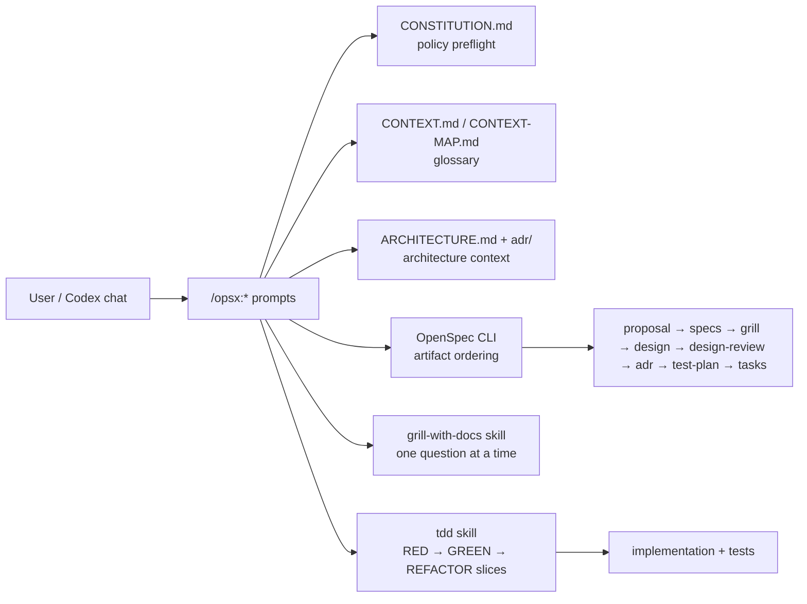

## Context

The current v0.1.2 overlay lifecycle is `proposal -> specs -> design -> review -> adr -> test-plan -> tasks`. It records review/test-plan artifacts, but the operational behavior can still be treated as optional or verification-after. The user wants the full Matt Pocock `grill-with-docs` and `tdd` skills integrated into the Codex/OpenSpec flow so new projects receive the hardened behavior by default.

## Goals / Non-Goals

**Goals:**

- Make Matt-style grill a real artifact gate before design and after design.
- Make Matt-style TDD a real apply discipline.
- Preserve the existing context model: `CONSTITUTION.md` for rules, `ARCHITECTURE.md` for snapshot, top-level `adr/` for decisions.
- Add `CONTEXT.md`/`CONTEXT-MAP.md` as glossary/domain-language entry points.
- Keep OpenSpec CLI unpatched and use project-local overlay files only.

**Non-Goals:**

- Do not change OpenSpec CLI internals.
- Do not require external services or secrets.
- Do not force target projects to overwrite user-owned context docs without explicit install flags.

## Decisions

1. Replace the v0.1.2 single `review` artifact with `grill` and `design-review` artifacts.
2. Vendor upstream Matt `grill-with-docs` files into `.codex/skills/grill-with-docs/` and add an OpenSpec adapter section.
3. Add `.codex/skills/tdd/` with upstream Matt TDD files and an OpenSpec adapter section.
4. Update the intent-driven schema artifact order to `proposal -> specs -> grill -> design -> design-review -> adr -> test-plan -> tasks`.
5. Update `test-plan.md` so it describes vertical TDD slices with RED/GREEN evidence rather than broad verification placeholders.
6. Add root `CONTEXT.md` for this repository's glossary and installer/checker support for glossary files.
7. Add durable ADR 0005 and update the current architecture snapshot.

## System context

## Risks / Trade-offs

- **Breaking lifecycle change:** existing v0.1.2 docs mention `review.md`. Mitigation: update all docs/specs and keep archived changes as historical examples.
- **Interactive grill vs FF:** grill normally asks one question at a time. In FF mode, Codex can proceed only when questions are resolved by repository context or prior user instruction; otherwise it must stop.
- **TDD in legacy stacks:** some targets may lack a test harness. Mitigation: `test-plan.md` must make harness creation the first slice or record an explicit approved exception.

## Migration Plan

1. Update schema/templates and overlay behavior.
2. Update prompts/skills and install/check scripts.
3. Update docs/specs/ADR/architecture.
4. Validate schema, change, all specs, and overlay smoke checks.
5. Archive the change and republish as a clean `v0.1.3` release.
6. Install the updated overlay globally.

## Open Questions

None.
