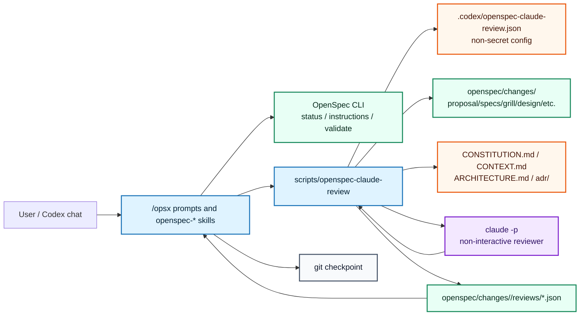

## Context

This change adds optional Claude Code review for generated OpenSpec artifacts in the Codex overlay layer.

Relevant constraints from project context:

- `CONSTITUTION.md` requires OpenSpec CLI 1.3.x-compatible public commands, project-local Codex overlay files under `.codex/`, Bash helper scripts under `scripts/`, Git-tracked context files with no secret values, and `scripts/check-overlay` after overlay/template updates.
- `ARCHITECTURE.md` and ADR 0001 keep OpenSpec as the lifecycle engine and put workflow behavior in `.codex/prompts`, `.codex/skills`, and helper scripts. The integration must not patch or fork OpenSpec CLI.
- ADR 0003 keeps `CONSTITUTION.md`, `CONTEXT.md`, `ARCHITECTURE.md`, and `adr/` as persistent project context outside the OpenSpec artifact graph.
- ADR 0005 makes `grill.md`, `design-review.md`, and `test-plan.md` mandatory; Claude review must not replace those gates.
- `grill.md` for this change resolved that model/effort must be configurable per stage, full model IDs should be preferred for reproducible reviews, aliases should remain supported, and unavailable-review behavior must be policy-driven.

The local Claude Code CLI currently available in this environment is `2.1.157`, and its CLI supports `-p`, `--model`, `--effort`, `--output-format`, `--json-schema`, `--max-budget-usd`, `--fallback-model`, `--permission-mode`, and tool allow/deny flags.

## Goals / Non-Goals

**Goals:**

- Add a project-local, non-secret Claude review configuration that can be enabled globally and overridden per OpenSpec stage.
- Add a deterministic helper wrapper around `claude -p` that resolves stage config, builds focused review input, requests structured output, parses the result, writes a report, and returns a policy-aware exit status.
- Integrate the helper into Codex workflow guidance for `openspec-continue`, `openspec-propose`, `openspec-ff`, and `openspec-verify` without changing OpenSpec CLI behavior.
- Support pinned model IDs and aliases, stage-specific effort, fallback model, maximum budget, prompt profile, strictness, and unavailable-review policy.
- Keep review inputs secret-safe and bounded, with no `.secrets.local.env` reads for ordinary artifact review.
- Extend overlay checks so the new assets are present and the wrapper can run in dry-run/config-validation mode without contacting Claude.

**Non-Goals:**

- Do not make Claude review a new OpenSpec artifact in the schema lifecycle.
- Do not require every installed project to have Claude credentials before it can use the template.
- Do not use Claude review as a substitute for `grill-with-docs`, ADR review, TDD, OpenSpec validation, or git checkpoints.
- Do not implement web search or external documentation lookup inside the reviewer by default.
- Do not store Claude auth tokens, API keys, private endpoints, or secret values in tracked config or reports.

## Decisions

### 1. Implement review in a helper script, not OpenSpec CLI

Add a new helper script:

```text
scripts/openspec-claude-review
```

Expected usage:

```bash
scripts/openspec-claude-review --change <change> --stage <proposal|specs|grill|design|design-review|adr|test-plan|tasks|verify>
scripts/openspec-claude-review --change <change> --stage design-review --dry-run
scripts/openspec-claude-review --validate-config
```

The script is responsible for:

1. resolving repository root;
2. reading non-secret review config;
3. resolving stage defaults and overrides;
4. validating model/effort compatibility;
5. collecting stage-specific artifact/context files;
6. building a bounded review prompt;
7. invoking `claude -p` when enabled and not in dry-run;
8. parsing structured output;
9. writing the review report;
10. exiting with a status that workflow prompts can interpret.

Rationale: this preserves the architecture boundary from ADR 0001. OpenSpec still owns artifact ordering and validation; Codex overlay owns workflow behavior.

### 2. Use JSON configuration for dependency-free parsing

Add a tracked, non-secret config file:

```text
.codex/openspec-claude-review.json
```

JSON is less friendly than YAML, but it can be parsed with Python standard library from a Bash helper without introducing `yq`, PyYAML, Node dependencies, or package installation steps.

Recommended default installed config should be safe-by-default:

```json
{
  "enabled": false,
  "configVersion": 1,
  "defaults": {
    "model": "claude-sonnet-4-6",
    "effort": "medium",
    "fallbackModel": "claude-sonnet-4-6",
    "maxBudgetUsd": 0.05,
    "permissionMode": "dontAsk",
    "tools": "none",
    "blockOn": ["fail", "blocked"],
    "unavailablePolicy": "warn",
    "persistReport": true,
    "inputMode": "bundle"
  },
  "stages": {
    "proposal": { "enabled": false, "model": "claude-sonnet-4-6", "effort": "low", "maxBudgetUsd": 0.03 },
    "specs": { "enabled": true, "model": "claude-sonnet-4-6", "effort": "medium", "maxBudgetUsd": 0.08 },
    "grill": { "enabled": false },
    "design": { "enabled": true, "model": "claude-sonnet-4-6", "effort": "high", "maxBudgetUsd": 0.12 },
    "design-review": { "enabled": true, "model": "claude-opus-4-8", "effort": "high", "maxBudgetUsd": 0.20 },
    "adr": { "enabled": true, "model": "claude-opus-4-8", "effort": "high", "maxBudgetUsd": 0.15 },
    "test-plan": { "enabled": true, "model": "claude-sonnet-4-6", "effort": "medium", "maxBudgetUsd": 0.08 },
    "tasks": { "enabled": true, "model": "claude-sonnet-4-6", "effort": "medium", "maxBudgetUsd": 0.08 },
    "verify": { "enabled": true, "model": "claude-opus-4-8", "effort": "high", "maxBudgetUsd": 0.25 }
  }
}
```

`enabled: false` at the top avoids breaking template users without Claude auth. A project can opt in by setting it to `true`. Stage defaults still document the recommended balanced model/effort profile.

### 3. Prefer bundled stdin input; allow read-only file mode later

Default input mode is `bundle`:

```bash
scripts/openspec-claude-review ... > /tmp/report.json
# internally:
cat "$PROMPT_FILE" | claude -p \
  --model "$MODEL" \
  --effort "$EFFORT" \
  --fallback-model "$FALLBACK_MODEL" \
  --max-budget-usd "$MAX_BUDGET_USD" \
  --permission-mode dontAsk \
  --tools "" \
  --output-format json \
  --json-schema "$REVIEW_SCHEMA"
```

The helper includes actual artifact contents in a generated prompt via stdin and disables tools by default with `--tools ""`. This is the most deterministic and least surprising review mode.

Optional future-compatible mode:

```json
"inputMode": "readOnlyTools"
```

When enabled, the helper may pass paths and allow only `Read`, `Glob`, and `Grep` while disallowing `Bash`, `Edit`, and `Write`. This is useful for very large contexts, but the initial implementation should default to bundled input because OpenSpec artifacts are usually small enough.

### 4. Persist structured reports under the change directory

Write reports to:

```text
openspec/changes/<change>/reviews/<stage>-claude-review.json
```

Report shape:

```json
{
  "schemaVersion": 1,
  "change": "add-claude-artifact-review",
  "stage": "design-review",
  "verdict": "pass",
  "modelConfigured": "claude-opus-4-8",
  "effortConfigured": "high",
  "fallbackModel": "claude-sonnet-4-6",
  "command": {
    "outputFormat": "json",
    "permissionMode": "dontAsk",
    "tools": "none"
  },
  "reviewedFiles": [
    { "path": "openspec/changes/<change>/design.md", "sha256": "..." }
  ],
  "mustFix": [],
  "shouldFix": [],
  "questions": [],
  "omittedContext": [],
  "summary": "...",
  "cost": { "totalCostUsd": 0.0, "numTurns": 1 },
  "reviewedAt": "2026-05-30T00:00:00Z"
}
```

The helper exits:

- `0` for pass or allowed warn;
- `1` for blocking `fail` / `blocked` verdict;
- `2` for configuration/parse/command errors that policy treats as blocking;
- `3` for review skipped by disabled config or unavailable policy that allows continuation.

The exact exit-code names can be documented by the script help; workflow prompts should not infer policy from prose.

### 5. Model/effort validation table

The helper uses a conservative built-in capability table and optional config override.

Built-in rules:

| Model selector | Effort handling |
| --- | --- |
| `claude-opus-4-8`, `claude-opus-4-7` | allow `low`, `medium`, `high`, `xhigh`, `max` |
| `claude-opus-4-6`, `claude-sonnet-4-6` | allow `low`, `medium`, `high`, `max` |
| `claude-haiku-4-5`, `claude-haiku-4-5-20251001` | omit `--effort` |
| `opus` | allow configured effort, warn that alias resolution can vary; `xhigh` may depend on provider/version |
| `sonnet` | allow `low`, `medium`, `high`, `max`; reject or warn on `xhigh` in strict mode |
| custom model | require `modelCapabilities` config or omit effort in non-strict mode |

Example override:

```json
{
  "modelCapabilities": {
    "my-gateway/opus-prod": {
      "effort": ["low", "medium", "high", "xhigh", "max"]
    }
  }
}
```

`max` is allowed but should not be used by default. `xhigh` is reserved for explicit high-strictness profiles, especially `design-review` or `verify` on complex changes.

### 6. Stage-specific context selection

Default file bundle by stage:

| Stage | Review input |
| --- | --- |
| `proposal` | `proposal.md`, `CONSTITUTION.md`, `CONTEXT.md`, `ARCHITECTURE.md`, ADR index/in-force summary |
| `specs` | `proposal.md`, delta specs, relevant canonical specs under `openspec/specs/` |
| `grill` | proposal, specs, `grill.md`, context/architecture/ADRs |
| `design` | proposal, specs, grill, `design.md`, architecture/ADRs, relevant docs/scripts when selected |
| `design-review` | proposal, specs, grill, design, design-review, architecture/ADRs |
| `adr` | grill, design-review, design, `adr.md`, top-level ADRs, `ARCHITECTURE.md` |
| `test-plan` | specs, design, ADR review, test-plan, TDD rules from `.codex/skills/tdd/SKILL.md` |
| `tasks` | all planning artifacts and task checklist |
| `verify` | all planning artifacts, task status, review reports, and relevant validation evidence |

The helper must never include `.secrets.local.env`, `.env.local`, `.claude` local transcripts, or other local secret/state paths.

### 7. Workflow integration points

Update these skills/prompts to say: after an artifact is written and before its checkpoint/dependent gate, call the helper when configured:

- `.codex/skills/openspec-continue-change/SKILL.md`
- `.codex/skills/openspec-propose/SKILL.md`
- `.codex/skills/openspec-ff-change/SKILL.md`
- `.codex/skills/openspec-verify-change/SKILL.md`
- `.codex/skills/openspec-apply-change/SKILL.md` only to read review reports as auxiliary context when present
- `.codex/prompts/opsx-continue.md`
- `.codex/prompts/opsx-propose.md`
- `.codex/prompts/opsx-ff.md`
- `.codex/prompts/opsx-verify.md`

The workflow remains:

1. create artifact;
2. run Claude review if configured for the stage;
3. show `git status --short`;
4. checkpoint artifact plus review report when produced;
5. only then allow a dependent artifact to consume them.

### 8. C4-inspired boundary view



Boundaries:

- OpenSpec CLI remains unaware of Claude review.
- Codex overlay decides when to call the helper.
- Helper is the only local automation that invokes `claude -p`.
- Review config and reports are Git-tracked only when non-secret.
- Claude auth is external local state, not repository content.

## Risks / Trade-offs

- **Cost risk:** Opus review can be expensive. Mitigation: disabled global default, per-stage budgets, Sonnet-first balanced profile, and `max` excluded from defaults.
- **Availability risk:** `claude` may be missing or unauthenticated. Mitigation: per-stage unavailable policy and dry-run/config validation.
- **False confidence risk:** A second model review can still miss issues. Mitigation: keep OpenSpec validation, grill, design-review, ADR, TDD, and verify gates authoritative.
- **Reproducibility risk:** aliases change over time or vary by provider. Mitigation: prefer full model IDs and record configured model/effort in each report.
- **Secret leakage risk:** review prompts may accidentally include local secret files. Mitigation: explicit denylist and never reading `.secrets.local.env` for ordinary artifact review.
- **Context bloat risk:** sending all repository files would increase cost and noise. Mitigation: stage-specific bundle manifests and omitted-context reporting.
- **Configuration complexity:** many knobs can confuse users. Mitigation: ship one safe config with documented balanced defaults and allow advanced overrides only when needed.

## Migration Plan

1. Add `scripts/openspec-claude-review` with `--help`, `--validate-config`, and `--dry-run` modes first.
2. Add `.codex/openspec-claude-review.json` with global `enabled: false` and balanced stage defaults.
3. Add review prompt/schema assets only if needed by the helper, preferably under `.codex/claude-review/`.
4. Update `openspec-*` skills and `/opsx:*` prompts to call or account for the helper when config enables it.
5. Update `scripts/check-overlay` to validate the config, script executability, and dry-run behavior without making an external Claude call.
6. Update docs and README files to explain enabling review, model/effort profiles, costs, and failure modes.
7. Run `openspec validate add-claude-artifact-review --strict`, `openspec schema validate intent-driven` if schema guidance changes, and `scripts/check-overlay`.

Rollback is straightforward: set `.codex/openspec-claude-review.json` top-level `enabled` to `false` or remove prompt/skill calls to the helper. Existing OpenSpec artifacts remain valid because Claude review reports are auxiliary context, not lifecycle artifacts.

## Open Questions

None.
