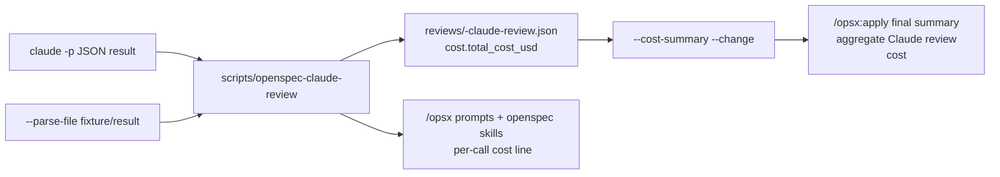

## Context

The current architecture keeps OpenSpec as the lifecycle engine and places Claude Code review orchestration in the Codex overlay (`.codex/prompts`, `.codex/skills`, and `scripts/openspec-claude-review`). ADR 0006 establishes Claude review as optional, structured, secret-safe, and outside the OpenSpec CLI. ADR 0007 adds session-scoped review controls and automatic safe local checkpoints.

`scripts/openspec-claude-review` already writes structured reports under `openspec/changes/<change>/reviews/` and preserves basic cost metadata for successful real `claude -p` calls. The gap is that workflow guidance does not require Codex to surface per-call cost to the user, parse-file/test paths do not consistently preserve cost metadata, and `/opsx:apply` has no deterministic aggregate-cost helper.

No external secrets are required for this change. `.secrets.local.env` is not needed and must not be read.

## Goals / Non-Goals

**Goals:**

- Preserve `total_cost_usd`, `duration_ms`, and `num_turns` consistently when Claude Code returns them, including parse-file regression paths.
- Add a no-Claude-invocation helper mode that aggregates numeric persisted review report costs for a change.
- Update workflow prompts/skills so after each reviewer call Codex displays the call cost when present, reports unavailable cost when absent, and does not stop solely because cost is present or absent.
- Update `/opsx:apply` guidance so final output includes an aggregate Claude artifact-review cost when any cost metadata is available.
- Keep budget exhaustion as a separate blocker that still disables session review as already specified.

**Non-Goals:**

- Do not query a provider billing API or claim to know remaining account budget.
- Do not add a new reviewer provider abstraction.
- Do not change default Claude review enablement or per-stage model/effort defaults.
- Do not alter OpenSpec CLI internals.
- Do not include non-review costs such as Codex tokens, OpenSpec validation, git operations, or unrelated Claude usage.

## Decisions

1. **Extract cost metadata with one helper function.**
   - Add an internal `extract_cost(obj)` function that returns only recognized Claude Code metadata keys with non-null values: `total_cost_usd`, `duration_ms`, and `num_turns`.
   - Use it for real Claude responses, `--parse-file`, and budget-exhausted reports.
   - This avoids duplicated parsing and makes fixture tests representative of real CLI output.

2. **Keep report shape backward-compatible.**
   - Continue storing cost under the existing top-level `cost` object in each review report.
   - Do not make cost mandatory; missing cost remains non-blocking.
   - Existing consumers that ignore `cost` continue to work.

3. **Add `--cost-summary` helper mode.**
   - CLI shape: `scripts/openspec-claude-review --cost-summary --change <change>`; no extra `--json` flag is needed because the helper already emits JSON.
   - It reads `openspec/changes/<change>/reviews/*.json`, sums numeric `cost.total_cost_usd`, and emits a structured JSON object with `totalCostUsd`, `reviewCount`, `costedReviewCount`, `missingCostCount`, and per-report entries.
   - It must not load Claude credentials, invoke `claude`, require `--stage`, validate reviewer stage configuration, or read `.secrets.local.env`.
   - It should run even when the project-global reviewer config is disabled or temporarily invalid, because final apply cost reporting depends only on persisted report files.
   - It should tolerate malformed/missing cost values by excluding them and reporting a warning entry rather than failing the apply summary.

4. **Workflow rendering remains Codex-owned.**
   - The helper returns machine-readable JSON. Prompts and skills tell Codex to display a concise human line after reviewer calls, e.g. `Claude review cost: $0.012345 (stage: specs)`.
   - This keeps shell helper output stable and avoids printing extra prose that would complicate automation.

5. **Apply aggregate is informational.**
   - `/opsx:apply` final output should include `Total Claude review cost: $X` when any numeric cost was observed or summarized.
   - If no numeric cost is available, final output should state `Total Claude review cost: unavailable/no cost metadata` only when Claude review was involved or reports exist.
   - Cost summary must never override blocking verdicts, budget exhaustion, missing TDD evidence, or checkpoint rules.

## Risks / Trade-offs

- Persisted report aggregation can include review reports generated before the current apply run. The final wording must say whether the total is for the current run if tracked in memory, or for persisted reports for the change when using the helper.
- If `persistReport` is false, only the current Codex run can aggregate those review costs. This is acceptable; the helper covers the durable persisted-report path.
- Floating-point summation may produce long decimals. Output should use the raw JSON number for automation and a concise decimal string in human summaries.
- Claude Code output format can evolve. Limiting extraction to recognized metadata keys keeps unknown fields out of reports while allowing future extension.

## Migration Plan

1. Update `scripts/openspec-claude-review` with cost extraction and `--cost-summary` mode.
2. Add regression checks in `scripts/check-overlay` for parse-file cost preservation and persisted-report cost aggregation.
3. Update `/opsx:*` prompts and `openspec-*` skills that invoke Claude review to require per-call cost display.
4. Update `/opsx:apply` prompt and skill final-output guidance to include aggregate Claude review cost.
5. Run shell syntax checks, helper config validation, targeted helper tests, OpenSpec validation, full overlay checks, diff whitespace checks, and tracked-secret checks.
6. Rollback is a normal git revert of the local checkpoint commits; no data migration is required.

## Open Questions

None.
