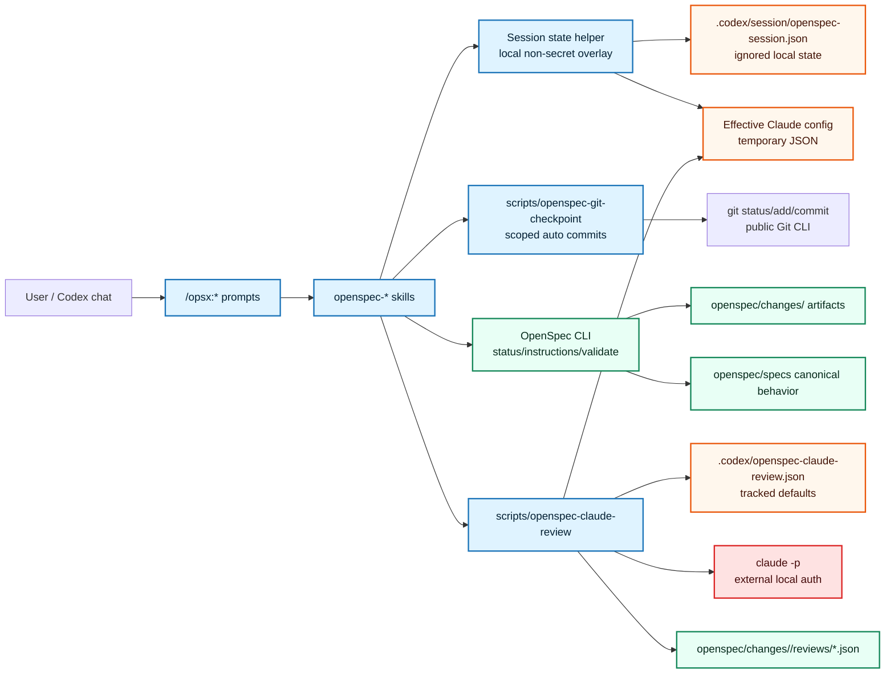

## Context

The current overlay is a project-local Codex/OpenSpec system: OpenSpec CLI owns artifact state and validation, while `.codex/prompts`, `.codex/skills`, and helper scripts own workflow behavior. `CONSTITUTION.md` requires OpenSpec CLI 1.3.x-compatible public commands, project-local Codex overlay files, Markdown artifacts, Bash/Python-stdlib helper scripts, top-level durable ADRs, root `ARCHITECTURE.md`, and strict no-secret handling.

In-force ADRs shape this design:

- ADR 0001 keeps OpenSpec unforked and puts workflow behavior in the Codex overlay. It currently says normal checkpoint commits require explicit user approval; this change intentionally revisits that rule.
- ADR 0003 keeps `CONSTITUTION.md`, `ARCHITECTURE.md`, and `adr/` as persistent project context and keeps local secrets out of Git and OpenSpec artifacts.
- ADR 0005 requires `grill.md`, `design-review.md`, and Matt TDD gates before implementation.
- ADR 0006 adds optional Claude Code artifact review through `scripts/openspec-claude-review` and `.codex/openspec-claude-review.json`, with structured reports and disabled-safe defaults.

The grill resolved the core policy boundary: automatic git discipline means visible automatic lifecycle checkpoint commits only. It does not authorize push, merge, archive, PR creation, destructive git operations, dirty unrelated work, external-system access, or bypassing project rules.

### Boundary diagram



## Goals / Non-Goals

**Goals:**

- Make normal OpenSpec lifecycle checkpoint commits automatic by default while preserving visible status, scoped staging, and commit-hash reporting.
- Keep hard safety gates explicit: unrelated dirty work, branch/merge/push/archive/destructive operations, missing planning artifacts, failed validation, and project-rule conflicts must still stop or require explicit approval.
- Add session-level Claude artifact review controls that merge over `.codex/openspec-claude-review.json` without editing tracked global defaults.
- Provide `/opsx:*` prompt commands for Claude review status, enable, disable, reset, and stage/model/effort settings.
- Reuse existing Claude review validation, model/effort handling, bounded input, no-secret rules, and structured report processing.
- Keep OpenSpec CLI unchanged and keep session overlays out of lifecycle artifacts unless an artifact intentionally records a decision, override, or verification outcome.

**Non-Goals:**

- No OpenSpec CLI patching or forking.
- No live Claude authentication setup, credential storage, or secret value inspection.
- No automatic push, merge, pull request, archive, or destructive git behavior.
- No replacement of `grill.md`, `design-review.md`, `adr.md`, `test-plan.md`, TDD evidence, OpenSpec validation, or durable ADR rules.
- No global Claude review enablement by default for new installs.

## Decisions

### 1. Add ignored local session state plus generated effective config

Add a small helper, `scripts/openspec-session-state`, that manages local non-secret workflow session state. The state file path is:

```text
.codex/session/openspec-session.json
```

Add `.codex/session/` to `.gitignore`. The file is local and ignored even though it should not contain secrets. Keeping it ignored prevents accidental churn and avoids treating per-chat choices as project policy.

State shape:

```json
{
  "schemaVersion": 1,
  "sessionKey": "<runtime session id or local fallback>",
  "createdAt": "<ISO timestamp>",
  "updatedAt": "<ISO timestamp>",
  "git": {
    "checkpointMode": "auto"
  },
  "claudeReview": {
    "decision": "unset | enabled | disabled",
    "enabled": true,
    "stages": {
      "design-review": {
        "model": "claude-opus-4-8",
        "effort": "xhigh"
      }
    }
  }
}
```

`sessionKey` should use a Codex/thread/session environment value when available. If the runtime does not expose one, commands still work by using the local state file as a best-effort worktree session and by letting the user reset it with `/opsx:claude-review-reset`. Prompt guidance should still explicitly ask at `/opsx:new`, `/opsx:propose`, `/opsx:ff`, and `/opsx:apply` when the session decision is `unset`.

The helper should support:

- `--status` — print current git and Claude review session state.
- `--git-mode auto|manual` — set checkpoint mode.
- `--claude-review on|off|reset` — set or clear session review intent.
- `--set-stage <stage> key=value ...` — set model, effort, budget, prompt profile, blocking policy, and stage enablement.
- `--effective-claude-config --out <path>` — deep-merge `.codex/openspec-claude-review.json` with the session overlay and write a temporary effective config for `scripts/openspec-claude-review --config <path>`.
- `--validate` — validate that state contains no unsupported fields and no secret-looking keys.

Merge order is:

1. tracked global `.codex/openspec-claude-review.json`;
2. session-level top-level enablement decision;
3. session stage overrides;
4. one-command explicit CLI overrides, when a command provides them.

Null values or explicit reset operations remove a session override and reveal the lower-priority value again.

### 2. Keep Claude review helper mostly unchanged and feed it an effective config

`scripts/openspec-claude-review` already accepts `--config`, validates stage/model/effort policy, collects bounded non-secret input, and returns structured reports. Instead of duplicating that logic, `scripts/openspec-session-state --effective-claude-config` should produce a temporary merged JSON config and lifecycle skills should call:

```bash
tmp_config="$(mktemp)"
scripts/openspec-session-state --effective-claude-config --out "$tmp_config"
scripts/openspec-claude-review --change "$change" --stage "$stage" --config "$tmp_config"
```

The temporary config must not be staged or committed. The state helper and review helper must both deny secret-looking fields and must not read `.secrets.local.env` for ordinary artifact review.

If Claude Code returns a budget-exhaustion result, the review helper should treat it as a hard `blocked` reviewer outcome rather than a generic unavailable reviewer. Claude Code print/SDK result envelopes identify this as subtype `error_max_budget_usd`; local CLI verification also shows exit code `1` with JSON stdout containing `errors: ["Reached maximum budget (...)"]`. In that case the helper should:

1. record `budgetExhausted: true`, the Claude subtype, reported cost metadata when present, and a clear `mustFix` message;
2. call `scripts/openspec-session-state --claude-review off` using the current `CODEX_OPENSPEC_SESSION_FILE` when set;
3. return a blocking exit code so the lifecycle step stops and reports the blocker to the user;
4. avoid retrying Claude review automatically until the user raises/clears the cap and explicitly re-enables review.

### 3. Add Claude review `/opsx:*` prompt commands

Add prompt files that map predictably to the slash command names:

| Command | Prompt file | Behavior |
| --- | --- | --- |
| `/opsx:claude-review-status` | `.codex/prompts/opsx-claude-review-status.md` | Show session state and effective non-secret stage settings. |
| `/opsx:claude-review-on` | `.codex/prompts/opsx-claude-review-on.md` | Set session review decision to enabled. |
| `/opsx:claude-review-off` | `.codex/prompts/opsx-claude-review-off.md` | Set session review decision to disabled. |
| `/opsx:claude-review-reset` | `.codex/prompts/opsx-claude-review-reset.md` | Clear session Claude review overrides. |
| `/opsx:claude-review-set` | `.codex/prompts/opsx-claude-review-set.md` | Set per-stage model, effort, budget, block policy, or stage enablement. |

These commands update only session state unless the user explicitly requests global defaults. If a user asks for global defaults, the workflow should edit `.codex/openspec-claude-review.json` as a normal tracked project change with validation and checkpointing.

### 4. Prompt at key entry points only when session decision is unset

Update `/opsx:new`, `/opsx:propose`, `/opsx:ff`, and `/opsx:apply` prompts and their skills to run the session-state helper before lifecycle work:

1. Ensure `.codex/session/` is ignored.
2. Read current session state.
3. If `claudeReview.decision` is `unset`, ask: “Enable Claude artifact review for this session?” with a concise default recommendation based on the workflow:
   - routine or cost-sensitive flow: recommend disabled;
   - architecture-sensitive `propose`, `ff`, or `apply`: recommend enabled for design/ADR/verify stages if Claude is available.
4. Record the answer in session state.
5. Continue using the effective config for review checks.

`/opsx:continue` should not repeatedly ask by default. It should reuse session state and only surface a concise status line when review is enabled, disabled, or skipped. If a user starts a fresh thread directly with `/opsx:continue` and no session decision exists, it may ask only before a stage where review would otherwise run.

### 5. Add scoped automatic checkpoint helper

Add `scripts/openspec-git-checkpoint` to make automatic checkpointing deterministic and testable. The helper should use only public Git commands and should not read secrets.

Inputs:

- `--change <name>`
- `--stage <scaffold|proposal|specs|grill|design|design-review|adr|test-plan|tasks|apply-group|verify|archive>`
- `--message <commit message>`
- repeated `--include <path>` for explicit additional paths such as coherent apply task groups
- `--dry-run`

Behavior:

1. Run `git status --porcelain=v1`.
2. Build an allowlist for the lifecycle step:
   - scaffold: `openspec/changes/<change>/.openspec.yaml`
   - proposal: `proposal.md`
   - specs: `specs/**` and explicitly included supporting artifact edits
   - grill/design/design-review/adr/test-plan/tasks: that artifact plus matching `reviews/<stage>-claude-review.json` when present
   - apply-group: only explicit `--include` paths
   - verify/archive: never auto-run without the workflow explicitly selecting the paths and approval policy
3. If any dirty path is outside the allowlist, stop before staging and report the paths.
4. Show the paths that will be staged and the commit message.
5. In non-dry-run automatic mode, run `git add -- <allowed paths>` and `git commit -m <message>`.
6. Print the commit hash and post-commit `git status --short`.

Manual mode remains available through session state or user instruction. In manual mode, prompts/skills show the same checkpoint plan but stop for explicit approval before staging and committing.

### 6. Update prompt/skill git policy to automatic default

Update these files so the overlay itself no longer contradicts the new behavior:

- `.codex/skills/openspec-git-discipline/SKILL.md`
- `.codex/skills/openspec-new-change/SKILL.md`
- `.codex/skills/openspec-continue-change/SKILL.md`
- `.codex/skills/openspec-propose/SKILL.md`
- `.codex/skills/openspec-ff-change/SKILL.md`
- `.codex/skills/openspec-apply-change/SKILL.md`
- archive/sync/bulk skills where hard gates remain explicit
- `.codex/prompts/opsx-new.md`, `opsx-continue.md`, `opsx-propose.md`, `opsx-ff.md`, `opsx-apply.md`, and related docs
- `AGENTS.md`, `CONSTITUTION.md`, `README.md`, `README.ru.md`, `docs/lifecycle.md`, and `docs/update-safety.md`

The wording should become: automatic checkpointing is the default for safe lifecycle checkpoints; explicit approval remains required for manual mode and hard/dangerous operations.

### 7. Verification and installer/check-overlay integration

Update `scripts/check-overlay` to verify:

- `.codex/session/` is ignored;
- `scripts/openspec-session-state` exists, is executable, passes `bash -n`, validates empty/default state, rejects secret-looking state, and can print an effective Claude config without contacting Claude;
- `scripts/openspec-git-checkpoint` exists, is executable, passes `bash -n`, and dry-runs correctly against a smoke change;
- Claude review still validates config and dry-runs without contacting Claude;
- the smoke lifecycle remains `proposal -> specs -> grill -> design -> design-review -> adr -> test-plan -> tasks`.

Update `scripts/install-overlay` so target projects receive the new prompt files, skills, helpers, `.gitignore` guidance, and docs without overwriting user-owned local session state.

## Risks / Trade-offs

- **Accidental staging risk:** Automatic commits are safer only if path scoping is strict. The git checkpoint helper must fail closed on unrelated dirty paths.
- **Runtime session identity uncertainty:** Codex may not expose a stable session id in every runtime. The ignored local state file plus explicit reset command is a pragmatic fallback, but prompt guidance must still ask when the decision is unset or stale.
- **More local state:** `.codex/session/` adds a new local-only surface. It is non-secret and ignored, but check-overlay should verify it is not tracked.
- **Command surface growth:** Five Claude review control commands add discoverability and maintenance burden, but they keep global config editing rare and intentional.
- **ADR mismatch until archive:** ADR 0001 remains in force until this change creates and archives a superseding durable ADR. The per-change ADR step must address this explicitly.
- **Cost/latency:** Enabling Claude review per session can increase runtime cost and delay. Status and set commands must make effective model/effort/budget visible before review runs. If an explicit budget cap is exhausted, the helper disables session review to prevent repeated paid failures and forces the user to opt back in.

## Migration Plan

1. Implement helpers behind dry-run/status/validation modes first.
2. Add `.codex/session/` to `.gitignore` and ensure no local session file is tracked.
3. Add Claude review control prompt files and update entry-point prompts/skills to initialize session state.
4. Update git-discipline prompts/skills to call `scripts/openspec-git-checkpoint` in automatic mode and to retain manual/hard-gate stops.
5. Update docs, installer, and overlay checks.
6. Create a durable ADR in the ADR step that supersedes or narrows ADR 0001’s explicit-approval checkpoint rule and records the session overlay model.
7. Update `ARCHITECTURE.md` and `adr/README.md` when the durable ADR is accepted.

Rollback options:

- Set session git mode to manual or delete `.codex/session/openspec-session.json`.
- Disable Claude review for the session with `/opsx:claude-review-off` or reset session settings.
- Revert the implementation commits if automatic checkpoint behavior is not accepted.
- Keep `.codex/openspec-claude-review.json` globally disabled to avoid live Claude calls.

## Open Questions

None blocking design.

Required follow-up for ADR step:

- Create a durable ADR that supersedes or narrows ADR 0001’s “mutating git operations require explicit approval” rule for safe lifecycle checkpoint commits, while preserving explicit approval for push, merge, archive, PR creation, destructive operations, hard gates, and dirty unrelated work.
- Record the non-secret session overlay model as Codex-layer workflow context, not OpenSpec artifact state.
