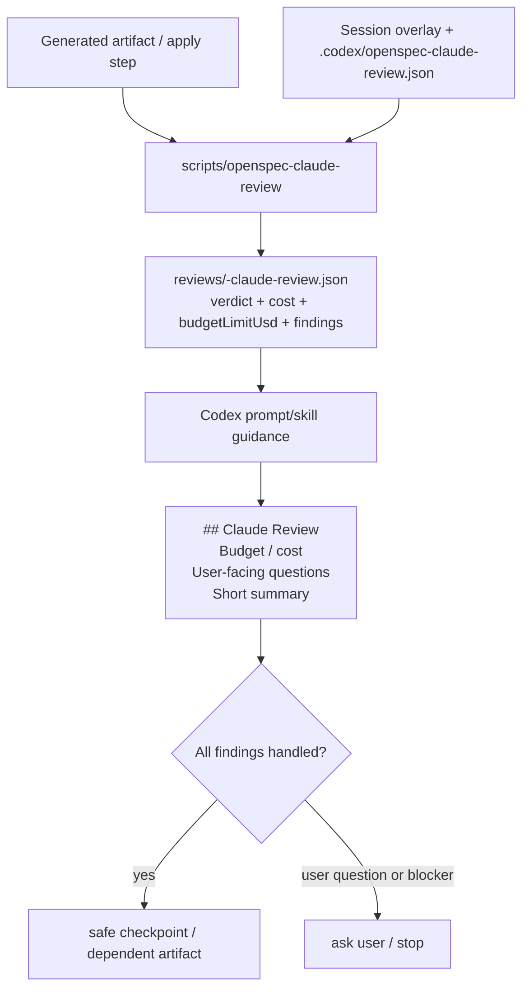

## Context

The current architecture keeps OpenSpec as the lifecycle engine and puts review orchestration in the project-local Codex overlay: `.codex/prompts`, `.codex/skills`, `scripts/openspec-claude-review`, session-state overlays, docs, and `scripts/check-overlay`. ADR 0006 establishes Claude review as optional, structured, secret-safe, and outside OpenSpec CLI internals. ADR 0007 establishes session controls, automatic safe local checkpoints, and budget-exhaustion fail-safe behavior.

Current prompts/skills mostly say to parse `cost.total_cost_usd` and print a cost line after reviewer calls. They do not require a stable user-facing block, do not require showing the configured budget cap, and do not force Codex to classify Claude questions/findings before checkpointing. `scripts/openspec-claude-review` computes the effective stage config but does not expose the configured `maxBudgetUsd` in ordinary reports, so assistants cannot reliably render budget cap status from persisted reports.

No external system access or secrets are needed. `.secrets.local.env` must not be read.

## Goals / Non-Goals

**Goals:**

- Require the assistant to render `## Claude Review` after every reviewer helper invocation or review decision boundary, including skip/unavailable outcomes.
- Make that block always include budget/cost status, user-facing questions, and a short verdict/summary/disposition.
- Add helper report support for the configured budget cap via `budgetLimitUsd` so the block can say `maxBudgetUsd`/`none` without rereading config.
- Update prompt/skill/docs guidance in the canonical template so installed overlays inherit the behavior.
- Update `scripts/check-overlay` with deterministic markers and helper-shape checks so future edits do not drop the behavior.
- Preserve existing optional review controls, budget-exhaustion fail-safe, no-secret policy, TDD, and checkpoint discipline.

**Non-Goals:**

- Do not change default Claude review enablement, model, effort, fallback, or budget values.
- Do not query provider billing APIs or claim remaining account budget.
- Do not invoke real Claude during automated overlay checks.
- Do not change OpenSpec CLI internals or installed OpenSpec packages.
- Do not require printing every raw Claude finding when no user decision is needed.

## Decisions

1. **Keep user rendering in prompts/skills.**
   - `scripts/openspec-claude-review` remains machine-readable and deterministic.
   - Prompts/skills tell Codex to render the `## Claude Review` block from helper JSON or the persisted report.
   - This follows ADR 0006: OpenSpec and the helper provide structured state, while Codex owns conversation output.

2. **Expose configured budget cap as `budgetLimitUsd`.**
   - Add the effective stage `maxBudgetUsd` value to the base report as `budgetLimitUsd`.
   - This preserves existing `cost.total_cost_usd` semantics while giving users the configured cap even when cost is absent.
   - `null` is valid and means no cap / none.

3. **Use text markers as overlay regression checks.**
   - `scripts/check-overlay` will assert `## Claude Review`, `Budget / cost`, `maxBudgetUsd`, `Вопросов, требующих участия пользователя: нет.`, and the no-unhandled-finding checkpoint rule in all relevant prompts/skills.
   - The check remains simple and robust for Markdown guidance files, and it matches existing overlay drift-check style.

4. **Treat findings as a disposition gate, not a raw-output gate.**
   - Codex must fix, defer, mark non-actionable, or ask the user for every actionable finding/question before checkpoint or dependent progress.
   - If Claude asks a question that Codex can answer from context, Codex should answer it internally and summarize the decision; only unresolved user decisions block.

5. **Document installed-project paths and template paths.**
   - Template docs live as `docs/lifecycle.md` and `docs/update-safety.md`.
   - Installer copies them to installed overlays as `docs/intent-driven-lifecycle.md` and `docs/intent-driven-update-safety.md`.
   - `scripts/check-overlay` should support both path sets where applicable.

## Risks / Trade-offs

- Text-marker checks cannot prove an assistant will perfectly reason about every finding, but they are deterministic and catch prompt/skill drift before release.
- Adding `budgetLimitUsd` is a report-shape expansion; consumers that ignore unknown fields remain compatible.
- Requiring a block for skipped/unavailable reviews can add output noise, but it satisfies the user's need for visible review state and cost/budget transparency.
- If a prompt omits a stage-specific wording path, the new check should fail early; this may require future prompt edits to maintain consistent vocabulary.

## Migration Plan

1. Update change specs and planning artifacts.
2. Add `budgetLimitUsd` to `scripts/openspec-claude-review` report output.
3. Update relevant `/opsx:*` prompts and lifecycle skills with the `## Claude Review` block contract and finding-disposition gate.
4. Update lifecycle and update-safety docs.
5. Extend `scripts/check-overlay` with prompt/skill/docs marker checks and helper report-shape checks.
6. Run OpenSpec validation, shell/config checks, `scripts/check-overlay`, diff hygiene, and tracked-secret checks.
7. Archive the change to sync canonical specs after verification.

Rollback is a normal git revert of local checkpoint commits; no data migration or secret cleanup is required.

## Open Questions

None.
