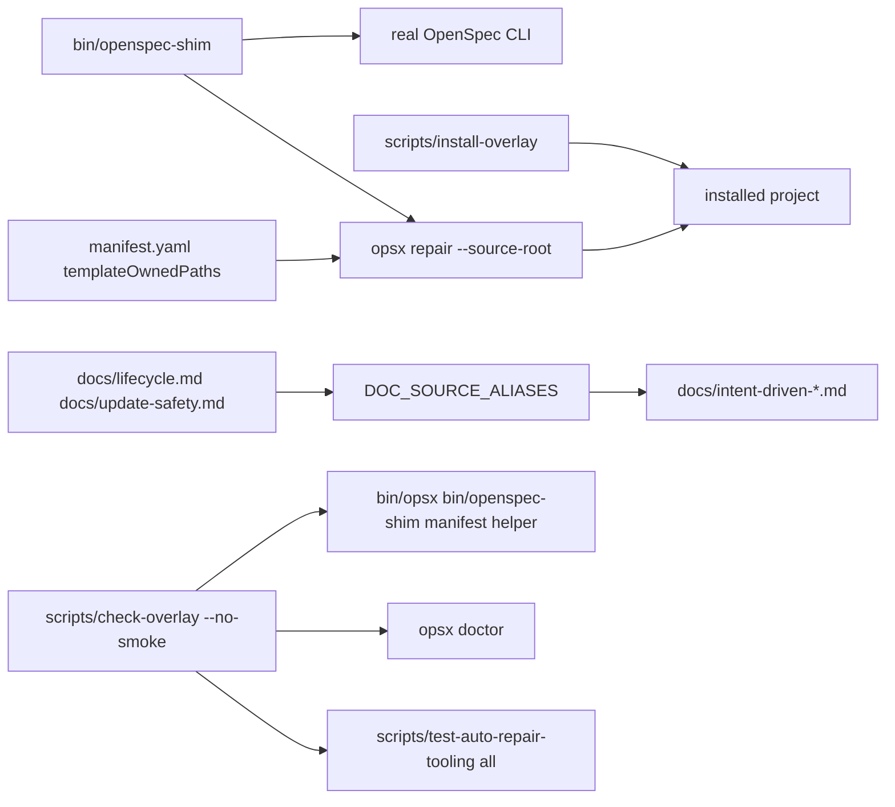

## Context

v0.1.5 introduced source-controlled auto-repair tooling and `scripts/check-overlay` assertions for that tooling. In installed projects, the ordinary `openspec update --force` + `opsx repair` path can still leave out the local `bin/` executables, root `manifest.yaml`, and `scripts/test-auto-repair-tooling`; then the checker fails even though manual copying can make it pass. Installed projects also intentionally receive docs as `docs/intent-driven-lifecycle.md` and `docs/intent-driven-update-safety.md`, while source regression helpers may assume source canonical docs.

Relevant constraints:

- ADR 0001: keep this as a project-local overlay; do not patch or fork OpenSpec.
- ADR 0003 and `CONSTITUTION.md`: preserve project-owned context and local secret boundaries.
- ADR 0005: implement behavior changes with TDD evidence.
- ADR 0007: auto-repair tooling and local checkpoint/session helpers are Codex-layer overlay assets.

## Goals / Non-Goals

**Goals**

- Fresh installed projects become `scripts/check-overlay --no-smoke` clean after documented install/update/repair without manual copies.
- Existing installed/brownfield projects with installed doc aliases pass `scripts/check-overlay --no-smoke` without canonical doc copies.
- Source repository checks keep running both `scripts/check-overlay --no-smoke` and full `scripts/check-overlay`.
- No-op/help commands still delegate to OpenSpec without repair side effects.
- `opsx doctor` remains meaningful in source and installed layouts.
- `opsx sanity` continues detecting stale real OpenSpec paths.
- Nested target directories under parent Git roots produce a warning/diagnostic without becoming a blocker.

**Non-Goals**

- No OpenSpec package patching.
- No archive, release, push, merge, or GitHub publication in this change.
- No project-owned context overwrite beyond create-only behavior already governed by the manifest.
- No secret file reads or secret value handling.

## Decisions

### Decision 1: Install and repair the tooling that installed checks require

Add the following template-owned paths to install/update distribution surfaces:

- `bin/opsx`
- `bin/openspec-shim`
- `manifest.yaml`
- `scripts/test-auto-repair-tooling`
- `scripts/install-overlay` if it is manifest-owned but not copied by the direct installer

`scripts/install-overlay` will copy these files with `--force-overlay` replacement semantics for template-owned assets and chmod executable files after copy. `manifest.yaml` will list the missing paths under `templateOwnedPaths` so `opsx repair` restores them after shim-triggered `openspec init`/`openspec update`.

Rationale: `scripts/check-overlay --no-smoke` currently validates these files. Making installed projects receive them is simpler and more observable than making the installed checker silently weaker.

### Decision 2: Keep alias docs for installed projects and adapt helper tests to both layouts

Installed projects should keep:

- `docs/intent-driven-lifecycle.md`
- `docs/intent-driven-update-safety.md`

Source remains authored at:

- `docs/lifecycle.md`
- `docs/update-safety.md`

`bin/opsx` already maps source canonical docs to installed alias target paths through `DOC_SOURCE_ALIASES`. `scripts/test-auto-repair-tooling` will be updated so its temporary minimal source roots can be built from either canonical source docs or installed alias docs. This prevents helper self-tests from failing in installed projects just because canonical docs are absent.

### Decision 3: Preserve source regression coverage but allow installed layout execution

Because `scripts/test-auto-repair-tooling all` exercises public `opsx` and shim behavior and can be made layout-neutral, `scripts/check-overlay` may continue running it when present. The checker will still fail if the helper is missing because the install/repair path now installs it. If future source-only tests are added, they must be explicitly guarded or moved behind a source-only subcommand.

### Decision 4: Warn on nested parent Git roots in all target-oriented tooling

Add a shared lightweight diagnostic pattern:

- detect whether a target path is inside a Git worktree;
- compare `git -C <target> rev-parse --show-toplevel` with the target path;
- if they differ and the target path does not contain its own `.git`, print a warning to stderr or normal diagnostic output: target is inside parent Git worktree and Git checks may refer to the parent unless the target is initialized as its own Git repository.

Apply it to:

- `scripts/install-overlay` after resolving `TARGET`;
- `bin/opsx repair`, `doctor`, and `init` target handling;
- `scripts/check-overlay` after root selection when the selected overlay root differs from the parent Git root.

The warning must not print secret values and must be non-blocking.

## Architecture / Data Flow

## Implementation Plan

1. Add regression tests/checks first:
   - installed direct installer creates required tooling and alias docs;
   - manifest repair restores missing tooling from a share source;
   - helper works when `ROOT` has only installed doc aliases;
   - nested Git target warning appears;
   - no-op shim help remains non-mutating;
   - stale sanity still fails on stale/missing/self-shim paths.
2. Update `scripts/install-overlay` to copy missing template-owned tooling and chmod executables.
3. Update `manifest.yaml` to include missing auto-repair tooling paths.
4. Update `scripts/test-auto-repair-tooling` doc helper setup to accept canonical or alias docs.
5. Add parent Git warning helper(s) in `bin/opsx`, `scripts/install-overlay`, and `scripts/check-overlay`.
6. Update docs only if automated drift checks require new public instructions.
7. Run required source and installed-project regression checks.

## Risks / Trade-offs

- Installing `bin/` files into projects adds more template-owned files to installed repositories, but they are already required by checker and doctor semantics.
- Warning on parent Git roots can be noisy in intentionally nested workspaces; keep it non-blocking and only emit for target-oriented commands.
- Running source helper checks in installed projects increases installed checker cost slightly, but tests are local shell/Python only and catch meaningful repair regressions.
- `manifest.yaml` release remains `0.1.5` until release metadata is deliberately updated; this change can prepare v0.1.6 later but should not publish it.

## Open Questions

None.
