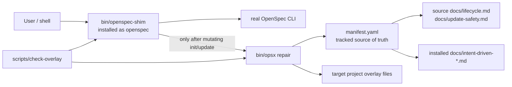

## Context

The active project rules require a project-local overlay, public OpenSpec CLI usage, no OpenSpec package patching, no secret reads, and `scripts/check-overlay` after overlay/template updates. In-force ADRs 0001, 0003, 0005, and 0007 keep OpenSpec as the lifecycle engine, Codex/helper scripts as overlay behavior, root context as Codex-only context, and checkpoint/TDD discipline as mandatory.

The reported regressions are in the globally installed auto-repair tooling under `/home/as/.local/share/codex-openspec-powers/`, but the source checkout currently tracks only the ordinary overlay prompts/skills/scripts/docs. The source repository stores canonical docs as `docs/lifecycle.md` and `docs/update-safety.md`; installed projects receive Brownfield-safe aliases `docs/intent-driven-lifecycle.md` and `docs/intent-driven-update-safety.md`.

## Goals / Non-Goals

**Goals:**

- Make auto-repair tooling tracked and testable from the source repository.
- Prevent same-root `install-auto-repair` from deleting its source/share root.
- Prevent shim auto-repair for help/version/no-op commands.
- Allow doctor/repair checks to compare source-repo canonical docs and installed-project alias docs correctly.
- Detect stale real OpenSpec binary paths with deterministic local version/path checks.
- Add command-based regression checks to `scripts/check-overlay` and a targeted test script without contacting external systems.

**Non-Goals:**

- Do not patch or fork OpenSpec 1.4.0.
- Do not change the intent-driven lifecycle schema.
- Do not read `.secrets.local.env` or require external network/package-manager checks.
- Do not rename installed docs away from Brownfield-safe aliases.
- Do not archive or publish the change in this run without explicit approval.

## Decisions

### 1. Add tracked auto-repair source files

Add `bin/opsx`, `bin/openspec-shim`, and `manifest.yaml` to the repository. The new `opsx` will support both the new root `manifest.yaml` and the legacy installed `.codex/codex-openspec-powers/manifest.yaml` path so existing global installs can be upgraded without a hard break.

Rationale: this follows ADR 0001's project-local overlay boundary and makes future releases reproducible. The global share copy can be used as migration input for initial content, but it must not remain the only source.

### 2. Use a root manifest with source-vs-installed path resolution

Keep `manifest.yaml` entries expressed as target installed paths, including `docs/intent-driven-lifecycle.md` and `docs/intent-driven-update-safety.md`. Add path resolution in `opsx` so source roots may satisfy those installed targets from canonical source docs:

| Target path | Source fallback |
| --- | --- |
| `docs/intent-driven-lifecycle.md` | `docs/lifecycle.md` |
| `docs/intent-driven-update-safety.md` | `docs/update-safety.md` |

When the target root is the source root, doctor/repair should compare canonical source docs to themselves and should not create alias docs. When the target root is an installed project, repair should still create/check alias docs from the canonical source content.

### 3. Make `install-auto-repair` same-root safe

Resolve source and share roots before copying. If they are the same directory, skip `rmtree/copytree` and preserve the existing source/share root. If they differ, refresh the share root from the source root using the existing ignore rules. Install `opsx` and `openspec` shims from `share_root/bin/` in both cases.

### 4. Classify shim commands before repair

Add no-op detection before command-name repair detection:

- top-level `--help`, `-h`, `--version`, `version`, and `help` do not repair;
- any command containing `--help` or `-h` does not repair;
- `update --help` therefore never repairs;
- mutating `init` with Codex/all tools and mutating `update` without no-op flags may repair after the real CLI succeeds.

This keeps public OpenSpec CLI behavior intact and restricts auto-repair to commands that can actually mutate overlay files.

### 5. Add local real OpenSpec sanity checks

Add `opsx sanity` or an internal post-install function that:

1. resolves the recorded real OpenSpec path;
2. resolves the current PATH real OpenSpec with the install bin/shim directory excluded;
3. runs `--version` on the recorded real binary and on the installed shim;
4. fails if the recorded path is missing, points at the shim, or reports a different version than the PATH real binary / shim delegation.

`install-auto-repair` should run this check after writing state and before reporting success. `scripts/check-overlay` should exercise it with fixtures, including a fake stale path, without changing the user's global install.

### 6. Regression checks are command-based TDD fixtures

Add `scripts/test-auto-repair-tooling` as the focused public-interface regression suite and call it from `scripts/check-overlay` after syntax/config checks. Use temporary directories with fake real OpenSpec and fake `opsx`/state files so tests can observe whether repair was invoked and whether roots were deleted. This keeps the checks deterministic and avoids secrets/external services.

## Risks / Trade-offs

- **New tracked tooling surface:** adding `bin/` and `manifest.yaml` increases release maintenance. Mitigation: include syntax checks and regression fixtures in `scripts/check-overlay`.
- **Manifest compatibility:** supporting legacy and root manifests adds branch logic. Mitigation: prefer root manifest for new source, keep legacy path as fallback only.
- **Version comparison false positives:** real OpenSpec wrappers may print version text with prefixes. Mitigation: compare normalized first semantic version-like token where possible, while still reporting raw outputs on failure.
- **Same-root install may hide stale files:** skipping the copy when roots match means stale source files are preserved. That is correct because the selected share root is the source; sanity checks still validate executables and real OpenSpec delegation.

## Migration Plan

1. Add tracked `bin/opsx`, `bin/openspec-shim`, and `manifest.yaml` from the current global copy, then refactor them for source-root support and safety.
2. Add `scripts/test-auto-repair-tooling` and wire it into `scripts/check-overlay`.
3. Run targeted tests, then `openspec validate harden-openspec-140-tooling --strict`, then `scripts/check-overlay`.
4. Existing global installs can be refreshed by running the new `opsx install-auto-repair --source-root /home/as/ai-projects/intent-driven-codex`; no OpenSpec package files are patched.
5. Rollback is local: restore the previous global `opsx`/shim from backups or reinstall OpenSpec directly; source changes are reversible through Git before release.

## Open Questions

None.
