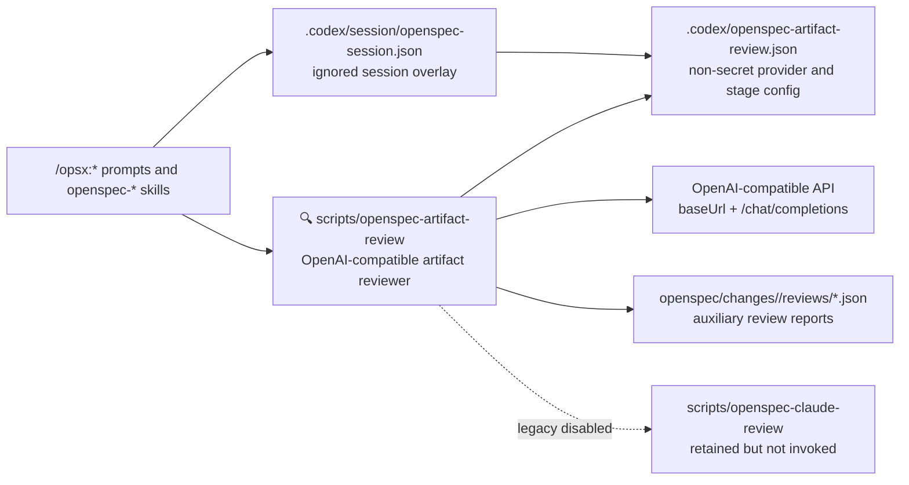

## Context and Goals

Replace the active Claude Code artifact review path with a configurable OpenAI-compatible artifact reviewer while preserving the safety and lifecycle semantics already built around reviews. Claude review code remains in the repository as disabled legacy compatibility, but current intent-driven workflows must not ask about or invoke it.

Primary local provider target:

- Base URL: `https://polza.ai/api/v1`
- Chat endpoint: `/chat/completions`
- API key variable: `POLZA_AI_API_KEY`
- Model: `deepseek/deepseek-v4-pro`

No tracked file may contain the API key value.

## Proposed Architecture



## Configuration Model

Add tracked `.codex/openspec-artifact-review.json`:

```json
{
  "enabled": false,
  "configVersion": 1,
  "provider": {
    "type": "openai-compatible",
    "baseUrl": "https://polza.ai/api/v1",
    "apiKeyEnv": "POLZA_AI_API_KEY",
    "endpoint": "chat/completions"
  },
  "defaults": {
    "model": "deepseek/deepseek-v4-pro",
    "effort": "high",
    "reasoning": {"enabled": true, "effort": "high", "exclude": true},
    "temperature": 0,
    "maxTokens": 4096,
    "structuredOutputMode": "prompt_only",
    "maxBudgetRub": null,
    "maxBudgetUsd": null,
    "blockOn": ["fail", "blocked"],
    "unavailablePolicy": "warn",
    "persistReport": true,
    "inputMode": "bundle"
  },
  "stages": { ... }
}
```

Design choices:

- `enabled: false` remains safe for installed projects.
- `apiKeyEnv` names the local variable; it never stores the value.
- `structuredOutputMode: prompt_only` is the default because the requested DeepSeek Pro model may not advertise `response_format` support in Polza metadata.
- `maxBudgetRub` is supported because Polza usage reports RUB cost; `maxBudgetUsd` remains accepted for compatibility with existing review-budget wording.

## Session State

Update `scripts/openspec-session-state` to add `artifactReview` alongside legacy `claudeReview`:

```json
{
  "artifactReview": {
    "decision": "enabled|disabled|unset",
    "enabled": true,
    "provider": {},
    "stages": {}
  }
}
```

- Current `/opsx:*` prompts use `artifactReview` only.
- Existing `claudeReview` is tolerated for old local state validation but does not enable current review.
- Stage override keys include model, effort, reasoning, baseUrl, apiKeyEnv, maxBudgetRub, maxBudgetUsd, promptProfile, blockOn, and enabled.

## Helper Behavior

Add `scripts/openspec-artifact-review` based on the existing helper structure:

1. Load tracked config or `--config` file.
2. Validate config and resolve stage settings.
3. Collect the same non-secret artifact/context bundle used by the Claude helper.
4. Build a Chat Completions request:
   - `model`
   - `messages` with a JSON-only system instruction and bundled user content
   - `temperature`, `max_tokens`, optional `reasoning`, optional response format
5. Read API key from configured environment variable.
6. POST to `baseUrl` + `endpoint`.
7. Parse `choices[0].message.content` as JSON review output.
8. Extract `usage.cost`, `usage.cost_rub`, prompt/completion token counts when present.
9. Persist report and exit according to blocking policy.

Report schema remains close to existing reports:

- `schemaVersion`
- `change`, `stage`
- `modelConfigured`, `effortConfigured`, `effortEffective`
- `provider` with base URL and endpoint but no secrets
- `budgetLimitRub`, `budgetLimitUsd`
- `reviewedFiles`, `omittedContext`
- `verdict`, `summary`, `mustFix`, `shouldFix`, `questions`
- `cost` with provider currency when available
- `reviewedAt`

## Lifecycle Integration

Replace active prompt/skill guidance:

- `scripts/openspec-claude-review` -> `scripts/openspec-artifact-review`
- `.codex/openspec-claude-review.json` -> `.codex/openspec-artifact-review.json`
- `claudeReview` session controls -> `artifactReview`
- `/opsx:claude-review-*` active docs -> `/opsx:review-*`
- `## Claude Review` user-facing block -> `## Artifact Review`

Legacy Claude prompts/files can remain but should be labelled deprecated or omitted from primary README command tables.

## Documentation and Diagram Updates

- README feature bullets, command tables, optional review section, architecture diagrams, and file tree must refer to OpenAI-compatible artifact review.
- Replace Claude diagram node/icon with `🔍 Artifact Reviewer`.
- Architecture snapshot must show OpenAI-compatible provider boundary and local secret boundary for `POLZA_AI_API_KEY`.
- ADR index must mark ADR 0006/0007 Claude-specific review parts as superseded by a new ADR.

## Migration and Compatibility

- Existing projects with Claude files are not broken by deletion because files are retained.
- Existing ignored `claudeReview` state no longer activates review; users must enable `artifactReview`.
- Existing review reports remain readable as auxiliary historical reports; new reports use artifact-review naming.

## Risks and Mitigations

- **Provider JSON drift**: prompt-only JSON may produce invalid output. Mitigation: strict parser and blocked result on invalid JSON.
- **Provider parameter incompatibility**: models differ in `reasoning`, `response_format`, and token parameter support. Mitigation: conservative defaults, configurable structured output mode, and validation warnings.
- **Secret leakage**: API key must not enter tracked config, reports, artifacts, command output, or docs. Mitigation: env-var-only key handling, deny patterns, redacted provider reporting, git secret checks.
- **Docs drift**: many Claude mentions exist. Mitigation: check-overlay grep checks and README/ARCHITECTURE updates.

## Verification Strategy

- OpenSpec strict validation for this change.
- Unit/CLI checks for config validation, dry-run, parse-file, skipped stage, missing credential, and cost-summary.
- Live local smoke call with Polza credentials when `POLZA_AI_API_KEY` is available.
- `scripts/check-overlay` after overlay/template updates.
- Git status and `git check-ignore .secrets.local.env` before completion.
